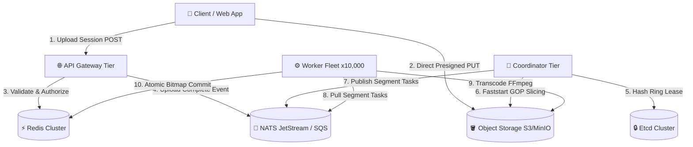

<div align="center">

# 🎬 Tessera — Distributed Video-on-Demand (VOD) Engine

**A hyper-scalable, cloud-agnostic, multi-region video ingestion and distributed transcoding engine built for global scale.**

[](https://go.dev)
[](https://nextjs.org)
[](https://react.dev)
[](https://ffmpeg.org)
[](https://docker.com)
[](LICENSE)

*An enterprise, cloud-native open-source alternative to AWS Elemental MediaConvert and Bitmovin.*

[Quickstart](#-quickstart-platform-in-a-box) • [Architecture](#-architecture-overview) • [Ecosystem](#-monorepo-structure) • [arc42 Docs](#-arc42-documentation-suite) • [Deployment](#-production-deployment)

</div>

---

## ⚡ Key Highlights

- **⚡ Faststart GOP-Aligned MP4 Stream Slicing**: Reads raw 64KB `moov`/`mdat` atoms directly over S3 HTTP range requests to slice 50GB source videos into GOP-aligned chunk tasks in **<500ms** without downloading source files.
- **🛡️ 1024 Virtual Partition Consistent Hash Ring**: FNV-1a partition mapping backed by Etcd lease heartbeats and atomic epoch fencing (`OwnerEpoch`), preventing split-brain slicing and duplicate work.
- **🚀 Shared-Nothing Worker Tier**: Workers pull tasks from NATS JetStream / AWS SQS, check Redis completion bitmaps, execute FFmpeg hardware transcoding (NVENC / VAAPI / CPU), and perform atomic single-pass S3 commits.
- **🌐 Geo-Scale Multi-Region Federation**: Isolated per-region compute stacks (US-East, EU-West, AP-East) with region-prefixed job IDs (`us-east:uuid`), Anycast routing, and automated Cross-Region Replication (CRR) for manifests.
- **💻 Complete Web Suite**: Includes a Next.js 16 **Developer Portal** (Upload Studio + `hls.js` Adaptive Player) and a Vite + React 19 **Admin Console** (SRE Telemetry, Worker GPU metrics, Hash Ring Lease visualizer).

---

## 🏗️ Architecture Overview

The system follows a strict **Shared-Nothing (SN)** model split into three distinct compute tiers:



---

## 🚀 Quickstart (Platform-in-a-Box)

Run the full distributed cluster locally on your machine in **60 seconds**:

```bash
# 1. Clone the repository
git clone https://github.com/Ashutosh-Repos/Tessera.git
cd Tessera

# 2. Boot single-region platform (Docker Compose)
chmod +x start.sh && ./start.sh
```

### What gets started?
- **Infrastructure**: Redis 7 (`:6379`), NATS JetStream (`:4222`, `:8222`), Etcd v3.5 (`:2379`), MinIO S3 (`:9000`, `:9001`).
- **Engine Services**: Gateway (`:8080`), Coordinator, and 2 Worker nodes.

**Endpoints Available Immediately**:
- **Gateway API & SSE**: `http://localhost:8080`
- **MinIO S3 Console**: `http://localhost:9001` (Credentials: `minioadmin` / `minioadmin`)
- **Developer Portal**: `http://localhost:3000` (`cd developer-portal && npm run dev`)
- **Admin Console**: `http://localhost:5173` (`cd admin-console && npm run dev`)

---

## 🧪 Multi-Region Local Simulation

Test multi-region isolation and Cross-Region Replication (CRR) on a single dev machine:

```bash
chmod +x scripts/run_simulation.sh
./scripts/run_simulation.sh
```

This script boots two isolated infrastructure stacks (**US-East** on `:8080`, `:6379`, `:4222`, `:9000` and **EU-West** on `:8090`, `:6389`, `:4232`, `:9010`), compiles the Go binary, boots 6 regional daemons, and launches the `simulate_crr.go` manifest sync loop.

---

## 📂 Monorepo Structure

```
.
├── cmd/transcoder/       # Single Cobra CLI entrypoint (server gateway|coordinator|worker)
├── internal/             # Core Go Engine Engine Packages
│   ├── config/           # Unified YAML schema & env-var override catalog
│   ├── coordinator/      # GOP stream slicer, Etcd hash ring, partition manager
│   ├── gateway/          # Ingress HTTP handlers, presigned URL signer, SSE multiplexer
│   ├── infra/            # Pluggable drivers (Redis, NATS, SQS, Etcd, AWS S3)
│   ├── models/           # Go data models (JobManifest, SegmentTask, Types)
│   └── worker/           # Task consumer, disk watchdog, FFmpeg executor
├── admin-console/        # SRE Control Center (Vite, React 19, TypeScript, Tailwind)
├── developer-portal/     # Developer Studio (Next.js 16 App Router, hls.js, Tailwind v4)
├── ui-sdk/               # Embeddable React Video Player & Upload SDK component package
├── configs/              # Presets: docker.yaml, us-east.yaml, eu-west.yaml
├── docs/                 # Complete 9-chapter arc42 Production Documentation Suite
├── scripts/              # run_simulation.sh, simulate_crr.go, test_upload.go
├── Dockerfile            # Two-stage static Alpine + FFmpeg build
├── docker-compose.prod.yml # Production multi-profile Compose manifest
└── start.sh              # One-command developer bootstrap script
```

---

## 📖 arc42 Documentation Suite

The repository contains an industry-standard **arc42 architecture documentation suite** located in [`docs/`](docs/):

| Chapter | Title | Summary |
| :--- | :--- | :--- |
| [01. Introduction & Goals](docs/01-introduction-and-goals.md) | Quality Goals & Stakeholders | 100K concurrent streams, <500ms GOP slicing, zero lock-in, 99.999% reliability. |
| [02. Architecture Constraints](docs/02-architecture-constraints.md) | Technical & Organisational Limits | Pure Go 1.22+, FFmpeg dependency, Shared-Nothing constraints, zero CGO. |
| [03. Context & Scope](docs/03-context-and-scope.md) | External Interfaces & APIs | C4 Context diagrams, REST API specs, SSE event contracts, UI application scope. |
| [04. Solution Strategy](docs/04-solution-strategy.md) | Core Engineering Decisions | Faststart GOP slicing, FNV-1a hash ring, NATS/SQS driver abstraction, Redis bitmaps. |
| [05. Building Block View](docs/05-building-block-view.md) | C4 Component Deep-Dive | Level 2/3 C4 diagrams, Go data models, Admin Console & Dev Portal specs. |
| [06. Runtime View](docs/06-runtime-view.md) | Execution Trajectories | Step-by-step sequence diagrams for Ingestion, Slicing, Transcoding, and Recovery. |
| [07. Deployment View](docs/07-deployment-view.md) | Production Operations Manual | Local Dev, VPS, Railway, AWS EKS/SQS, GCP GKE/GCS, Oracle Free-Tier, and Multi-Region. |
| [08. Cross-Cutting Concepts](docs/08-cross-cutting-concepts.md) | Architecture Patterns | Security, OpenTelemetry tracing, Prometheus metrics, circuit breakers, idempotency. |
| [09. Architectural Decisions](docs/09-architecture-decisions.md) | Nygard ADR Log | 11 Architecture Decision Records (ADRs) explaining every major design choice. |

---

## 🛠️ Production Deployment Options

Tessera is cloud-agnostic and can be deployed anywhere:

- **Self-Hosted Bare-Metal / VPS**: Run `docker compose -f docker-compose.prod.yml --profile infra-selfhosted --profile backend up -d` on any Linux host.
- **Railway PaaS**: Deploy Gateway, Coordinator, and Workers as separate container services using Railway-managed Redis.
- **Amazon Web Services (AWS)**: AWS EKS with Graviton nodes for Gateway/Coordinator, GPU instances (`g5.xlarge`) for Workers, SQS FIFO queues, and S3.
- **Google Cloud Platform (GCP)**: GKE Standard/Autopilot, Cloud Memorystore, GCS via S3 Interoperability API, and NATS JetStream.
- **Oracle Cloud (OCI)**: Free-Tier ARM deployment across 4× Ampere A1 instances over a encrypted Tailscale mesh network.

For detailed configuration instructions, step-by-step commands, and Kubernetes manifests, see [Chapter 7: Deployment View](docs/07-deployment-view.md).

---

## 📄 License

Distributed under the MIT License. See `LICENSE` for more information.

---

<div align="center">
  <sub>Built with precision for world-scale streaming. Powered by Go, NATS, Redis, and FFmpeg.</sub>
</div>
