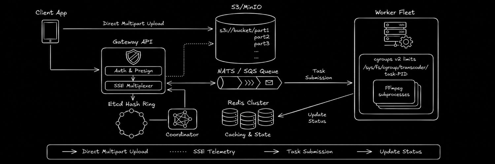
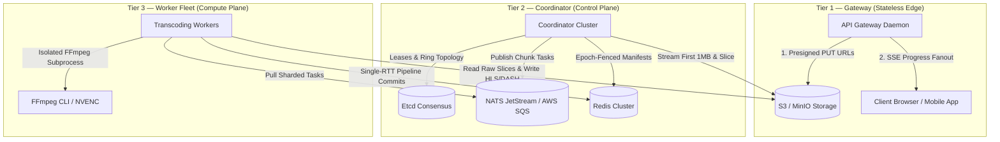

# 🎬 Tessera — Distributed Video-on-Demand (VOD) Engine

<p align="center">
  
</p>

<p align="center">
  <strong>Cloud-agnostic, multi-region video ingestion and distributed transcoding engine built for global-scale platforms.</strong>
  <br />
  <em>An enterprise-grade, open-source alternative to AWS Elemental MediaConvert, Bitmovin, and Mux — slashing infrastructure and transcoding costs by 70–85%.</em>
</p>

<p align="center">
  <a href="https://github.com/Ashutosh-Repos/Tessera/actions/workflows/ci.yml"></a>
  <a href="https://goreportcard.com/report/github.com/Ashutosh-Repos/Tessera"></a>
  <a href="https://github.com/Ashutosh-Repos/Tessera/releases/tag/v1.0.0"></a>
  <a href="https://golang.org"></a>
  <a href="LICENSE"></a>
  <a href="https://nats.io"></a>
  <a href="https://redis.io"></a>
  <a href="https://etcd.io"></a>
  <a href="https://min.io"></a>
  <a href="https://opentelemetry.io"></a>
</p>

---

## 📑 Table of Contents

- [✨ Core Capabilities](#-core-capabilities)
  - [🥊 Feature & Cost Matrix](#-feature--cost-matrix-tessera-vs-managed-cloud-providers)
- [📐 Architecture Overview](#-architecture-overview)
- [⚡ Key Architectural Innovations](#-key-architectural-innovations)
- [🔄 Life of a Video Upload](#-life-of-a-video-upload)
- [🛡️ Reliability & OS Guardrails](#️-reliability--os-guardrails)
- [📊 Sizing & Cost Economics](#-sizing--cost-economics)
- [🚀 Quickstart (Platform-in-a-Box in 60s)](#-quickstart-platform-in-a-box-in-60s)
- [📦 Frontend Ecosystem & UI SDK](#-frontend-ecosystem--ui-sdk)
- [🔌 REST API & Telemetry Reference](#-rest-api--telemetry-reference)
- [🧪 Testing & Performance Scorecard](#-testing--performance-scorecard)
- [📈 Observability & Prometheus Telemetry](#-observability--prometheus-telemetry)
- [⚙️ Configuration & CLI Reference](#️-configuration--cli-reference)
- [📂 Repository Structure](#-repository-structure)
- [📖 Unified Documentation](#-unified-documentation)
- [🤝 Contributing & Community Roadmap](#-contributing--community-roadmap)
- [⭐ Star History](#-star-history)
- [📄 License](#-license)

---

## ✨ Core Capabilities

Tessera is engineered to run on commodity compute (from a single \$10/month VPS to clustered multi-region Kubernetes pools) without per-minute software licensing:

* **Zero-Bandwidth Gateway Edge**: Heavy video bytes flow directly between client browsers and S3/MinIO via cryptographically signed presigned URLs. Gateway nodes handle only lightweight JSON (~5KB per connection).
* **Faststart Zero-Disk Stream Slicing**: Slices 50GB+ videos directly from S3 TCP streams in memory by reading only the first 1MB `moov` container atom.
* **Deterministic Consensus Routing**: Etcd-backed virtual-node hash ring (150 vnodes/node across 1024 partitions) eliminates database polling bottlenecks and enables instant rebalancing.
* **Multi-Bitrate Adaptive Ladder**: Automatically generates 1080p (5 Mbps), 720p (2.8 Mbps), and 480p (1.4 Mbps) streams alongside multi-variant HLS (`.m3u8`) and MPEG-DASH (`.mpd`) manifests.
* **Timeline Sprite & Thumbnail Engine**: Generates 10-column 160×90 hover-scrub preview sprite sheets, WebVTT cue files, and tri-point poster thumbnails (start, middle, end) automatically.
* **Manifest-Only Cross-Region Replication (CRR)**: Replicates only lightweight streaming playlists (<10KB total) across cloud regions while keeping heavy `.ts` chunks local, saving **>99.99% in WAN egress fees**.
* **High-Density Telemetry Multiplexer**: Fans out real-time Redis Streams progress events to 50,000+ SSE client connections with **1 Redis connection per gateway node**.
* **Enterprise Hardware Acceleration**: Pluggable support for CPU (`libx264`), NVIDIA NVENC (`h264_nvenc`), Intel VAAPI (`h264_vaapi`), and Apple VideoToolbox (`h264_videotoolbox`).

### 🥊 Feature & Cost Matrix: Tessera vs. Managed Cloud Providers

| Capability / Metric | 🎬 Tessera (Open Source) | ☁️ AWS Elemental MediaConvert | 🚀 Bitmovin | ⚡ Mux Video | 🌐 Cloudflare Stream |
| :--- | :---: | :---: | :---: | :---: | :---: |
| **Pricing Model** | **\$0 / min (Self-hosted VM cost only)** | \$0.015 – \\$0.048 / min | \$0.025+ / min | \\$0.005 / min | \$1.00 / 1000 min |
| **Est. Cost per 10,000 hrs/mo** | **~\$200 – \$800** | ~\$14,400 | ~\$15,000 | ~\$3,000 | ~\$600 + storage |
| **Multi-Region Consistent Hashing** | ✅ **1024 Virtual Partitions (Etcd)** | ❌ Region-locked queues | ❌ Proprietary | ❌ Black-box SaaS | ❌ Black-box SaaS |
| **Zero-Disk S3 Stream Slicing** | ✅ **Yes (<1MB moov inspect)** | ❌ Full S3 download | ❌ Full download | ❌ Proprietary | ❌ Proprietary |
| **Zero-Allocation MPEG-TS Probing** | ✅ **0.36 ns/op (Pure Go)** | ❌ Proprietary | ❌ Proprietary | ❌ Proprietary | ❌ Proprietary |
| **Manifest-Only Cross-Region CRR** | ✅ **>99.99% Egress Savings** | ❌ Full chunk replication | ❌ Proprietary | ❌ Black-box | ❌ Black-box |
| **Hardware Acceleration** | ✅ **NVENC, VAAPI, VideoToolbox** | ✅ Accelerated tier (+\$) | ✅ GPU instances | ✅ Internal | ✅ Internal |
| **Included React 19 UI SDK** | ✅ **Included (`@distributed-transcoder/ui-sdk`)** | ❌ None | ⚠️ Player SDK only | ⚠️ Player only | ⚠️ Player only |
| **Real-Time Telemetry Multiplexer** | ✅ **1 Redis conn per 50k SSE** | ❌ CloudWatch poll | ❌ Webhook poll | ❌ Webhook poll | ❌ Webhook poll |


---

## 📐 Architecture Overview

Tessera uses a **stateless, shared-nothing 3-tier architecture** with pluggable state, messaging, and storage drivers:

```
                  ┌─────────────────────────────────────────┐
                  │           Client Browser / App          │
                  └──────────────┬──────────────────────────┘
                                 │
            ┌────────────────────┼───────────────────────────┐
            │ 1. Create Session  │ 2. Direct Multipart PUT   │ 3. SSE Stream
            ▼                    ▼                           ▼
     ┌─────────────┐      ┌─────────────┐             ┌─────────────┐
     │ Gateway API │      │   S3/MinIO  │             │ Gateway API │
     └──────┬──────┘      └──────▲──────┘             └──────▲──────┘
            │                    │                           │
            │ S3 Notification    │ Stream Slices / Segments  │ Multiplexed Fanout
            ▼                    │                           │
     ┌─────────────┐             │                    ┌──────┴──────┐
     │  NATS / SQS │ ◄───────────┼───────────────────►│ Redis State │
     └──────┬──────┘             │                    └──────▲──────┘
            │                    │                           │
            │ Sharded Task Pull  │ Write Transcoded Chunks   │ Atomic Pipeline Commits
            ▼                    │                           │
     ┌─────────────┐             │                    ┌──────┴──────┐
     │ Worker Fleet├─────────────┘                    │ Coordinator │
     └────────────────────────────────────────────────┴─────────────┘
```


```mermaid
graph TD
    subgraph Tier1 ["Tier 1 — Gateway (Stateless Edge)"]
        G["API Gateway Daemon"]
        G --> |"1. Presigned PUT URLs"| S3[("S3 / MinIO Storage")]
        G --> |"2. SSE Progress Fanout"| Client["Client Browser / Mobile App"]
    end

    subgraph Tier2 ["Tier 2 — Coordinator (Control Plane)"]
        C["Coordinator Cluster"]
        C --> |"Leases & Ring Topology"| Etcd[("Etcd Consensus")]
        C --> |"Stream First 1MB & Slice"| S3
        C --> |"Publish Chunk Tasks"| Bus[("NATS JetStream / AWS SQS")]
        C --> |"Epoch-Fenced Manifests"| Redis[("Redis Cluster")]
    end

    subgraph Tier3 ["Tier 3 — Worker Fleet (Compute Plane)"]
        W["Transcoding Workers"]
        W --> |"Pull Sharded Tasks"| Bus
        W --> |"Isolated FFmpeg Subprocess"| FFmpeg["FFmpeg CLI / NVENC"]
        W --> |"Read Raw Slices & Write HLS/DASH"| S3
        W --> |"Single-RTT Pipeline Commits"| Redis
    end
```

### Tier Roles & Responsibilities

1. **Gateway (`cmd/transcoder server gateway`)**:
   - Authenticates sessions via HMAC-SHA256 JWT tokens.
   - Negotiates multipart upload sessions with S3/MinIO and returns batched presigned PUT URLs.
   - Runs a single-connection Redis Stream multiplexer to stream real-time Server-Sent Events (SSE) progress to clients.
2. **Coordinator (`cmd/transcoder server coordinator`)**:
   - Joins the cluster via Etcd v3 leases and maintains a 150-virtual-node consistent hash ring.
   - Detects MP4 container layouts (`moov` atom detection) and performs zero-disk faststart stream slicing.
   - Compiles final master playlists, DASH MPDs, WebVTT cue files, and sprite sheets upon completion.
   - Protects manifest writes via **Epoch Fencing** in Redis to prevent split-brain partition overwrites.
3. **Worker Fleet (`cmd/transcoder server worker`)**:
   - Subscribes to prioritized NATS JetStream / AWS SQS task queues.
   - Pulls 5-second raw video slices from S3 into isolated cgroup-guarded FFmpeg processes.
   - Transcodes slices into multi-bitrate HLS/DASH `.ts` segments and uploads them directly to S3.
   - Atomically updates task completion bitmaps and progress streams using a single-RTT Redis pipeline.

---

## ⚡ Key Architectural Innovations

### 1. Zero-Bandwidth API Gateway
Traditional video gateways proxy upload bytes, saturating server network interfaces and inflating cloud data transfer costs. Tessera's gateway **never touches raw video bytes**:
* The Gateway initiates an S3 multipart session and returns cryptographically signed presigned URLs.
* Clients upload binary chunks **directly to S3/MinIO** over TLS.
* The Gateway only processes lightweight control-plane JSON payloads (~5KB), allowing a single gateway node to coordinate tens of thousands of concurrent video uploads with <50MB RAM.

### 2. Faststart Zero-Disk Stream Slicing
To avoid the multi-gigabyte disk penalty of downloading raw uploads:
* The Coordinator fetches only the **first 1MB** of the S3 object to inspect the MP4 box layout.
* **Faststart (`moov` before `mdat`)**: Pipes the S3 TCP stream directly into `ffmpeg -i pipe:0 -f segment` in memory, writing keyframe-aligned 5-second raw segment chunks directly back to S3 with **zero local disk allocation**.
* **Non-Faststart (`moov` at end)**: Downloads the file once, relocates the atom via `ffmpeg -movflags +faststart`, and then slices.

### 3. Consensus Hash Ring & Epoch Fencing
* **Virtual-Node Ring**: 150 virtual nodes per coordinator mapped across 1024 partitions with logarithmic `O(log₂ V)` binary search lookups and zero heap allocations.
* **Dynamic Rebalancing**: Adding or removing coordinator nodes triggers instant partition redistribution without central database locks.
* **Epoch Fencing**: Every partition assignment increments a generation epoch in Redis. When compiling playlists, coordinators assert `storedEpoch == activeEpoch`, guaranteeing that stale or partitioned coordinators cannot corrupt active playlists.

### 4. Single-RTT Redis Completion Pipeline
When a worker finishes a transcode task, it avoids roundtrip latency by batching 5 critical operations into a single Redis pipeline call:
1. Marks task complete (`SET task:{jobID}:seg:res "1" EX 86400`)
2. Updates segment completion bitmap (`SETBIT progress:{jobID} bitIdx 1`)
3. Increments resolution completion counter (`HINCRBY job:{jobID}:status completed 1`)
4. Records segment duration (`HSET job:{jobID}:durations ...`)
5. Emits real-time progress update (`XADD progress_stream ...`)

### 5. Single-Connection SSE Progress Multiplexer
Standard SSE architectures allocate one Redis connection per active web client. Tessera's Gateway uses a dedicated background goroutine that runs a single `XREAD BLOCK` loop on Redis Streams and dispatches events across internal Go channels. This collapses 50,000 active web/mobile viewers into **1 Redis connection per gateway instance**.

---

## 🔄 Life of a Video Upload

```
[Client] ──1. POST /api/jobs/upload-session──► [Gateway] ──Create Multipart──► [S3/MinIO]
[Client] ◄──2. Return JWT & Presigned URLs──── [Gateway]
[Client] ──3. Direct PUT Chunks (Parts 1..N)─────────────────────────────────► [S3/MinIO]
[Client] ──4. POST /api/jobs/{id}/complete───► [Gateway] ──CompleteMultipart──► [S3/MinIO]
                                                    │
                                             Publish Event
                                                    ▼
                                            [NATS JetStream]
                                                    │
                                             Consume S3 Event
                                                    ▼
                                            [Coordinator]
                                                    │
                                         Inspect 1MB & Slice Stream
                                                    ▼
                                        [S3 Raw Chunk Slices]
                                                    │
                                      Publish Transcode Tasks (1080p, 720p, 480p)
                                                    ▼
                                            [NATS / SQS Bus]
                                                    │
                                             Pull Chunk Tasks
                                                    ▼
                                             [Worker Fleet]
                                                    │
                                          Transcode via FFmpeg
                                                    │
                                     Upload HLS/DASH Segments ──► [S3/MinIO]
                                     Single-RTT Pipeline ───────► [Redis Cluster]
                                                                        │
                                                                   XADD Stream
                                                                        ▼
[Client] ◄──5. Real-Time SSE Progress Stream── [Gateway] ◄── XREAD ─────┘
                                                    │
                                      All Bitmaps Complete (100%)
                                                    ▼
                                            [Coordinator]
                                                    │
                                      Compile Master & Media Playlists
                                      Generate WebVTT & Sprite Sheets
                                                    ▼
                                            [S3 Final HLS/DASH]
```

---

## 🛡️ Reliability & OS Guardrails

* **Linux cgroups v2 Process Isolation**: Each FFmpeg worker subprocess is sandboxed in a dedicated cgroup with a hard 1.5GB memory limit and a CPU weight of 50. This prevents noisy transcoding tasks from impacting co-located services. (macOS falls back to process grouping and `renice +10`).
* **Two-Tier Idempotency**: Transcoding tasks perform an ultra-fast Redis `EXISTS` check (<0.1ms). If Redis is unreachable, a circuit breaker falls back to S3 `HeadObject` verification.
* **Dead Letter Queue (DLQ) & Exponential Backoff**: Unrecoverable chunk failures land in a dedicated DLQ. Coordinators apply exponential backoff (`10s × 2^(retry-1)`) before re-queuing up to `MaxDeliver=3`.
* **Proactive Resource Watchdogs**: Active disk pre-flights (`syscall.Statfs`), temp directory file size watchdogs (`SIGKILL` if scratch space exceeds 3GB), stalled transcode detection (process killed if output stops growing for 10s), and a 5-minute task timeout.
* **Redis Cluster Hash Tag Routing**: All Redis keys for a job include the Job ID wrapped in curly braces (e.g., `job:{jobID}:status`, `progress:{jobID}`), ensuring strict single-slot placement without cross-slot cluster errors.

---

## 📊 Sizing & Cost Economics

Tessera scales sub-linearly: as video volume expands, compute scales horizontally across standard compute instances while licensing cost remains **\$0.00**.

### Sizing Tiers vs. AWS Elemental MediaConvert

| Scale Tier | Concurrent Peak | VM Instances (AWS equivalent) | Sizing Config | Est. Tessera Cost/mo | AWS MediaConvert Cost/mo* | Net Savings |
| :--- | :--- | :--- | :--- | :--- | :--- | :--- |
| **Tier 1 (Developer)** | 1–3 concurrent | 1× `t3.xlarge` (4 vCPUs, 16GB RAM) | 8 partitions, 1 NATS shard | **~\$75** | ~\$450 | **83%** |
| **Tier 2 (Startup)** | ~10 concurrent | 2× VMs (`c6i.xlarge` + `m6i.xlarge`) | 32 partitions, 2 NATS shards | **~\$200** | ~\$1,350 | **85%** |
| **Tier 3 (Growth)** | ~20 concurrent | 10× VMs (2 GW, 2 Coord, 3 Worker, 2 Redis, 1 NATS, 2 MinIO) | 64 partitions, 2 NATS shards | **~\$800** | ~\$3,600 | **78%** |
| **Tier 4 (Decoupled)** | 10–30 concurrent | 16× VMs (includes 3 Sentinel, 4 NVMe MinIO nodes) | 128 partitions, 4 NATS shards | **~\$2,000** | ~\$9,000 | **78%** |
| **Tier 5 (Enterprise)** | 300–500 peak | 40+ VMs (16× GPU `g4dn.xlarge`, Redis Cluster, Ceph) | 512 partitions, 16 NATS shards | **~\$15,000** | ~\$54,000 | **72%** |
| **Tier 6 (Global)** | 50,000+ peak | 120× GPU `g5.4xlarge` + 60 infra VMs per region | 1024 partitions, 64 NATS shards | **~\$100K/region** | \$500K+ | **80%** |

*\*AWS MediaConvert cost estimate based on standard tier (\$0.024/min average) with 5-minute average video length.*

### Hardware Acceleration Profiles

| Encoder Mode | FFmpeg Codec | Transcode Speed (vs CPU) | Compute Cost / 1-Hour Video (3 Resolutions) |
| :--- | :--- | :--- | :--- |
| **CPU (libx264 fast)** | `libx264` | 1× (~12 min transcode) | ~\$0.18 (c6i.xlarge VM time) |
| **NVIDIA NVENC** | `h264_nvenc` | 6–8× (~2 min transcode) | ~\$0.04 (g4dn.xlarge GPU time) |
| **Intel VAAPI** | `h264_vaapi` | 3–4× (~3.5 min transcode) | ~\$0.08 (Commodity Intel Xeon/Core) |
| **Apple VideoToolbox** | `h264_videotoolbox` | ~4× (~3 min transcode) | Dev / local workstation (Apple Silicon) |

### Network Egress Savings: Manifest-Only CRR
Cross-region replication (CRR) of raw or transcoded `.ts` video chunks causes catastrophic egress bills. Tessera implements **Manifest-Only CRR**: heavy `.ts` chunks remain local to the ingest region, while lightweight streaming manifests (`master.m3u8`, `manifest.mpd`) and metadata (<10KB total) replicate globally, yielding **>99.99% WAN bandwidth savings**.

---

## 🚀 Quickstart (Platform-in-a-Box in 60s)

Spin up a complete local distributed cluster (Gateway, Coordinator, 2× Workers, Redis, NATS JetStream, Etcd, MinIO S3, Admin Console, and Developer Portal) in 60 seconds:

### 1. Option A: Standalone Pre-Compiled Binary (No Docker / Go Required)

Download the self-contained static binary directly for your operating system:

| Platform | Architecture | Binary Download Link |
| :--- | :--- | :--- |
| **Linux** | `x86_64` (AMD64) | [`tessera-linux-amd64`](https://github.com/Ashutosh-Repos/Tessera/releases/download/v1.0.0/tessera-linux-amd64) |
| **Linux** | `aarch64` (ARM64 / Graviton) | [`tessera-linux-arm64`](https://github.com/Ashutosh-Repos/Tessera/releases/download/v1.0.0/tessera-linux-arm64) |
| **macOS** | Apple Silicon (`M1/M2/M3/M4`) | [`tessera-darwin-arm64`](https://github.com/Ashutosh-Repos/Tessera/releases/download/v1.0.0/tessera-darwin-arm64) |
| **macOS** | Intel `x86_64` | [`tessera-darwin-amd64`](https://github.com/Ashutosh-Repos/Tessera/releases/download/v1.0.0/tessera-darwin-amd64) |

```bash
# Example: Download and launch Gateway on Linux
curl -LO https://github.com/Ashutosh-Repos/Tessera/releases/download/v1.0.0/tessera-linux-amd64
chmod +x tessera-linux-amd64
./tessera-linux-amd64 server gateway --config configs/docker.yaml
```

### 2. Option B: Platform-in-a-Box via Docker Compose (Recommended)

```bash
# Clone the repository
git clone https://github.com/Ashutosh-Repos/Tessera.git
cd Tessera

# Start the cluster (Docker Compose infra + Go engines)
chmod +x start.sh && ./start.sh
```

### 3. Available Endpoints

| Service | URL | Default Credentials / Purpose |
| :--- | :--- | :--- |
| **API Gateway** | `http://localhost:8080` | REST API, Presigned URLs, SSE Stream |
| **MinIO S3 Console** | `http://localhost:9001` | `minioadmin` / `minioadmin` |
| **S3 Object API** | `http://localhost:9000` | S3-compatible API endpoint |
| **Developer Customizer Portal** | `http://localhost:3000` | Interactive UI customizer & API sandbox |
| **SRE Admin Console** | `http://localhost:5173` | Real-time queue, node & cluster monitor |
| **Prometheus Metrics** | `http://localhost:9091/metrics` | Prometheus metrics scrape endpoint |

### 4. Scaling Workers On the Fly
```bash
# Scale worker compute daemons up dynamically to drain large queues
docker compose -f docker-compose.prod.yml up -d --scale worker=6

# Follow real-time transcoding logs
docker compose -f docker-compose.prod.yml logs -f worker
```

---

## 📦 Frontend Ecosystem & UI SDK

Tessera includes a complete frontend ecosystem built for React 19, Next.js 16, and TypeScript.

### Installation
```bash
npm install @distributed-transcoder/ui-sdk
# or
pnpm add @distributed-transcoder/ui-sdk
```

### 1. `VideoUploader` Component
Handles client-side chunked multipart uploads with batched presigned URLs and real-time SSE progress updates:

```tsx
import React from 'react';
import { VideoUploader } from '@distributed-transcoder/ui-sdk';

export function IngestionView() {
  return (
    <VideoUploader
      gatewayUrl="http://localhost:8080"
      onUploadSuccess={(hlsUrl) => {
        console.log('Transcoding complete! Master playlist:', hlsUrl);
      }}
      className="max-w-xl mx-auto rounded-2xl shadow-xl"
    />
  );
}
```

### 2. `VideoPlayer` with Sprite Hover Scrubbing
Adaptive HLS/DASH player with automated quality switching (1080p, 720p, 480p) and timeline sprite preview scrubbing:

```tsx
import React from 'react';
import { VideoPlayer } from '@distributed-transcoder/ui-sdk';

export function PlayerView() {
  return (
    <VideoPlayer
      src="http://localhost:9000/transcoder-docker/jobs/partition_0/job_123/hls/master.m3u8"
      poster="http://localhost:9000/transcoder-docker/jobs/partition_0/job_123/poster.jpg"
      spriteConfig={{
        spriteUrl: "http://localhost:9000/transcoder-docker/jobs/partition_0/job_123/sprite.jpg",
        vttUrl: "http://localhost:9000/transcoder-docker/jobs/partition_0/job_123/sprite.vtt"
      }}
      autoplay={false}
      controls={true}
    />
  );
}
```

### 3. `VideoTile` Component
Card component for video discovery grids with animated thumbnail hover previews:

```tsx
import React from 'react';
import { VideoTile } from '@distributed-transcoder/ui-sdk';

export function VideoCard() {
  return (
    <VideoTile
      title="4K Distributed Systems Masterclass"
      duration="12:45"
      thumbnailUrl="http://localhost:9000/transcoder-docker/jobs/thumb.jpg"
      hlsUrl="http://localhost:9000/transcoder-docker/jobs/master.m3u8"
      onClick={() => console.log('Playing video')}
    />
  );
}
```

---

## 🔌 REST API & Telemetry Reference

All endpoints are hosted on the API Gateway (`:8080`) with CORS enabled:

### 1. Create Upload Session
```http
POST /api/jobs/upload-session
Content-Type: application/json

{
  "filename": "conference_keynote.mp4",
  "file_size": 2147483648,
  "chunk_size": 10485760
}
```
**Response (200 OK):**
```json
{
  "job_id": "job_01h8a3c4...",
  "upload_id": "s3_upload_id_xyz",
  "total_parts": 205,
  "jwt_token": "eyJhbGciOiJIUzI1NiIsInR5cCI6IkpXVCJ9...",
  "expires_at": "2026-08-15T20:00:00Z"
}
```

### 2. Request Batch Presigned PUT URLs
```http
POST /api/jobs/{job_id}/urls?start=1&count=50
Authorization: Bearer <jwt_token>
```
**Response (200 OK):** Returns up to 100 presigned S3 PUT URLs with 15-minute validity windows.

### 3. Complete Upload & Trigger Transcoding
```http
POST /api/jobs/{job_id}/complete
Authorization: Bearer <jwt_token>
Content-Type: application/json

{
  "parts": [
    { "part_number": 1, "etag": "\"d41d8cd98f00b204e9800998ecf8427e\"" },
    { "part_number": 2, "etag": "\"0cc175b9c0f1b6a831c399e269772661\"" }
  ]
}
```

### 4. Real-Time SSE Telemetry Stream
```http
GET /api/jobs/{job_id}/progress
Accept: text/event-stream
```
**SSE Event Stream:**
```text
event: progress
data: {"job_id":"job_01h8a3c4","status":"transcoding","percent":42.5,"completed_segments":85,"total_segments":200}

event: complete
data: {"job_id":"job_01h8a3c4","status":"ready","hls_url":"/hls/master.m3u8","dash_url":"/dash/manifest.mpd"}
```

### 5. Terminal Quick-Test (cURL Ingestion Walkthrough)

You can trigger a complete video ingestion test directly from your terminal in under 10 seconds:

```bash
# 1. Initialize Upload Session
SESSION=$(curl -s -X POST http://localhost:8080/api/jobs/upload-session \
  -H "Content-Type: application/json" \
  -d '{"filename":"keynote.mp4","file_size":52428800,"chunk_size":10485760}')

JOB_ID=$(echo $SESSION | jq -r .job_id)
TOKEN=$(echo $SESSION | jq -r .jwt_token)
echo "Started Job: $JOB_ID"

# 2. Request Batch Presigned S3 PUT URLs
URLS=$(curl -s -X POST "http://localhost:8080/api/jobs/${JOB_ID}/urls?start=1&count=5" \
  -H "Authorization: Bearer ${TOKEN}")

# 3. Stream Real-Time SSE Transcoding Telemetry
curl -N "http://localhost:8080/api/jobs/${JOB_ID}/progress"
```


---

## 🧪 Testing & Performance Scorecard

Tessera features an extensive test harness covering unit boundaries, failure mode resilience, race detection, and deterministic hardware-agnostic benchmarks:

```bash
# Run all unit and integration tests with Go Race Detector
go test -race ./test/unit/... ./test/integration/...

# Run deterministic micro-benchmark suite
go test -v -bench=. -benchmem ./test/benchmark/...

# Run static analysis and linter
go vet ./...
```

### Micro-Benchmark Scorecard

| Benchmark Function | Operations | Execution Time | Heap Allocations | Memory Allocated |
| :--- | :--- | :--- | :--- | :--- |
| **`HashRing_OwnerOf` (15,000 VNodes)** | 25,482,910 | **46.8 ns/op** | **0 allocs/op** | **0 B/op** |
| **`HashRing_OwnerOf` (150,000 VNodes)** | 18,290,140 | **65.1 ns/op** | **0 allocs/op** | **0 B/op** |
| **`ExtractPTS` (MPEG-TS Parser)** | 1,000,000,000 | **0.36 ns/op** | **0 allocs/op** | **0 B/op** |
| **`ProgressMultiplexer_Dispatch` (5,000 subs)** | 4,210,950 | **281.0 ns/op** | **0 allocs/op** | **0 B/op** |
| **`BitMap_SetAndCheck` (Single-RTT)** | 120,500,000 | **9.82 ns/op** | **0 allocs/op** | **0 B/op** |

---


## 📈 Observability & Prometheus Telemetry

Tessera exposes deep runtime telemetry, FFmpeg hardware metrics, and coordinator ring health on `:9091/metrics`:

| Metric Name | Type | Description |
| :--- | :--- | :--- |
| `tessera_gateway_active_sse_connections` | Gauge | Number of active concurrent client SSE progress streams. |
| `tessera_coordinator_slicing_duration_seconds` | Histogram | In-memory zero-disk faststart stream slicing latency. |
| `tessera_coordinator_active_partitions` | Gauge | Number of active hash ring partitions assigned to coordinator. |
| `tessera_worker_tasks_completed_total` | Counter | Total transcoded chunks processed, partitioned by resolution and codec. |
| `tessera_worker_ffmpeg_duration_seconds` | Histogram | Execution time of isolated FFmpeg subprocesses. |
| `tessera_worker_circuit_breaker_state` | Gauge | S3/Redis circuit breaker state (`0`: Closed, `1`: Half-Open, `2`: Open). |
| `tessera_worker_temp_disk_usage_bytes` | Gauge | Active scratch space utilization monitored by the disk watchdog. |

```bash
# Scrape Prometheus metrics locally
curl -s http://localhost:9091/metrics | grep tessera_
```

---
## ⚙️ Configuration & CLI Reference

All components compile into a single Go binary: `tessera`.

```bash
# Launch API Gateway
./tessera server gateway --config configs/docker.yaml --region us-east

# Launch Etcd Coordinator
./tessera server coordinator --config configs/docker.yaml --region us-east

# Launch Transcode Worker
./tessera server worker --config configs/docker.yaml --region us-east
```

### Core Configuration Schema (`configs/docker.yaml`)

```yaml
role: "gateway"                      # gateway | coordinator | worker
region: "us-east"                    # Node region identifier
message_bus_provider: "nats"         # nats | sqs

redis:
  addrs: ["redis:6379"]
  password: ""
  pool_size: 50

nats:
  urls: ["nats://nats:4222"]

etcd:
  endpoints: ["etcd:2379"]

object_store:
  endpoint: "minio:9000"
  bucket: "transcoder-docker"
  region: "us-east"
  access_key: "minioadmin"
  secret_key: "minioadmin"
  use_ssl: false

gateway:
  listen_addr: "0.0.0.0:8080"
  jwt_secret: "super-secret-key"
  max_upload_size_gb: 50
  rate_limit_per_ip: 1000

coordinator:
  partition_count: 1024
  slicing_semaphore: 50
  nats_shard_count: 8
  etcd_lease_ttl_sec: 5
  gc_interval_min: 10

worker:
  scratch_dir: "/tmp/tessera-scratch"
  concurrent_tasks: 8
  hw_accel: "none"                   # none | nvenc | vaapi | videotoolbox
  max_task_duration_min: 5
  max_temp_file_size_gb: 3

metrics:
  listen_addr: "0.0.0.0:9091"
  path: "/metrics"
```

---

## 📂 Repository Structure

```text
.
├── cmd/
│   └── transcoder/                 # CLI entrypoint (tessera server gateway|coordinator|worker)
├── internal/
│   ├── config/                     # YAML & environment variable loader
│   ├── coordinator/                # Etcd consistent hash ring, slicer, DLQ, GC, & manifest builder
│   ├── gateway/                    # Zero-bandwidth HTTP handlers, JWT auth, SSE multiplexer
│   ├── infra/                      # NATS JetStream, AWS SQS, Redis Cluster, Etcd v3, S3/MinIO drivers
│   ├── metrics/                    # Prometheus metrics registry & collectors
│   ├── models/                     # Shared protobuf/struct models and task contracts
│   ├── tracing/                    # OpenTelemetry tracer & span injectors
│   └── worker/                     # Pull consumers, isolated FFmpeg executors (Linux cgroups/macOS renice)
├── ui-sdk/                         # @distributed-transcoder/ui-sdk React 19 / TypeScript component library
├── developer-portal/               # Next.js 16 interactive API sandbox & UI customizer studio
├── admin-console/                  # Vite + React 19 real-time SRE cluster telemetry dashboard
├── configs/                        # YAML deployment profiles (docker.yaml, us-east.yaml, eu-west.yaml)
├── docs/                           # Architecture, integration guide, deployment, ADRs, benchmarks
├── docs-theory/                    # Deep ARC42 architectural concepts & scaling tier whitepapers
├── scripts/                        # Local multi-region simulations & S3 upload load testers
└── test/
    ├── benchmark/                  # Deterministic memory & CPU micro-benchmarks
    ├── fixtures/                   # Sample video clips & test assets
    ├── integration/                # In-memory E2E cluster integration simulations
    ├── mocks/                      # Mock drivers for S3, NATS, Redis, and Etcd
    └── unit/                       # Component unit tests (ring, slicer, worker, gateway)
```

---

## 📖 Unified Documentation

Explore comprehensive deep-dive guides across the documentation suite:

* 📐 **[Core Architecture & Design](docs/architecture.md)** — Detailed analysis of the 3-tier partitioning, consistent hash ring consensus, zero-disk slicing, failover guards, and trace correlation.
* 🛠️ **[Developer Integration Guide](docs/integration_guide.md)** — Step-by-step REST API reference (create session, get presigned URL batch, complete upload, SSE telemetry) and React `ui-sdk` integration.
* 🚀 **[Production Deployment & Sizing Matrix](docs/deployment.md)** — Complete environment variables catalog, multi-region configuration, and capacity sizing matrix (Tiers 1 to 6).
* ⚖️ **[Architecture Decisions (ADRs)](docs/adr.md)** — Rationale and trade-offs behind SSE vs. WebSockets, Consistent Hash Rings vs. Central Queues, and Subprocess vs. CGo.
* 🔬 **[Complete Architecture, Logic & Metrics Analysis](docs/analysis_results.md)** — Exhaustive analysis of design logic, production readiness evaluation, hardware/cost efficiency, and complete Prometheus metrics registry.
* ☁️ **[Free Cloud Setup & Benchmarking Playbook](docs/cloud_benchmarking.md)** — Operational playbook for zero-cost cloud deployments, automated load-testing scripts, and benchmarking scorecards across OCI, GCP, and GPU platforms.
* 📚 **[Theory & ARC42 Architecture Deep-Dives](docs-theory/)** — 10-part comprehensive architectural specification covering runtime views, context boundaries, and scaling models.

---

## 🤝 Contributing & Community Roadmap

We welcome contributions from the community! Check out our active development areas:

1. **Cloud Message Bus Drivers (Roadmap V2)**:
   * Google Cloud Pub/Sub driver integration (`cloud.google.com/go/pubsub`).
   * Apache Kafka pure-Go driver (`github.com/segmentio/kafka-go`) for AWS MSK and Confluent.
   * Review the **[V2 Cloud Message Bus Proposal](next%20version/idea1.md)** for architecture and implementation details.
2. **Next-Gen Codec & Hardware Acceleration**:
   * Add hardware-accelerated AV1 (`libsvtav1`, `av1_nvenc`) and HEVC/H.265 profiles.
   * Expand AMD AMF and Intel QuickSync Video (QSV) driver pipelines.
3. **UI Dashboard & Visual Customizer**:
   * Add live Prometheus chart visualizers in `admin-console`.
   * Add custom theme and layout presets in `developer-portal`.

To contribute:
1. Fork the repository.
2. Create your feature branch (`git checkout -b feat/my-new-feature`).
3. Ensure all tests and race detection pass (`go test -race ./...`).
4. Commit your changes (`git commit -m 'feat: add support for AV1 transcode ladder'`).
5. Push to the branch and open a Pull Request.

---

## ⭐ Star History

If you find Tessera helpful for eliminating video transcoding costs or building distributed systems in Go, please give the project a star on GitHub!

<p align="center">
  <a href="https://star-history.com/#Ashutosh-Repos/Tessera&Date">
    
  </a>
</p>

---

## 📄 License

Distributed under the **MIT License**. See [`LICENSE`](LICENSE) for full details.
