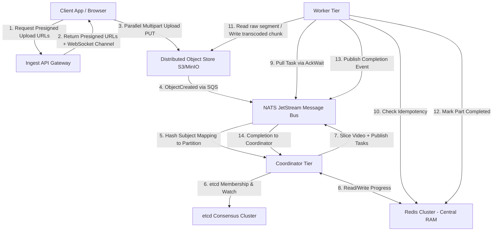

# High-Level Design (HLD): Distributed Video Processing & Adaptive Streaming Engine (HLS + DASH)

> **⚠️ NOTICE**: This document provides a high-level summary. The authoritative, detailed design is in **distributed_transcoder_design_plan.md v3.1**. In case of conflict, that document takes precedence.

This document defines the production-grade High-Level Design for a **100% Decentralized, Shared-Nothing Distributed Video Transcoding and Adaptive Streaming Engine (HLS + DASH)**. The system is designed to scale horizontally to support **50 Million users** (500K concurrent uploads, 10M concurrent viewers, 150M+ concurrent segment tasks) without the write-buffer saturation, replication lag, or lock contention bottlenecks typical of centralized SQL databases.

---

## 1. System Overview & Architecture Topology

The system uses a **Shared-Nothing (SN) Architecture** with **Role-Weighted Tiered Nodes**. There is no central relational database. Instead:
* **S3/Object Store** serves as the persistent state registry and single source of truth for job and task completion.
* **Redis Cluster** serves as the centralized in-memory acceleration layer (progress bitmaps, idempotency cache, real-time status).
* **NATS JetStream** manages durable, sharded task queues, event dispatch, and task claiming via `AckWait`.
* **etcd** handles coordinator registration and slicing locks only (no per-task leases).
* **Tiered Coordinators** run concurrently, sharding job ownership via a consistent hash ring.

### 1.1 Core Architecture Diagram



---

## 2. Component Specifications

### 2.1 Ingest API Gateway (Tier 1)
* **Responsibilities**: Generates presigned S3 upload URLs for multipart assembly, assigns a `Job_UUID`, writes a `job_manifest.json` file directly to S3, issues JWT-authenticated WebSocket progress channels.
* **State Management**: Stateless. Progress forwarding via Redis Streams (`XREAD BLOCK`).
* **Instance**: c6gn.xlarge (4 vCPU, 16 GB RAM, high network). ~100 nodes at peak.

### 2.2 Distributed Object Store (S3/MinIO)
* **Responsibilities**: Stores raw video files, sliced segments, intermediate transcoded `.ts` chunks, manifest files, and completion sentinels.
* **Role as State Registry**: The presence of objects in deterministic paths in S3 is the absolute source of truth for job completion.
  * Manifest Path: `jobs/partition_{id}/job_{uuid}/job_manifest.json`
  * Chunk Output Path: `jobs/partition_{id}/job_{uuid}/transcoded/segment_{index}_{resolution}.ts`
  * Completion File Path: `jobs/partition_{id}/job_{uuid}/job_completed.json`

### 2.3 Coordinator Tier (Tier 2 — Control Plane)
* **Responsibilities**: Segment raw inputs into GOP-aligned slices, publish transcoding tasks to sharded NATS queues, track chunk completion via Redis bitmaps, compile HLS (`.m3u8`) and DASH (`.mpd`) manifests, monitor DLQ for failed tasks.
* **Sharding Model**: 1024 virtual partition slots mapped via Consistent Hash Ring to coordinators registered in `etcd`.
* **State Management**: Progress stored in **Redis Cluster bitmaps** (`SETBIT`/`BITCOUNT`), not local RAM. On partition adoption, coordinators reconstruct state from Redis (<50ms) or fall back to S3 scanning (5-30s).
* **Instance**: r6g.2xlarge (8 vCPU, 64 GB RAM). ~50 nodes at peak.

### 2.4 NATS JetStream Cluster (Event Bus)
* **Responsibilities**: Transmits and persists task requests, completion events, and S3 upload notifications.
* **Task Claiming**: Uses built-in `AckWait = 30s` for per-task mutual exclusion. No etcd per-task leases.
* **Sharded Queues**: `transcode-tasks.shard.{0-3}` with priority levels (high/normal/low) and DLQ (`MaxDeliver = 3`).
* **Native Subject Mapping**: Maps global upload events to partition-scoped coordinator topics:
  ```
  s3-raw-uploads.job.*  ->  job-uploads.partition.{{hash(1024, 1)}}.job.{{1}}
  ```
* **Durability**: Uses Raft-replicated write-ahead logs (WAL) to ensure messages survive broker crashes.

### 2.5 Worker Tier (Tier 3 — Transcode Plane)
* **Responsibilities**: Pull tasks from sharded NATS queues, execute isolated FFmpeg subprocesses with strict resource limits, upload outputs, mark completion in Redis, and ACK tasks in NATS.
* **Concurrency Protection**: Uses **NATS JetStream `AckWait`** (30s) for task claiming. If a worker crashes before ACKing, NATS automatically redelivers the task. Workers send `msg.InProgress()` heartbeats every 10s during active transcoding to extend the deadline for large segments.
* **Instance**: g5.xlarge (NVIDIA T4, 4 vCPU, 16 GB VRAM). ~10,000 nodes at peak.

### 2.6 Redis Cluster (Central RAM — State Cache)
* **Responsibilities**: Job progress bitmaps, task completion flags (idempotency), manifest cache, real-time job status, segment durations, and progress streams for WebSocket delivery.
* **Not source of truth** — S3 remains durable. Redis is a cache. If it fails, workers fall back to S3 `HeadObject`.
* **Topology**: 3 shards × 2 (master+replica) = 6 nodes per region. 32 GB memory, 3M+ ops/sec.

---

## 3. Distributed Data Flow & Protocols

### 3.1 Resumable Ingestion & Video Slicing
```
+------------+             +-------------+             +------------+             +-----+
| Client App |             | Ingest Gate |             | S3 Bucket  |             |NATS |
+-----+------+             +------+------+             +-----+------+             +--+--+
      |                           |                          |                       |
      | 1. POST /upload-session   |                          |                       |
      |-------------------------->|                          |                       |
      |                           | 2. CreateMultipartUpload |                       |
      |                           |------------------------->|                       |
      |                           | 3. Presigned PUT URLs    |                       |
      |                           |<-------------------------|                       |
      | 4. Return PUT URLs +      |                          |                       |
      |    wss:// progress channel|                          |                       |
      |<--------------------------|                          |                       |
      |                           |                          |                       |
      | 5. Parallel PUT 50MB parts                           |                       |
      |----------------------------------------------------->|                       |
      |                                                      |                       |
      | 6. CompleteMultipartUpload                           |                       |
      |----------------------------------------------------->|                       |
      |                                                      |                       |
      |                                                      | 7. ObjectCreated Event|
      |                                                      |---------------------->|
```

1. **Upload Initiation**: The client initiates an upload with the gateway. The gateway initiates an S3 Multipart Upload session and returns a **long-lived JWT session token (24h expiry)**.
2. **Just-In-Time URL Batching**: To prevent presigned URLs from expiring during massive 4K video uploads over slow connections, the client uses the JWT to fetch small batches of presigned PUT URLs just-in-time.
3. **Partition Mapping**: NATS hashes the `Job_UUID` (FNV-1a mod 1024) to route the event to the coordinator owning that partition.
4. **GOP-Aligned Stream Slicing**:
   * **Event Deduplication**: SQS provides *at-least-once* delivery. To prevent sequential duplicate slicing, the coordinator performs an atomic Redis deduplication check: `SETNX upload:event:{job_uuid} 1 EX 86400`. If it returns 0, the event is silently dropped.
   * The owner coordinator streams the raw file from S3.
   * It runs FFmpeg in stream-copy mode (`-c copy`) to segment the video at **I-frame (keyframe) boundaries**.
   * Segment files are written directly back to S3: `jobs/partition_{id}/job_{uuid}/raw/chunk_%03d.mp4`.

---

### 3.2 Slicing Concurrency Control (etcd Lock)
To prevent two coordinators from slicing the same raw input due to network partitions or flapping ring memberships:
* Coordinators must acquire an exclusive `etcd` transaction-backed lock at `/locks/slicing/{job_uuid}` before starting slicing.
* The lock is bound to a 10-second TTL lease, renewed every 3 seconds.
* If a coordinator fails to maintain the lock, it immediately halts the stream copy.
* Each coordinator limits concurrent slicing to **50 parallel jobs** (semaphore) to prevent slicing backlogs during peak upload bursts.

---

### 3.3 Task Dispatch, Idempotency, & Execution

```
+-------------+            +------+            +-------------+            +-------+
| Coordinator |            | NATS |            | Worker Node |            | Redis |
+------+------+            +--+---+            +------+------+            +---+---+
       |                      |                       |                       |
       | 1. Publish Tasks     |                       |                       |
       |  (sharded stream)    |                       |                       |
       |--------------------->|                       |                       |
       |                      | 2. Pull Task          |                       |
       |                      |  (AckWait: 30s)       |                       |
       |                      |<----------------------|                       |
       |                      |                       |                       |
       |                      |                       | 3. EXISTS task:*      |
       |                      |                       |---------------------->|
       |                      |                       | 4. HIT → ACK skip    |
       |                      |                       |    MISS → S3 HEAD     |
       |                      |                       |<----------------------|
       |                      |                       |                       |
       |                      |                       | 5. Transcode & Upload |
       |                      |                       |---> S3                |
       |                      |                       |                       |
       |                      |                       | 6. SET task:* +       |
       |                      |                       |    SETBIT progress +  |
       |                      |                       |    HSET duration      |
       |                      |                       |---------------------->|
       |                      | 7. ACK task     <-----|                       |
       |                      | 8. Completion   <-----|                       |
       | 9. BITCOUNT check <--|                       |                       |
```

1. **Dispatch**: The coordinator publishes transcoding segment tasks to sharded NATS JetStream queues (`transcode-tasks.shard.{0-3}`) with priority levels. Coordinators use **NATS JetStream Async Publishing** (`js.PublishAsync`) to dispatch all tasks in parallel, reducing publish time from ~300ms to <10ms.
2. **Task Claiming via NATS AckWait**: A worker pulls a task. NATS marks it as in-flight with `AckWait = 30s`. If the worker crashes or doesn't ACK, NATS automatically redelivers. After `MaxDeliver = 3` failures, the task routes to the Dead Letter Queue.
3. **Two-Tier Idempotency Check (Redis → S3 Fallback)**:
   * **Fast Path**: `EXISTS task:{job_uuid}:{segment}:{resolution}` in Redis (<0.1ms). If key exists → ACK and skip.
   * **Slow Path**: If Redis returns MISS or is unreachable, fall back to S3 `HeadObject` (~5-10ms).
4. **Execution & Resource Fencing**:
   * If the file is missing, the worker streams the slice from S3, launches a local FFmpeg subprocess, and transcodes the chunk.
   * In production, the worker constrains the FFmpeg process using cgroups v2 (`memory.max = 1.5G` and `cpu.weight`).
5. **Completion Write Path**: The worker writes the output to S3, executes a Redis pipeline (SET + SETBIT + HINCRBY + HSET duration + XADD progress stream), and ACKs the NATS task. To prevent fatal `CROSSSLOT` pipeline errors in the Redis Cluster, all keys MUST include the job UUID as a **Hash Tag** (e.g., `task:{uuid}:{seg}`).

---

### 3.4 Manifest Compilation (Stitching — HLS + DASH)
To protect S3 from write IOPS bottlenecking, coordinators **never** write manifests during segment processing. 
* Completion tracking is stored in **Redis progress bitmaps** (`BITCOUNT job:{uuid}:progress`). No local RAM state to lose on crash.
* When `BITCOUNT` equals the total task count:
  1. **Consistency Barrier**: Wait 1 second, then verify last segment via S3 `HeadObject`.
  2. Read segment durations from Redis `HGETALL job:{uuid}:durations`.
  3. Compile HLS master + media playlists (`.m3u8`) **and** DASH MPD (`.mpd`).
  4. Write all manifests to S3 in a single batch `PutObject`.
  5. Write `job_completed.json` sentinel.
  6. Push `COMPLETED` event to client via WebSocket.

---

## 4. Fault Tolerance, Resilience, & Fencing

### 4.1 Chronological Self-Fencing Timeline
To prevent split-brain conditions where partitioned coordinators overwrite each other's state:

```
Timeline of a Network Partition:
T = 0s ----------------------- Coordinator A loses network connectivity to etcd.
T = 1.5s --------------------- Coordinator A fails its first etcd lease keep-alive refresh.
T = 3.0s (SELF-FENCE) -------- Coordinator A fails to refresh within the 3s safety threshold.
                               It immediately terminates its NATS consumers.
                               (No state flush needed — progress lives in Redis, not local RAM.)
T = 5.0s (LEASE EXPIRES) ----- Coordinator A's lease in etcd expires.
                               etcd deletes "/registry/coordinators/coord_A".
T = 5.0s --------------------- All 49 surviving coordinators receive deletion event via etcd watch.
                               The Consistent Hash Ring is recalculated. Only the specifically assigned
                               nodes (e.g., Coordinator B) begin their 10-second flapping grace period.
                               Other nodes safely ignore the event (preventing a Thundering Herd).
T = 15.0s (TAKEOVER) --------- The flapping grace period ends.
                               Coordinator B safely adopts the partitions via Redis fast path.
```

By ensuring that the partitioned coordinator self-fences at $T = 3\text{s}$ and the adopting coordinator does not start state reconstruction until $T = 15\text{s}$, we guarantee a **12-second safety buffer** where no concurrent execution can occur.

---

### 4.2 Worker Watchdog & Self-Fencing
If a compute worker experiences severe CPU starvation or network isolation:
1. The worker runs a watchdog on a dedicated OS thread locked via `runtime.LockOSThread()`.
2. The watchdog monitors FFmpeg output file size every 10 seconds. If no progress (bytes written) in 10s:
   * The watchdog issues a `SIGKILL` to the running `ffmpeg` subprocess.
   * NATS `AckWait` expires after 30s, and the task is automatically redelivered.
3. **Parent Death Signal**: On Linux, `Pdeathsig = SIGKILL` ensures FFmpeg dies if the worker crashes. On macOS, a PID-polling watchdog checks `os.Getppid()` every second.
4. **NTP Clock Drift Safety**: All nodes must run an NTP daemon (`chronyd`). Furthermore, all watchdogs and internal Go timers strictly use `time.Since()` (monotonic clocks) to prevent false-positives caused by wall-clock drift.

---

### 4.3 Coordinator Shard Adoption & State Reconstruction
When Coordinator B adopts a partition, it reconstructs state using a **three-tier fallback** strategy:

#### Tier 1: Redis Fast Path (<50ms)
```go
func (s *ShardAdoptionDaemon) ReconstructPartitionState(ctx context.Context, partitionID int) error {
    // 1. Try Redis fast path first
    activeJobs, err := s.Redis.SMembers(ctx, fmt.Sprintf("partition:%d:active_jobs", partitionID))
    if err == nil && len(activeJobs) > 0 {
        for _, jobID := range activeJobs {
            status, _ := s.Redis.HGetAll(ctx, fmt.Sprintf("job:%s:status", jobID))
            manifest, _ := s.Redis.Get(ctx, fmt.Sprintf("job:%s:manifest", jobID))
            s.ActiveJobs[jobID] = &JobProgress{
                JobID:     jobID,
                State:     status["state"],
                Completed: parseInt(status["completed"]),
                Total:     parseInt(status["total"]),
                Manifest:  manifest,
            }
        }
        _, err = s.NatsCli.BindConsumer(ctx, partitionID)
        return err // Done — full state recovered in <50ms
    }

    // 2. Fall through to S3 reconstruction if Redis is unavailable
    return s.reconstructFromS3(ctx, partitionID)
}

func (s *ShardAdoptionDaemon) reconstructFromS3(ctx context.Context, partitionID int) error {
    jobDirs, err := s.S3Cli.ListObjectsPrefix(ctx, fmt.Sprintf("jobs/partition_%d/", partitionID))
    if err != nil {
        return err
    }
    for _, dir := range jobDirs {
        jobID := extractJobID(dir)
        if s.isJobCompleted(ctx, jobID, partitionID) {
            continue
        }
        manifestBytes, err := s.S3Cli.DownloadFile(ctx,
            fmt.Sprintf("jobs/partition_%d/job_%s/job_manifest.json", partitionID, jobID))
        if err != nil {
            continue
        }
        transcodedChunks, _ := s.S3Cli.ListObjectsPrefix(ctx,
            fmt.Sprintf("jobs/partition_%d/job_%s/transcoded/", partitionID, jobID))
        progress := &JobProgress{JobID: jobID, CompletedSegments: make(map[string]bool)}
        for _, chunkPath := range transcodedChunks {
            progress.CompletedSegments[extractChunkKey(chunkPath)] = true
        }
        s.ActiveJobs[jobID] = progress
        // Rebuild Redis state from S3 for future fast failovers
        s.Redis.SAdd(ctx, fmt.Sprintf("partition:%d:active_jobs", partitionID), jobID)
    }
    _, err = s.NatsCli.BindConsumer(ctx, partitionID)
    return err
}
```

### 4.4 Worker Local SSD Disk Fencing & Scratch Watchdog
Compute workers perform disk-heavy operations: downloading raw slices, running FFmpeg, and writing temp files. To prevent local SSD starvation:
1. **Disk Quota Fencing**: Before starting a task, the worker checks available disk space on `/tmp/scratch` using `syscall.Statfs`. If free capacity is below **10GB**, it rejects the task (re-queuing in NATS) and initiates self-fencing.
2. **Scratch Watchdog**: A background thread tracks temp files. If a task exceeds 5 minutes or a temp file exceeds **3GB**, the watchdog kills the FFmpeg process group and cleans up.

### 4.5 Tiered Node Degraded State & Graceful Drain Protocol
In the role-weighted tiered model, failures are isolated by role — a worker crash never affects ingestion or coordination.

#### 4.5.1 Degraded State Self-Fencing
If a sub-daemon crashes while the host node remains online:
1. A local **Go Sentinel Thread** detects the sub-process failure.
2. It immediately deletes the node's registration key `/registry/coordinators/{node_id}` in `etcd`.
3. This triggers other coordinators to adopt the partitions. The sentinel thread restarts the unhealthy sub-daemon.

#### 4.5.2 Graceful Drain & Scale-In Protocol
During rolling updates or cluster scale-in:
1. **Ingress Drain**: Disable `/health` → LB stops routing new uploads.
2. **Coordinator Offload**: Stop consuming NATS partition messages. Delete `/registry/coordinators/{node_id}` from etcd. (No state flush needed — progress lives in Redis.)
3. **Worker Compute Drain**: Stop pulling new NATS tasks. Complete in-flight FFmpeg transcodes (up to 5 minutes to accommodate large 4K software encodes). Upload results, ACK tasks.
4. **Timeout (5 minutes)**: Kill remaining FFmpeg processes. NATS makes unACKed tasks visible to other workers. Exit process.

---

## 5. System Scalability & Sizing Estimation

### 5.1 Storage IOPS and API Call Optimization
With **500K concurrent jobs** and an average of 300 transcoding tasks per job:
* **Naïve S3 Design (ListObjects per task)**: 150M tasks × `ListObjectsV2` = $750/day.
* **Optimized Design (HeadObject)**: 150M × `HeadObject` = $60/day (92% reduction).
* **With Redis Cache**: Redis `EXISTS` handles 99%+ of idempotency checks. Only ~1.5M S3 HEAD calls/day = $0.60/day (99.9% reduction).

### 5.2 Tiered Fleet Sizing (50M Users)

| Tier | Nodes | Instance | Monthly Cost |
| :--- | :--- | :--- | :--- |
| **Gateway** | 100 | c6gn.xlarge | ~$12.4K |
| **Coordinator** | 50 | r6g.2xlarge | ~$14.6K |
| **Worker** | 10,000 | g5.xlarge | ~$7.37M |
| **Redis** | 18 | r6g.xlarge | ~$6.6K |
| **etcd** | 15 | m6g.large | ~$2.7K |
| **NATS** | 15 | c6g.xlarge | ~$3.8K |
| **S3 Storage** | — | 16.5 PB/month | ~$380K |
| **CDN Egress** | — | 50 Tbps peak | ~$2-5M (committed) |
| **TOTAL** | **10,198** | | **~$10-12M/month** |

### 5.3 Network & Throughput Calculations
For 500K concurrent transcoding jobs with 10MB segments (5s duration):
* Processing bandwidth: $500\text{K} \times 10\text{MB} / 5\text{s} = 1\text{ TB/s}$ aggregate.
* CDN egress: $10\text{M} \times 5\text{ Mbps} = 50\text{ Tbps}$.

---

## 6. Multi-Region Geo-Distributed Extension

### 6.1 Regional Ingestion & Processing Pipeline
1. **Geo-DNS Routing**: Clients are routed to the physically closest regional API Gateway.
2. **Local Landing Zone**: Raw videos are uploaded, sliced, and transcoded within local regional S3 Buckets.
3. **Region-Scoped Job Partitioning**: `Job_UUID` prefixed with regional code (e.g. `us-east-1:uuid`). Only local coordinators adopt.

### 6.2 Coordination & WAN Mitigation Protocols
| Concern | Solution |
| :--- | :--- |
| **Consensus (etcd)** | Isolated regional clusters. No cross-region Raft replication. |
| **Messaging (NATS)** | Regional clusters connected via NATS Leaf Nodes. Task dispatch is region-local. |
| **State (Redis)** | Fully independent regional clusters. Reconstructable from S3. |
| **Manifest Replication** | Final HLS/DASH manifests replicated via S3 CRR. |
| **Segment Delivery** | CDN edge nodes cache `.ts` segments on first miss from origin regional bucket. |
| **Region Failover** | New uploads route to secondary region. CDN cache serves existing content. |
