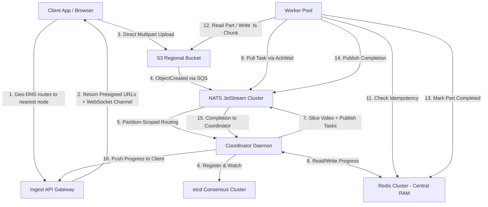

# Architecture Design: Distributed Video Processing & Adaptive Streaming Engine (HLS + DASH)

**Version**: 3.1 — Audit-Hardened Shared-Nothing Architecture  
**Scale Target**: 50 Million Users (500K concurrent uploads, 10M concurrent viewers)  
**Language**: Go · **Encoding**: FFmpeg / Hardware VPU · **State**: S3 · **Coordination**: etcd · **Messaging**: NATS JetStream

---

## 1. Architectural Philosophy & Scale Model

### 1.1 Traffic Model: 50 Million Users

| Metric | Value | Derivation |
| :--- | :--- | :--- |
| **Total Registered Users** | 50,000,000 | Business target |
| **Daily Active Users (DAU)** | 25,000,000 | 50% DAU ratio |
| **Peak Concurrent Viewers** | 10,000,000 | 40% of DAU during peak hours |
| **Daily Uploads** | 500,000 | 1% of DAU uploads a video per day |
| **Peak Concurrent Uploads** | 50,000 | 10% of daily uploaders active simultaneously |
| **Peak Concurrent Transcoding Jobs** | 500,000 | Upload queue depth + processing backlog |
| **Tasks per Job** | 300 | 100 segments × 3 resolutions (1080p, 720p, 480p) |
| **Peak Concurrent Segment Tasks** | 150,000,000 | 500K jobs × 300 tasks |
| **CDN Egress (Peak)** | 50 Tbps | 10M viewers × 5 Mbps avg bitrate |

### 1.2 Design Principles

At the scale of 50M users and 150M concurrent segment tasks, centralized relational databases suffer write-buffer saturation, row-lock contention, and replication lag. This architecture eliminates all centralized databases by adopting a **Shared-Nothing (SN)** model:

| Principle | Implementation |
| :--- | :--- |
| **Database-Less State** | No PostgreSQL, no SQL transactions. S3 object existence is the single source of truth. |
| **Role-Weighted Tiered Topology** | Single Go binary with `--role=gateway|coordinator|worker`. Each tier scales independently on right-sized hardware. |
| **Partition-Scoped Ownership** | 1024 virtual partitions mapped via Consistent Hash Ring. Each coordinator owns disjoint partitions. |
| **Lease-Based Mutual Exclusion** | `etcd` ephemeral leases for coordinator registration and slicing locks. NATS `AckWait` for per-task claiming. |
| **Write-Once Manifests** | HLS playlists (`.m3u8`) and DASH MPDs (`.mpd`) are compiled in RAM and written to S3 exactly once on job completion. |
| **Geo-Distributed Processing** | Video processing occurs in the region closest to the uploader. Only manifests replicate globally. |

---

## 2. System Architecture

### 2.1 End-to-End User Flow

When a user uploads a video, this is what happens:

```
 ┌──────────────────────────────────────────────────────────────────────────────┐
 │                     USER UPLOADS VIDEO                                       │
 └────────────────────────────┬─────────────────────────────────────────────────┘
                              │
                              ▼
                    ┌───────────────────┐
                    │   Geo-DNS / CDN   │  Routes to the nearest available
                    │  (Anycast + BGP)  │  processing region
                    └────────┬──────────┘
                             │
                             ▼
 ┌───────────────────────────────────────────────────────────────────────────────┐
 │                    GEO-NEAREST PROCESSING NODE                                │
 │                                                                               │
 │  ┌─────────────────────────┐                                                  │
 │  │ ① INGEST GATEWAY        │  Receives the upload, generates presigned S3     │
 │  │   ─ Accept Upload       │  URLs, writes job_manifest.json, opens a         │
 │  │   ─ Presigned S3 URLs   │  WebSocket channel for real-time progress.       │
 │  │   ─ WebSocket Progress  │                                                  │
 │  └───────────┬─────────────┘                                                  │
 │              │ raw video lands in S3 → S3 event → NATS                        │
 │              ▼                                                                │
 │  ┌─────────────────────────┐                                                  │
 │  │ ② COORDINATOR           │  Owns this job's partition. Streams raw from     │
 │  │   ─ Slice Video (GOP)   │  S3, slices into small GOP-aligned parts,        │
 │  │   ─ Dispatch Tasks      │  publishes each part as a transcode task to      │
 │  │   ─ Track Progress      │  NATS, tracks completion in Redis bitmaps.       │
 │  │   ─ Compile Manifests   │                                                  │
 │  └───────────┬─────────────┘                                                  │
 │              │ publishes N tasks (1 per part × resolution)                     │
 │              ▼                                                                │
 │  ┌─────────────────────────┐                                                  │
 │  │ ③ WORKER POOL (×W)      │  Workers pull tasks from NATS in parallel.       │
 │  │   ─ Pull Task from NATS │  Each worker transcodes ONE part at ONE          │
 │  │   ─ AckWait (30s lease) │  resolution. All parts transcode in parallel     │
 │  │   ─ FFmpeg Transcode    │  across all available workers in the node        │
 │  │   ─ Upload .ts to S3    │  (and across other nodes in the region).         │
 │  │   ─ Mark Done in Redis  │                                                  │
 │  └───────────┬─────────────┘                                                  │
 │              │ all parts completed                                            │
 │              ▼                                                                │
 │  ┌─────────────────────────┐                                                  │
 │  │ ④ COORDINATOR (cont.)   │  Detects 100% completion via Redis BITCOUNT.     │
 │  │   ─ Compile .m3u8 (HLS) │  Arranges all transcoded parts in correct order, │
 │  │   ─ Compile .mpd (DASH) │  generates master + media playlists for HLS      │
 │  │   ─ Write to S3         │  and/or DASH, writes to S3, pushes final         │
 │  │   ─ Notify Client       │  progress update to client via WebSocket.        │
 │  └─────────────────────────┘                                                  │
 │                                                                               │
 └───────────────────────────────────────────────────────────────────────────────┘
```

### 2.2 Role-Weighted Tiered Node Architecture

The system ships as a **single Go binary** with a `--role` flag. Each role activates a different subset of daemons. All three tiers share the same codebase, the same configuration format, and the same health-check interface — the only difference is which daemons are active and what hardware they run on.

```
──────────────────────────────────────────────────────────────────────────────────────
Single Binary:  ./transcoder --role=gateway|coordinator|worker
──────────────────────────────────────────────────────────────────────────────────────

┌───────────────────────────┐  ┌───────────────────────────┐  ┌───────────────────────────┐
│ TIER 1: GATEWAY (×100) │  │ TIER 2: COORDINATOR (×50)│  │ TIER 3: WORKER (×10K) │
│                           │  │                           │  │                           │
│ Ingest   [██ ACTIVE ]    │  │ Ingest   [░░ OFF    ]    │  │ Ingest   [░░ OFF    ]    │
│ Coord    [░░ STANDBY]    │  │ Coord    [██ ACTIVE ]    │  │ Coord    [░░ OFF    ]    │
│ Worker   [░░ OFF    ]    │  │ Worker   [▒▒ LIGHT  ]    │  │ Worker   [██ ACTIVE ]    │
│                           │  │                           │  │                           │
│ Instance: c6gn.xlarge    │  │ Instance: r6g.2xlarge    │  │ Instance: g5.xlarge      │
│ (High Network, 4 vCPU,   │  │ (High RAM, 8 vCPU,       │  │ (NVIDIA T4 GPU, 4 vCPU, │
│  no GPU)                  │  │  no GPU)                  │  │  16 GB VRAM)              │
│ ~$0.17/hr                 │  │ ~$0.40/hr                 │  │ ~$1.01/hr                 │
└───────────────────────────┘  └───────────────────────────┘  └───────────────────────────┘
         │                              │                              │
         ▼                              ▼                              ▼
  [ Geo-DNS + LB ]               [ etcd Cluster ]            [ NATS JetStream ]
  (Route to nearest              (50-node Coord Ring)        (Regional Task Bus)
   gateway node)
                                        │
                             ┌──────────┴──────────┐
                             ▼                     ▼
                 [ Redis Cluster ]      [ S3 Regional Bucket ]
                 (Central RAM /          (Persistent Source of Truth)
                  Progress Cache)
```

#### Why Tiered?

At 50M users the load is deeply asymmetric:

| Role | Actual Need | If Symmetric (10K nodes) | Waste |
| :--- | :--- | :--- | :--- |
| Ingest | ~100 nodes | 10,000 ingest gateways | 99% |
| Coordinator | ~50 nodes | 10,000 coordinators + 10K etcd watchers | 99.5% |
| Worker | ~10,000 nodes | 10,000 workers | 0% ✔ |

Tiered nodes eliminate this waste. Each tier scales independently:
* **Upload spike?** Scale gateway tier from 100 → 200. Workers unaffected.
* **Transcode backlog?** Scale worker tier from 10K → 15K. Coordinators unaffected.
* **More partitions?** Add coordinator nodes. Gateway and workers unaffected.

#### Tier Responsibilities

| Tier | Active Daemons | Hardware Profile | Scaling Trigger |
| :--- | :--- | :--- | :--- |
| **Gateway** | Ingest Gateway (HTTP, WebSocket, Rate Limiter) | High-bandwidth network, 4 vCPU, 16 GB RAM, no GPU | Upload request rate |
| **Coordinator** | Coordinator (Slicer, Manifest Builder, Progress Manager) | High RAM (64 GB), 8 vCPU, fast SSD, no GPU | Active partition count, job queue depth |
| **Worker** | Worker (FFmpeg, VPU, NATS AckWait) | GPU/VPU (NVIDIA T4, Apple M-series), 4–8 vCPU, 16 GB RAM | NATS `transcode-tasks.shard.*` queue depth |

#### Resource Isolation (cgroups v2)
On coordinator nodes that run a light worker sidecar, cgroups prevent starvation:
* **Control Slice** (Coordinator): `cpu.weight = 1000` (high priority), ensures etcd heartbeats and NATS consumers are never delayed.
* **Compute Slice** (Light Worker): `cpu.weight = 100` (low priority), `memory.max = 1.5G`.
* **Parent Death Handling**: On Linux, `Pdeathsig = SIGKILL` ensures FFmpeg dies if the worker crashes. On macOS (Apple Silicon VPU workers), a PID-polling watchdog goroutine checks `os.Getppid()` every second — if parent PID changes to 1 (launchd), FFmpeg is killed.

#### Autoscaling Policies

```
┌──────────────────────────────────────────────────────────────────────────┐
│                      AUTOSCALING ENGINE                                │
│                                                                        │
│  Gateway Tier:                                                         │
│    Metric: HTTP request rate (uploads/sec)                             │
│    Scale-Up:  > 500 uploads/sec/node for 2 min → add nodes            │
│    Scale-Down: < 100 uploads/sec/node for 10 min → drain + remove     │
│    Floor: 20 nodes (always-on for baseline traffic)                    │
│                                                                        │
│  Coordinator Tier:                                                     │
│    Metric: Active jobs per coordinator                                 │
│    Scale-Up:  > 10K active jobs/coordinator for 5 min → add nodes     │
│    Scale-Down: < 2K active jobs/coordinator for 15 min → drain        │
│    Floor: 10 nodes (minimum for partition coverage)                    │
│                                                                        │
│  Worker Tier:                                                          │
│    Metric: NATS transcode-tasks queue depth AND GPU Utilization        │
│    Scale-Up:  > 10K pending tasks for 1 min → add GPU nodes           │
│    Scale-Down: < 1K pending tasks AND < 30% average GPU utilization   │
│                for 10 min → drain + terminate                          │
│    Floor: 100 nodes (always-on for low-latency processing)             │
│    Ceiling: 15K nodes (cost cap)                                       │
└──────────────────────────────────────────────────────────────────────────┘
```

### 2.3 Infrastructure Components



| Component | Role | State |
| :--- | :--- | :--- |
| **Geo-DNS + LB** | Routes user uploads to the nearest available processing node. Latency-based DNS resolution (AWS Route 53, Cloudflare LB). | Stateless |
| **S3 Regional Bucket** | Raw videos, sliced parts, transcoded `.ts` chunks, `job_manifest.json`, `job_completed.json`, final `.m3u8`/`.mpd` manifests | Persistent (Source of Truth) |
| **Redis Cluster** | Job progress bitmaps, task completion flags, manifest cache, idempotency checks, real-time progress for client WebSocket | In-Memory (State Cache) |
| **NATS JetStream** | Regional sharded task dispatch (`transcode-tasks.shard.{0-3}`), partition-scoped completion events, S3 upload notifications via SQS bridge, task claiming via AckWait | Durable (Raft WAL) |
| **etcd Cluster** | Coordinator registry, slicing locks (no per-task leases — NATS AckWait handles task claiming) | Ephemeral (TTL Leases) |
| **FFmpeg / VPU** | Segment transcoding (software `libx264` / hardware `h264_videotoolbox`, `h264_vaapi`, or NVENC) | Stateless |

---

## 3. Distributed State Architecture

### 3.1 S3 Directory Layout (Persistent Source of Truth)

```
s3://bucket/
├── jobs/
│   └── partition_{id}/
│       └── job_{uuid}/
│           ├── job_manifest.json            # Target profiles, segment count, resolutions
│           ├── job_completed.json           # Completion signal (presence = done)
│           ├── raw/
│           │   ├── chunk_000.mp4            # GOP-aligned sliced segments
│           │   ├── chunk_001.mp4
│           │   └── ...
│           └── transcoded/
│               ├── segment_000_1080p.ts     # Transcoded output chunks
│               ├── segment_000_720p.ts
│               ├── segment_001_1080p.ts
│               └── ...
```

> **Note**: `progress_handover.json` is eliminated. Redis Cluster replaces it as the shared progress state layer.

### 3.2 Redis Cluster Key Layout (Central RAM — State Cache)

Redis Cluster serves as the **centralized in-memory acceleration layer**. It is *not* the source of truth — S3 remains durable — but it eliminates expensive S3 state reconstruction on coordinator failover and provides sub-millisecond reads for workers.

#### Why Redis Won't Be a Bottleneck
| Factor | Analysis |
| :--- | :--- |
| **Data Size** | 500K active jobs × ~1KB bitmap = **~500 MB** hot state. Trivially fits in memory. |
| **Throughput** | Redis Cluster with 3 shards (6 nodes) handles **3M+ ops/sec**. Our peak is ~1M ops/sec. |
| **Access Pattern** | Writes are append-only bitmaps (`SETBIT`). Reads are single-key lookups (`GETBIT`, `BITCOUNT`). No cross-key transactions. |
| **Failure Mode** | Redis is a cache. If it goes down, workers fall back to S3 `HeadObject`. Coordinators fall back to S3 directory listing. Zero data loss. |

#### Key Schema
```
# ─── Job Progress Bitmap (1 bit per segment×resolution task) ─────────────────
job:{job_uuid}:progress         → BITMAP   (bit index = segment_index × len(resolutions) + resolution_offset)
                                            SETBIT on task completion, BITCOUNT for progress %

# ─── Job Manifest Cache (avoids repeated S3 downloads) ──────────────────────
job:{job_uuid}:manifest         → STRING   (JSON blob, TTL: 1 hour, refreshed on access)

# ─── Task Completion Flag (sub-ms idempotency check for workers) ────────────
task:{job_uuid}:{segment}:{res} → EXISTS   (SET on completion, TTL: 24 hours)
                                            Workers check EXISTS before S3 HEAD — 100× faster

# ─── Partition → Active Jobs Index (coordinator fast-load) ──────────────────
partition:{id}:active_jobs      → SET      (SADD job_uuid on creation, SREM on completion)

# ─── Real-Time Job Status (API & dashboard queries) ─────────────────────────
job:{job_uuid}:status           → HASH     {state: "TRANSCODING", completed: 187, total: 300,
                                            owner_epoch: 42, partition: 512,
                                            last_updated: 1717523400}

# ─── Segment Durations (for manifest #EXTINF compilation) ────────────────────
job:{job_uuid}:durations        → HASH     {segment_000_1080p: "5.005", segment_001_1080p: "4.998", ...}
                                            Written by workers, read by coordinator for manifest

# ─── Progress Stream (replaces Pub/Sub for reliable delivery) ────────────────
progress:{job_uuid}             → STREAM   (XADD by workers/coordinator, XREAD BLOCK by gateways)
                                            MAXLEN ~1000 to cap memory. Gateway resumes from last ID.

# ─── Rate Limiting (ingest API protection) ──────────────────────────────────
ratelimit:upload:{client_ip}    → STRING   (INCR + EXPIRE, 100 uploads/min per IP)
```

#### Redis Cluster Topology (Per Region)
```
┌─────────────────────────────────────────────────────┐
│              Redis Cluster (3 Shards, 6 Nodes)         │
│                                                     │
│  ┌─────────┐ ┌─────────┐ ┌─────────┐               │
│  │ Master1 │ │ Master2 │ │ Master3 │               │
│  │Slots 0-5│ │Slots 5K-│ │Slots10K-│               │
│  │   461   │ │  10922  │ │  16383  │               │
│  └────┬────┘ └────┬────┘ └────┬────┘               │
│       │           │           │                     │
│  ┌────▼────┐ ┌────▼────┐ ┌────▼────┐               │
│  │Replica1 │ │Replica2 │ │Replica3 │               │
│  └─────────┘ └─────────┘ └─────────┘               │
│                                                     │
│  Total Memory: 32 GB (16 GB usable + 16 GB replica) │
│  Peak Ops: 3M+ ops/sec across shards               │
└─────────────────────────────────────────────────────┘
```

### 3.3 etcd Key Layout (Ephemeral Coordination State)

```
/registry/coordinators/{node_id}                → {"host":"10.0.0.1"}   (Lease TTL: 5s)
/locks/slicing/{job_uuid}                        → coordinator_id        (Lease TTL: 10s)
```

> **Note**: Per-task leases are **NOT** stored in etcd. Task claiming uses NATS JetStream's `AckWait` timeout (30s). If a worker crashes before ACKing, NATS automatically redelivers the task. This keeps etcd key count at ~50 coordinator registrations + ~200 concurrent slicing locks (50 coordinators × 4 concurrent slots), well within etcd's capacity.

### 3.4 NATS Subject Topology

```
# ─── S3 Upload Notifications (via SQS Bridge) ───────────────────────────────
s3-raw-uploads.job.*                                    # S3 → SQS → NATS bridge
  → job-uploads.partition.{{hash(1024,1)}}.job.{{1}}    # Native hash transform to partition

# ─── Transcode Task Queues (Sharded by Partition Range) ──────────────────────
transcode-tasks.shard.0       # Partitions 0–255     (AckWait: 30s, MaxDeliver: 3)
transcode-tasks.shard.1       # Partitions 256–511
transcode-tasks.shard.2       # Partitions 512–767
transcode-tasks.shard.3       # Partitions 768–1023

# ─── Priority Queues (Workers pull high → normal → low) ─────────────────────
transcode-tasks.shard.{N}.priority.high      # Paid users, short videos (<1 min)
transcode-tasks.shard.{N}.priority.normal    # Standard users
transcode-tasks.shard.{N}.priority.low       # Bulk re-encodes, backfill

# ─── Dead Letter Queue (after 3 failed deliveries) ──────────────────────────
transcode-tasks-dlq                          # Poison tasks land here
                                              # Coordinator monitors, marks job FAILED

# ─── Completion Events (Partition-Scoped) ────────────────────────────────────
task-updates.partition.{id}.job.*             # Partition-scoped completion events
```

**CRITICAL**: The Ingest Gateway hashing and NATS `{{hash}}` subject mapping must use the identical algorithm (FNV-1a mod 1024) to ensure consistent partition resolution.

#### Why Sharded Task Queues?
A single `transcode-tasks` subject with 10,000 worker consumers creates massive contention on consumer ACK tracking. Sharding into 4 streams gives 4× the throughput ceiling (~2M tasks/sec aggregate). Workers subscribe to `transcode-tasks.shard.*` — NATS distributes load across streams internally.

> **Dynamic Shard Scaling**: The shard count (4) is derived from `ceil(peak_tasks_per_sec / 250K)`. If throughput grows 2-3×, increase to 8 shards by creating new streams and rebalancing consumer groups. Existing streams continue operating — no migration needed.

#### Dead Letter Queue (DLQ)
If a segment consistently fails (corrupted chunk, unsupported codec, FFmpeg crash loop), NATS redelivers up to `MaxDeliver = 3` times. After 3 failures, the task routes to `transcode-tasks-dlq`. The coordinator monitors the DLQ via a separate consumer, marks the job as `FAILED`, and notifies the client via WebSocket.

#### S3 Event Notification Bridge
S3 Event Notifications have a soft limit of ~1K events/sec/prefix. At peak upload rates, we route events through **S3 → SQS → NATS bridge** instead of direct S3-to-NATS. SQS handles millions of messages/sec with at-least-once delivery. A lightweight bridge daemon polls SQS in batches and publishes to NATS. Events are filtered to trigger only on `CompleteMultipartUpload` (not individual part uploads).

---

## 4. Data Flow & Protocols

### 4.1 Phase 1: Geo-Routed Ingestion

When a user uploads a video, Geo-DNS routes them to the **nearest available processing node**. The ingest gateway on that node handles everything from there.

```
Client                  Geo-DNS           Ingest Gateway           S3 Bucket          NATS
  │                       │                    │                      │                  │
  │ 1. Upload Request ───>│                    │                      │                  │
  │                       │ 2. Resolve nearest │                      │                  │
  │                       │    processing node │                      │                  │
  │ 3. Redirect ──────────│───>│               │                      │                  │
  │                            │               │                      │                  │
  │ 4. POST /upload-session ──>│               │                      │                  │
  │                            │ 5. CreateMultipartUpload             │                  │
  │                            │──────────────────────────────────────>│                  │
  │                            │ 6. Presigned PUT URLs                │                  │
  │ 7. Return URLs + wss://    │<─────────────────────────────────────│                  │
  │    progress channel  <─────│                                      │                  │
  │                            │                                      │                  │
  │ 8. Parallel PUT 50MB parts ──────────────────────────────────────>│                  │
  │ 9. CompleteMultipartUpload ──────────────────────────────────────>│                  │
  │                            │                                      │ 10. ObjectCreated│
  │                            │                                      │─────────────────>│
```

* **Geo-DNS** (Route 53 latency-based, Cloudflare LB, or Anycast BGP) routes the user to the physically closest available processing node.
* Uploads bypass application servers entirely. The `upload-session` returns a **long-lived JWT session token (24h expiry)** instead of fixed presigned URLs. 
* **Just-In-Time URL Batching**: To prevent presigned URLs from expiring during massive 4K video uploads over slow connections, the client uses the JWT to fetch small batches of presigned PUT URLs (e.g., 10 at a time, valid for 15 mins) just-in-time as the upload progresses.
* The `Tus` resumable protocol handles interruptions: the client queries the gateway for the last successful offset and resumes.
* The ingest gateway returns a **WebSocket channel URL** (`wss://node:8080/progress/{job_uuid}?token=eyJ...`) alongside the upload URLs. The `token` is a **signed JWT** (issued during session creation, TTL = job processing time estimate). The gateway validates the JWT before establishing the WebSocket. This prevents unauthorized users from snooping on job progress by guessing UUIDs.

### 4.2 Phase 2: GOP-Aligned Slicing

* **Event Deduplication**: SQS provides *at-least-once* delivery. To prevent sequential duplicate slicing triggers from SQS, the coordinator performs an atomic Redis deduplication check: `SETNX upload:event:{job_uuid} 1 EX 86400`. If it returns 0, the event is silently dropped.

The owner coordinator streams the raw file from S3 and runs FFmpeg in **stream-copy mode** (`-c copy`):
* No decoding or encoding occurs → CPU load is negligible, RAM stays **under 50MB**.
* Segments are cut at **I-frame (keyframe) boundaries** to ensure each chunk is independently decodable.
* Output: `jobs/partition_{id}/job_{uuid}/raw/chunk_%03d.mp4`

#### Slicing Concurrency Lock (etcd)
```
etcd Txn:
  Compare: version("/locks/slicing/{job_uuid}") == 0
  Success: Put "/locks/slicing/{job_uuid}" → coordinator_id (Lease TTL: 10s, renewed every 3s)
  Failure: Abort — another coordinator is already slicing this job
```

#### Slicing Concurrency Limit
Each coordinator limits concurrent slicing operations to **50 parallel jobs** (semaphore). Because `ffmpeg -c copy` consumes <50MB RAM and negligible CPU, 50 parallel slices easily fit within the 64GB RAM budget. This provides 2,500 slicing slots fleet-wide, preventing slicing backlogs during peak upload bursts. If the slicing queue exceeds the threshold, the coordinator emits a `slicing_backlog` metric that triggers coordinator tier autoscaling.

#### Non-Faststart Recovery
If the raw video's `moov` atom is at the end of the file (common with raw camera recordings), stream-based segmenting fails. The coordinator detects this via `ffprobe` and dispatches a `FaststartTask` to run `qt-faststart` before re-attempting slicing.

### 4.3 Phase 3: Distributed Transcoding

```
Coordinator              NATS              Worker                           Redis
  │                        │                  │                                │
  │ 1. Publish Tasks ─────>│                  │                                │
  │   (to sharded stream)  │                  │                                │
  │                        │ 2. Pull Task ────│                                │
  │                        │  (AckWait: 30s)  │                                │
  │                        │                  │                                │
  │                        │                  │ 3. EXISTS task:*               │
  │                        │                  │───────────────────────────────>│
  │                        │                  │ 4. HIT → ACK skip              │
  │                        │                  │    MISS → S3 HEAD (fallback)   │
  │                        │                  │                                │
  │                        │                  │ 5. FFmpeg transcode            │
  │                        │                  │ 6. Upload .ts → S3             │
  │                        │                  │                                │
  │                        │                  │ 7. SET task:* + SETBIT progress│
  │                        │                  │    + HSET duration              │
  │                        │                  │───────────────────────────────>│
  │                        │ 8. ACK task  <───│                                │
  │                        │ 9. Completion <──│                                │
  │ 10. BITCOUNT check <───│                  │                                │
  │                        │                  │                                │
  │ 11. If 100%: barrier   │                  │                                │
  │     + compile manifests│                  │                                │
```

#### NATS Async Task Batching
A single job produces up to 300 segment tasks. To prevent network round-trip latency when publishing these to NATS, coordinators use **NATS JetStream Async Publishing** (`js.PublishAsync`), dispatching all 300 tasks in parallel and waiting on the futures. This reduces publish time from ~300ms to <10ms.

#### Task Claiming via NATS AckWait (No etcd Leases)

Task mutual exclusion uses **NATS JetStream's built-in `AckWait`** instead of etcd per-task leases. This eliminates 500K concurrent etcd leases:

```
Worker pulls task from NATS:
  ─ NATS marks task as "in-flight" with AckWait = 30s
  ─ Worker sends msg.InProgress() every 10s during active transcoding
    (resets the AckWait deadline — prevents timeout on large segments)
  ─ If worker ACKs within deadline → task is done
  ─ If worker crashes / doesn't send InProgress or ACK → NATS redelivers after 30s
  ─ After MaxDeliver = 3 failures → task routes to DLQ
```

> **Why `msg.InProgress()`?** The initial AckWait of 30s is sufficient for typical 5s segments (~2-5s transcode). But large 4K segments with software fallback (`libx264`) can take 60-120 seconds. Rather than setting a high global AckWait (which delays crash detection), workers heartbeat via `msg.InProgress()` to extend the deadline only when actively making progress. If the watchdog detects FFmpeg stall (no output bytes in 10s), it kills FFmpeg and stops sending `InProgress()` — the task times out and redelivers.

> **Why not etcd?** At 500K concurrent tasks, etcd would need 500K active leases with 10s keep-alive renewals = 50K RPCs/sec. etcd handles ~10-30K writes/sec. Using NATS AckWait keeps etcd key count at ~50 coordinator registrations + ~200 concurrent slicing locks.

#### Two-Tier Idempotency Check (Redis → S3 Fallback)
Before transcoding, the worker executes a **Redis-first idempotency check**:

1. **Fast Path (Redis)**: `EXISTS task:{job_uuid}:{segment}:{resolution}` — returns in **< 0.1ms**.
   * If the key exists → task is already completed → ACK and skip.
2. **Slow Path (S3 Fallback)**: If Redis returns MISS *or* Redis is unreachable, the worker falls back to a targeted `S3 HeadObject` on the output path — returns in **~5-10ms**.
   * If the S3 object exists → ACK and skip.
   * If missing → proceed with transcoding.

This two-tier check eliminates **99%+ of S3 HeadObject calls** during normal operation, further reducing API costs.

> **Circuit Breaker for Redis Failure**: If Redis is unreachable, all 10K workers simultaneously falling back to S3 HEAD would create a thundering herd (~25M S3 API calls in 10s). Workers implement a **circuit breaker**: after 3 consecutive Redis failures within 5s, the circuit opens and workers apply exponential backoff with jitter (100ms → 200ms → 400ms → max 5s) before S3 fallback. This spreads S3 load over 30-60 seconds instead of an instant spike.

#### Completion Write Path (Redis + NATS)
After a successful transcode and S3 upload, the worker executes a Redis pipeline (batched, single RTT):
```
PIPELINE:
  SET    task:{job_uuid}:{segment}:{resolution} "1" EX 86400
  SETBIT job:{job_uuid}:progress <bit_index> 1
  HINCRBY job:{job_uuid}:status completed 1
  HSET   job:{job_uuid}:status last_updated <unix_timestamp>
  HSET   job:{job_uuid}:durations {segment}_{resolution} {duration_seconds}
  XADD   progress:{job_uuid} MAXLEN ~1000 * phase TRANSCODING completed {N} total {T}
EXEC
```

> **PIPELINE Atomicity Note**: Redis `PIPELINE` batches commands for a single network RTT but is not transactional (no rollback). Each command executes atomically in order — `HINCRBY` is safe under concurrency (atomic increment). `HSET last_updated` is best-effort (last writer wins, acceptable for GC timestamps). No `MULTI/EXEC` needed because fields are independent.

> **XADD Throttling**: The `XADD` to the progress stream fires on every task completion (300 per job). At 500K concurrent jobs this is manageable (~150M total entries, distributed across Redis shards by UUID hash). If progress stream write volume becomes a concern, workers can throttle XADD to every 10th completion or every 5 seconds, whichever comes first. The `HINCRBY` still updates on every completion for accurate `BITCOUNT`.

The `durations` hash stores exact segment durations (e.g., `segment_000_1080p` → `5.005`) so the coordinator can compile `#EXTINF` tags without needing to `ffprobe` each `.ts` file from S3.

The coordinator then receives the NATS completion event and calls `BITCOUNT job:{job_uuid}:progress` to check if all tasks are done — a single O(1) operation instead of scanning S3 directories.

#### Speculative Double-Commit Prevention
Workers write outputs to worker-specific temporary paths (`/transcoded/segment_42_1080p_{worker_id}.ts`). Only the worker that has the active NATS in-flight claim (AckWait window) executes the final `CopyObject` to the canonical path, then deletes the temporary file. If two workers race (due to redelivery), the idempotency check prevents duplicate writes.

#### Hardware VPU Acceleration
In production, FFmpeg delegates to hardware encoders to reduce CPU utilization from 99% to under 5%:
* **Apple Silicon**: `-c:v h264_videotoolbox`
* **Linux VAAPI**: `-hwaccel vaapi -c:v h264_vaapi`
* **NVIDIA**: `-hwaccel cuda -c:v h264_nvenc`

#### Audio-Video Drift Prevention
Workers preserve Presentation Timestamps via `-copyts` and align keyframes across resolutions via `-force_key_frames "expr:gte(t,0)"`. Audio is transcoded exactly once as a contiguous AAC track.

### 4.4 Phase 4: Manifest Compilation (HLS + DASH)

The coordinator is responsible for arranging all transcoded parts into the correct order and compiling the final playback manifests. Coordinators **never** write manifests during active transcoding — this prevents S3 write IOPS bottlenecks at scale.

* Completion tracking is stored in **Redis progress bitmaps** (`BITCOUNT job:{uuid}:progress`). No local RAM state to lose on crash.
* When `BITCOUNT` equals the total task count (all parts × all resolutions complete), the coordinator:

#### Manifest Generation
```
Coordinator detects: BITCOUNT job:{uuid}:progress == total_tasks (e.g., 300)
         │
         ├─ 0. CONSISTENCY BARRIER: Wait 1 second for S3 eventual consistency.
         │    Then verify last segment exists via HeadObject (< 50ms).
         │    This prevents manifest compilation from reading a 404 on the
         │    last uploaded .ts file due to S3 cross-AZ replication lag.
         │
         ├─ 1. Read segment durations from Redis: HGETALL job:{uuid}:durations
         │    (Written by workers during completion — no ffprobe needed)
         │
         ├─ 2. Generate HLS Master Playlist (master.m3u8)
         │     ├─ #EXT-X-STREAM-INF: 1080p, 720p, 480p variant streams
         │     ├─ Media Playlist per resolution (1080p.m3u8, 720p.m3u8, 480p.m3u8)
         │     └─ Each media playlist lists segments in order:
         │         #EXTINF:5.005,
         │         segment_000_1080p.ts
         │         segment_001_1080p.ts
         │         ...
         │
         ├─ 3. Generate DASH MPD (manifest.mpd)
         │     ├─ <AdaptationSet> per resolution with SegmentTemplate
         │     └─ <Representation> with bandwidth, width, height
         │
         ├─ 4. Write all manifests to S3 (single batch PutObject)
         │
         ├─ 5. Write job_completed.json sentinel to S3
         │
         └─ 6. Push final "COMPLETED" event to client via WebSocket
              + Set Redis keys to expire via TTL (24h)
```

* Both **HLS** (`.m3u8` — Apple/Safari/most players) and **DASH** (`.mpd` — Android/Chrome/Smart TVs) are generated so playback works on all devices.
* A `job_completed.json` sentinel file is written to S3 to mark the job as globally finished.

### 4.5 Phase 5: Real-Time Progress Updates to Client

The coordinator pushes live progress updates to the client throughout the entire pipeline. The client sees the job move through each phase:

```
Client (WebSocket)              Ingest Gateway              Coordinator         Redis
  │                                  │                          │                 │
  │ wss://node/progress/{uuid}?token │                          │                 │
  │─────────────────────────────────>│                          │                 │
  │                                  │ 1. Validate JWT          │                 │
  │                                  │ 2. HGETALL job:{uuid}:   │                 │
  │                                  │    status (snapshot)     │                 │
  │                                  │──────────────────────────────────────────>│
  │ ◄── snapshot: current state   │                          │                 │
  │                                  │ 3. XREAD BLOCK           │                 │
  │                                  │    progress:{uuid}       │                 │
  │                                  │    (Redis Stream)        │                 │
  │                                  │──────────────────────────────────────────>│
  │                                  │                          │                 │
  │   ◄── {phase:"UPLOADING", pct:45}│                          │                 │
  │   ◄── {phase:"SLICING", pct:0}   │                          │                 │
  │   ◄── {phase:"TRANSCODING",      │                          │                 │
  │        completed:42, total:300,  │                          │                 │
  │        pct:14}                   │                          │                 │
  │   ◄── {phase:"TRANSCODING",      │                          │                 │
  │        completed:299, total:300, │                          │                 │
  │        pct:99}                   │                          │                 │
  │   ◄── {phase:"COMPILING", pct:0} │                          │                 │
  │   ◄── {phase:"COMPLETED",        │                          │                 │
  │        hls_url:"...",            │                          │                 │
  │        dash_url:"..."}           │                          │                 │
```

#### Progress Architecture
| Layer | Mechanism |
| :--- | :--- |
| **Worker → Redis** | On each part completion: `SETBIT` + `HINCRBY` + `XADD progress:{uuid}`.<br> *(Note: Keys must use **Hash Tags** e.g., `job:{uuid}:status` to prevent Redis Cluster CROSSSLOT errors during pipelines).* |
| **Coordinator → Redis** | `XADD` phase transitions (SLICING → TRANSCODING → COMPILING → COMPLETED) |
| **Redis → Ingest Gateway** | `XREAD BLOCK` on Redis Stream `progress:{uuid}`. Streams persist messages with IDs — if the gateway reconnects, it resumes from its last-seen ID with zero message loss. |
| **Gateway → Client** | WebSocket (preferred) or SSE (fallback) forwards updates to the browser/app |
| **Polling Fallback** | `GET /api/jobs/{uuid}/status` reads from Redis `HGETALL job:{uuid}:status` for clients that can't use WebSocket |

#### Stateless WebSocket Reconnection
If the client disconnects and reconnects to a **different gateway** (via Geo-DNS load balancing):
1. New gateway validates the JWT token.
2. Reads current state from Redis `HGETALL job:{uuid}:status` — sends immediate snapshot to client.
3. Subscribes to Redis Stream `progress:{uuid}` via `XREAD BLOCK` with last-seen ID `0` (or the client's last-seen ID if provided in reconnect).
4. Client receives current state + live updates seamlessly. No progress gap.

> **Why Redis Streams instead of Pub/Sub?** Redis `PUBLISH` is fire-and-forget — if a subscriber disconnects for even 1ms, messages are permanently lost. Redis Streams persist messages with IDs and support `XREAD` with resume-from-ID. This guarantees exactly-once progress delivery across gateway failovers. Stream entries auto-expire via `MAXLEN ~1000` to prevent unbounded growth.

> **MAXLEN ~1000 Safety**: If a client disconnects for an extended period, early stream entries may be trimmed. This is safe because reconnection always starts with a `HGETALL` snapshot of current state ([step 2 above](#stateless-websocket-reconnection)). The stream only provides incremental updates *after* the snapshot. Trimmed entries predate the snapshot and carry no information the client doesn't already have.

> **Gateway Stream Multiplexing**: If a gateway has 500 active WebSockets, it does **not** open 500 Redis connections. A single background goroutine per gateway executes `XREAD BLOCK 1000 STREAMS progress:uuid1 progress:uuid2 ...` for all active jobs simultaneously. This multiplexes the updates back to the respective WebSockets via Go channels, reducing Redis connections from 50,000 across the fleet to just ~100.

---

## 5. Fault Tolerance & Resilience

### 5.1 Coordinator Self-Fencing Timeline

```
T = 0.0s ─── Coordinator A loses network connectivity to etcd.
T = 1.5s ─── First etcd lease keep-alive refresh fails.
T = 3.0s ─── SELF-FENCE: Coordinator A terminates NATS consumers.
             (No state flush needed — progress lives in Redis, not local RAM.)
T = 5.0s ─── etcd lease expires. "/registry/coordinators/coord_A" is deleted.
T = 5.0s ─── All surviving coordinators receive deletion event via etcd Watch.
             Ring Recalculation: Fleet locally recalculates the **Consistent Hash Ring** (e.g., Ketama).
             Only the specific mathematically adjacent nodes (e.g., Coordinator B) are newly assigned the orphaned partitions.
             Coordinator B begins 10-second flapping grace period.
T = 15.0s ── TAKEOVER: Coordinator B adopts partitions. (Other nodes ignore the event, preventing a Thundering Herd).
             Reads job list from Redis: SMEMBERS partition:{id}:active_jobs (~1ms).
             Reads each job's progress from Redis: BITCOUNT job:{uuid}:progress (~0.1ms each).
             Total state reconstruction: < 50ms (vs. 5-30s with S3 scanning).
```

**Safety Margin**: 12 seconds of guaranteed silence between self-fence (T=3s) and takeover (T=15s). No concurrent coordinator writes can occur.

**Failover Speed Improvement with Redis**:
| Metric | Without Redis (S3 Only) | With Redis |
| :--- | :--- | :--- |
| State reconstruction latency | 5–30 seconds (S3 ListObjects + downloads) | **< 50 milliseconds** |
| Self-fence flush cost | Write `progress_handover.json` to S3 (~200ms) | **Nothing** (state already in Redis) |
| First task dispatch after takeover | ~35 seconds | **~15.05 seconds** |

#### Epoch Fencing
Coordinators embed their `owner_epoch` into every NATS task update and S3 progress write. During manifest compilation, the coordinator validates its epoch against S3 object tags to prevent stale writes from previously partitioned nodes.

#### Rebalance Storm Mitigation
When a coordinator's `etcd` key is deleted, surviving nodes delay takeover by a **10-second grace period**. If the departed node recovers within this window, the rebalance is cancelled entirely, avoiding unnecessary partition shuffling.

### 5.2 Worker Watchdog & Self-Fencing

```go
// Watchdog runs on a dedicated OS thread to prevent GC/scheduler starvation.
// Monitors FFmpeg output progress — if no bytes written in 10s, kills the process
// and lets the NATS AckWait (30s) expire, triggering task redelivery.
go func() {
    runtime.LockOSThread()
    ticker := time.NewTicker(10 * time.Second)
    defer ticker.Stop()

    var lastOutputSize int64
    for {
        select {
        case <-transcodeCtx.Done():
            return
        case <-ticker.C:
            currentSize := getOutputFileSize(outputPath)
            if currentSize == lastOutputSize {
                // No progress in 10s — FFmpeg is stalled
                _ = ffmpegCmd.Process.Signal(syscall.SIGKILL)
                return  // NATS AckWait will expire, task redelivered
            }
            lastOutputSize = currentSize
        }
    }
}()
```

* **Task Timeout**: Workers must ACK the NATS task within 30 seconds (AckWait). The watchdog monitors FFmpeg progress — if no output bytes are written for 10 seconds, it kills FFmpeg and lets the NATS AckWait expire, triggering redelivery.
* **Self-Fence Trigger**: If FFmpeg hangs or the process stalls, `SIGKILL` is sent to the FFmpeg process group immediately.
* **Parent Death Signal (Linux)**: `cmd.SysProcAttr.Pdeathsig = syscall.SIGKILL` ensures FFmpeg dies if the worker process crashes.
* **Parent Death Signal (macOS)**: A PID-polling watchdog goroutine checks `os.Getppid()` every second. If parent PID changes to 1 (launchd), FFmpeg is killed. This is required because `Pdeathsig` is Linux-only.

### 5.3 Local Disk Fencing & Scratch Watchdog

Before starting a task:
1. **Disk Quota Check**: Worker calls `syscall.Statfs("/tmp/scratch")`. If free space < **10GB**, the task is re-queued to NATS and the worker enters self-fencing.
2. **Runtime Watchdog**: A background thread monitors temp files. If a task exceeds **5 minutes** or a temp file exceeds **3GB**, the watchdog kills the FFmpeg process group and cleans up.

### 5.4 State Reconstruction on Partition Adoption

When a coordinator adopts a new partition, it rebuilds state using a **three-tier fallback** strategy:

#### Tier 1: Redis Fast Path (< 50ms)
1. `SMEMBERS partition:{id}:active_jobs` → list of active job UUIDs.
2. For each job: `HGETALL job:{uuid}:status` → state, completed count, total count.
3. For each job: `GET job:{uuid}:manifest` → cached manifest JSON.
4. Bind NATS durable consumer for the partition.
5. **Done.** Full state recovered in under 50ms.

#### Tier 2: Redis Partial + S3 Backfill (1–5s)
If Redis has the job list but is missing manifests or progress data (e.g., Redis eviction or partial restart):
1. Read active jobs from Redis `SMEMBERS`.
2. For missing manifests: download `job_manifest.json` from S3 and re-cache in Redis.
3. For missing progress: run `BITCOUNT` on the progress bitmap. If bitmap is missing, fall through to Tier 3.

#### Tier 3: Full S3 Reconstruction (5–30s)
If Redis is completely unavailable or empty (cold start / region failover):
1. `ListObjectsV2` on `jobs/partition_{id}/` in S3.
2. Skip completed jobs via `HeadObject` on `job_completed.json`.
3. Download each `job_manifest.json`.
4. List `transcoded/` directory to discover completed chunks.
5. **Rebuild Redis state** from S3 scan results to accelerate future failovers.
6. Bind NATS durable consumer.

### 5.5 Tiered Node Failure Isolation

With tiered architecture, failures are isolated by role — a worker crash never affects ingestion or coordination:

| Failure | Blast Radius | Recovery |
| :--- | :--- | :--- |
| **Gateway node crash** | Upload clients on that node get disconnected. LB routes to other gateways. | Clients reconnect via Geo-DNS. WebSocket progress resumes from Redis state. |
| **Coordinator node crash** | Partitions owned by that coordinator become orphaned. | etcd lease expires (5s) → surviving coordinators adopt partitions (15s). Redis state recovers in < 50ms. |
| **Worker node crash** | In-flight FFmpeg tasks on that worker are lost. | NATS AckWait expires (30s) → tasks automatically redelivered to other workers. Idempotency check (Redis EXISTS / S3 HEAD) prevents duplicate output. |
| **Redis cluster shard crash** | Workers on that shard's keys fall back to S3 HEAD. Coordinators fall back to S3 listing. | Redis replica promotes to master in < 1s. State is reconstructed from S3 if needed. |

Each tier has its own health-check endpoint and its own drain protocol. The sentinel thread per tier handles restarts independently.

### 5.6 Graceful Drain & Rolling Update Protocol

During planned maintenance or scale-in:

```
Signal SIGTERM
  │
  ├─ 1. Ingress Drain ───── Disable /health → LB stops routing new uploads
  │
  ├─ 2. Coordinator ─────── Stop consuming NATS partition messages
  │                          (No flush needed — progress lives in Redis)
  │                          Delete /registry/coordinators/{id} from etcd
  │
  ├─ 3. Worker ──────────── Stop pulling new NATS tasks
  │                          Complete in-flight FFmpeg transcodes (up to 5 minutes to accommodate large 4K software encodes)
  │                          Upload results, ACK tasks
  │
  └─ 4. Timeout (5 min) ─── Kill remaining FFmpeg processes
                             NATS makes unACKed tasks visible to other workers
                             Exit process
```

### 5.7 NATS JetStream Broker Failure

NATS JetStream operates in a **Raft consensus cluster** (3 or 5 nodes). If a broker crashes:
* Remaining nodes elect a new leader in < 1 second.
* Replicated WAL logs recover all unacknowledged tasks.
* Workers that receive redelivered tasks check Redis EXISTS / S3 HEAD for idempotency before re-executing.

### 5.8 Job Garbage Collection (GC)

Failed, abandoned, or timed-out jobs leave orphaned data in S3 and Redis. A **Job GC daemon** runs on the coordinator tier:

```
Job GC Loop (runs every 10 minutes on each coordinator):
  1. SMEMBERS partition:{id}:active_jobs → list of active job UUIDs
  2. For each job:
     a. HGET job:{uuid}:status → check last_updated timestamp
     b. If last_updated > 24 hours ago AND state ≠ COMPLETED:
        → Mark as ABANDONED
        → Delete S3 objects: raw/, transcoded/, job_manifest.json
        → SREM partition:{id}:active_jobs
        → DEL job:{uuid}:progress, job:{uuid}:status, job:{uuid}:manifest
        → Notify client via WebSocket: {phase: "FAILED", reason: "timeout"}
  3. S3 Lifecycle Rule (backup): Delete objects in raw/ older than 7 days.
```

> At 500K uploads/day with 1% failure rate, 5,000 orphaned jobs/day × 500MB = **2.5 TB/day of garbage** without GC. The daemon prevents unbounded S3 growth.

### 5.9 NTP Clock Drift Fencing

At 50M scale, hardware clocks across 10,000 workers will inevitably drift. If a worker's clock is 5 minutes behind, JWTs fail validation and NATS AckWaits behave unpredictably.
* **Infrastructure Requirement**: All nodes must run a strict NTP daemon (`chronyd` with `makestep` limits).
* **Code Requirement**: All internal Go timers, watchdogs, and etcd lease renewals MUST strictly use `time.Since()` (which leverages the OS **monotonic clock**), ignoring wall-clock time completely.

---

## 6. Scalability, Capacity Planning, & Cost Analysis

### 6.1 Tiered Fleet Sizing (50M Users)

#### Tier 1: Gateway Nodes (Upload & Client Communication)

| Resource | Calculation | Fleet Size |
| :--- | :--- | :--- |
| **Gateway Nodes** | 50K peak uploads ÷ 500 connections/node | **100 nodes** |
| **Instance Type** | c6gn.xlarge (high network, 4 vCPU, 16 GB) | |
| **Total vCPUs** | 100 × 4 | **400 vCPUs** |
| **Cost** | 100 × $0.17/hr × 730 hrs/month | **~$12.4K/month** |

#### Tier 2: Coordinator Nodes (Job Management & Manifest Compilation)

| Resource | Calculation | Fleet Size |
| :--- | :--- | :--- |
| **Coordinator Nodes** | 1024 partitions ÷ ~20 partitions/node | **50 nodes** |
| **Instance Type** | r6g.2xlarge (high RAM, 8 vCPU, 64 GB) | |
| **Total vCPUs** | 50 × 8 | **400 vCPUs** |
| **etcd Watchers** | 50 coordinators (vs. 10K in symmetric model) | **50 watchers** |
| **Cost** | 50 × $0.40/hr × 730 hrs/month | **~$14.6K/month** |

#### Tier 3: Worker Nodes (GPU/VPU Transcoding)

| Resource | Calculation | Fleet Size |
| :--- | :--- | :--- |
| **Worker Nodes** | 500K peak concurrent in-flight tasks ÷ 50 concurrent task slots/node | **10,000 nodes** |
| **Instance Type** | g5.xlarge (NVIDIA T4, 4 vCPU, 16 GB VRAM) | |
| **Total GPUs** | 10,000 × 1 T4 | **10,000 GPUs** |
| **Local SSD Scratch** | 10,000 × 500 GB NVMe | **5 PB** |
| **Cost** | 10,000 × $1.01/hr × 730 hrs/month | **~$7.37M/month** |

#### Coordination Infrastructure (Shared)

| Resource | Calculation | Fleet Size |
| :--- | :--- | :--- |
| **Redis Cluster** | 6-node cluster per region (3 masters + 3 replicas) × 3 regions | **18 Redis nodes** |
| **Redis Memory** | 500K jobs × ~1KB state = 500MB active + overhead | **32 GB/cluster** |
| **Redis Ops/sec** | 1M completions + 500K idempotency checks/sec peak | **~1.5M ops/sec** |
| **etcd Cluster** | 5-node Raft cluster per region (3 regions) | **15 etcd nodes** |
| **etcd Watchers** | Only 50 coordinator nodes (not 10K) | **50 watchers** |
| **NATS JetStream** | 5-node Raft cluster per region (3 regions) | **15 NATS nodes** |
| **NATS Message Rate** | 500K task dispatches + 500K completions/sec peak | **~1M msgs/sec** |

#### Storage Plane

| Resource | Calculation | Volume |
| :--- | :--- | :--- |
| **Daily Raw Uploads** | 500K videos × 500 MB avg | **250 TB/day** |
| **Daily Transcoded Output** | 500K × 3 resolutions × 200 MB avg | **300 TB/day** |
| **S3 API Calls (Peak Hour)** | 150M tasks × HeadObject + PutObject | **~300M calls/hour** |
| **Monthly Storage** | (250 + 300) TB/day × 30 days | **~16.5 PB/month** |

#### Delivery Plane (CDN & Viewing)

| Resource | Calculation | Capacity |
| :--- | :--- | :--- |
| **Peak CDN Egress** | 10M concurrent viewers × 5 Mbps | **50 Tbps** |
| **CDN PoPs** | Distributed across 50+ global edge locations | **50+ PoPs** |
| **Origin Shield Bandwidth** | ~5% cache miss rate × 50 Tbps | **2.5 Tbps** |
| **Manifest Reads/sec** | 10M viewers × 1 manifest fetch/10s | **1M reads/sec** |

### 6.2 Total Cost Summary

| Tier | Nodes | Instance | Monthly Cost | % of Total (midpoint ~$11M) |
| :--- | :--- | :--- | :--- | :--- |
| **Gateway** | 100 | c6gn.xlarge | $12,400 | < 0.2% |
| **Coordinator** | 50 | r6g.2xlarge | $14,600 | < 0.2% |
| **Worker** | 10,000 | g5.xlarge | $7,373,000 | ~67% |
| **Redis** | 18 | r6g.xlarge | $6,600 | < 0.1% |
| **etcd** | 15 | m6g.large | $2,700 | < 0.1% |
| **NATS** | 15 | c6g.xlarge | $3,800 | < 0.1% |
| **S3 Storage** | — | 16.5 PB/month | ~$380,000 | ~3.5% |
| **CDN Egress** | — | 50 Tbps peak | ~$2-5M (committed) | ~20-35% |
| **TOTAL** | **10,198** | | **~$10-12M/month** |

> **CDN Cost Note**: 50 Tbps peak egress is ~22.5 PB/hour at peak, translating to hundreds of PB/month. AWS CloudFront metered pricing ($0.02-0.085/GB) would cost $5-15M/month. At this scale, **committed bandwidth pricing** (Cloudflare Enterprise, AWS CloudFront Private Pricing, or Akamai contract) is required, reducing the effective cost to ~$2-5M/month. The exact cost depends on the negotiated contract. |

> **Key Insight**: ~67% of the cost is worker GPU instances. This is why independent worker autoscaling matters — scaling workers down during off-peak hours (50% utilization × 12 hrs) saves **~$3.7M/month**. CDN egress is the second largest cost (20-35%), making origin shield caching and committed bandwidth contracts critical.

### 6.3 S3 API Cost Optimization

| Metric | Naïve Design (ListObjects) | Optimized Design (HeadObject) | With Redis Cache |
| :--- | :--- | :--- | :--- |
| API Call per Task | `ListObjectsV2` | `HeadObject` | Redis `EXISTS` (99% hit) |
| Cost per 1,000 Requests | $0.005 | $0.0004 | ~$0 (in-memory) |
| Daily Calls hitting S3 | 150 Million | 150 Million | ~1.5 Million (1% miss) |
| **Daily Cost** | **$750** | **$60** | **~$0.60** |
| **Monthly Cost** | **$22,500** | **$1,800** | **~$18** |
| **Savings** | — | 92% | **99.9%** |

> **Note on Redis "99% hit"**: The 1% Redis miss rate applies to **retry/failover scenarios** where a task is being redelivered after a worker crash. In steady-state operation, workers check `EXISTS` on fresh (not-yet-completed) tasks and get a MISS, which is expected — they proceed to transcode without calling S3 HEAD at all. The savings come from workers that do find a HIT (task already completed by a previous attempt) skipping the S3 HEAD entirely.

### 6.4 Storage Tiering (S3 Express One Zone)

* **Hot Tier**: S3 Express One Zone for raw segments and intermediate `.ts` chunks. Single-digit millisecond latency. 100,000+ requests/sec per partition.
* **Cold Tier**: Standard S3 for final HLS/DASH playlists and archived source videos.
* **Archive Tier**: S3 Glacier Deep Archive for raw source videos older than 90 days. Retrieval within 12 hours.
* **Latency Reduction**: 10× improvement over standard S3 for `HeadObject` and `PutObject` calls.

### 6.5 Network Throughput Sizing

#### Processing Bandwidth (Ingest + Transcode)
For 500K concurrent transcoding jobs with 10MB segments (5s duration):
$$\text{Processing Bandwidth} = 500\text{K} \times 10\text{MB} / 5\text{s} = 1\text{ TB/s}$$

#### CDN Delivery Bandwidth (Viewing)
For 10M concurrent viewers at adaptive bitrate:
$$\text{CDN Egress} = 10\text{M} \times 5\text{ Mbps} = 50\text{ Tbps}$$

This requires multi-region CDN edge deployments with origin shield caching and SSD-tiered storage backends (AWS S3 Express, Ceph on NVMe, or MinIO on bare-metal).

### 6.6 Per-Region Tiered Capacity (3-Region Deployment)

| Region | Users | Gateways | Coordinators | Workers | CDN Egress |
| :--- | :--- | :--- | :--- | :--- | :--- |
| **US-East** | 20M | 40 | 20 | 4,000 | 20 Tbps |
| **EU-West** | 18M | 36 | 18 | 3,600 | 18 Tbps |
| **APAC** | 12M | 24 | 12 | 2,400 | 12 Tbps |
| **Total** | **50M** | **100** | **50** | **10,000** | **50 Tbps** |

---

## 7. Multi-Region Geo-Distribution

### 7.1 Regional Processing Pipeline

```
              [ Global User Upload ]
                       │
              (Geo-DNS / Anycast BGP)
                       ▼
        ┌──────────────────────────────────────┐
        │         Edge CDN (Cloudfront)        │
        └───────┬──────────────────────┬───────┘
                │                      │
     (Route to US-East)      (Route to EU-West)
                ▼                      ▼
  ┌──────────────────────────┐  ┌──────────────────────────┐
  │    US-East Region PoP    │  │    EU-West Region PoP    │
  │                          │  │                          │
  │  Tier 1: 40 Gateways     │  │  Tier 1: 36 Gateways     │
  │  Tier 2: 20 Coordinators │  │  Tier 2: 18 Coordinators │
  │  Tier 3: 4,000 Workers   │  │  Tier 3: 3,600 Workers   │
  │                          │  │                          │
  │  Local S3 Bucket         │  │  Local S3 Bucket         │
  │  Local Redis Cluster     │  │  Local Redis Cluster     │
  │  Local NATS Leaf         │  │  Local NATS Leaf         │
  │  Local etcd Cluster      │  │  Local etcd Cluster      │
  └────────────┬─────────────┘  └────────────┬─────────────┘
             │                          │
             └─────────────┬────────────┘
                          ▼
             (Async Manifest Replication via S3 CRR)
```

### 7.2 WAN Mitigation Protocols

| Concern | Solution |
| :--- | :--- |
| **Data Gravity** | Raw videos and `.ts` chunks never leave the home region. Only manifests replicate globally. |
| **etcd Latency** | Fully independent regional etcd clusters. Only ~20 coordinators per region (not 4K). |
| **NATS WAN** | Regional NATS clusters connected via Leaf Nodes. Task dispatch is region-local. |
| **Job Isolation** | `Job_UUID` prefixed with region code (`us-east-1:uuid`). Only local coordinators adopt. |
| **CDN Delivery** | Edge nodes cache `.ts` segments on first miss, pulling from the origin regional bucket. Cached segments remain available even during origin region outages. |
| **Redis Isolation** | Fully independent regional Redis Clusters. No cross-region replication. State is reconstructable from regional S3. |
| **Worker Autoscaling** | Worker fleet per region scales independently based on local NATS queue depth. Off-peak hours scale down to floor. |
| **Region Failover** | **New uploads only**: If a region goes offline, DNS routes new uploads to the secondary region. Coordinators execute Tier 3 S3 reconstruction and rebuild Redis from scratch. **Existing content playback** relies on CDN edge caches — segments already cached at PoPs remain available. For origin-level content redundancy, S3 Cross-Region Replication can be enabled for the `transcoded/` prefix at additional storage cost. |

> **RTO/RPO for Region Failover**: RTO for new uploads = ~30 seconds (DNS failover + coordinator bootstrap). RPO for in-flight jobs in the failed region = up to 30 seconds of lost transcoding progress (last NATS AckWait window). Completed content with CDN cache hits has zero downtime.

---

## 8. Observability & Monitoring

### 8.1 Metrics Export (Prometheus)

Each tier exposes a `/metrics` endpoint scraped by a regional Prometheus cluster. Key metrics by tier:

#### Gateway Metrics
| Metric | Type | Alert Threshold |
| :--- | :--- | :--- |
| `gateway_upload_requests_total` | Counter | — |
| `gateway_upload_bytes_total` | Counter | — |
| `gateway_active_websockets` | Gauge | > 5K/node |
| `gateway_presigned_url_latency_ms` | Histogram | p99 > 200ms |
| `gateway_rate_limit_rejections_total` | Counter | > 100/min/node |

#### Coordinator Metrics
| Metric | Type | Alert Threshold |
| :--- | :--- | :--- |
| `coord_active_jobs` | Gauge | > 15K/coordinator |
| `coord_slicing_backlog` | Gauge | > 10 (triggers autoscale) |
| `coord_slicing_duration_seconds` | Histogram | p99 > 30s |
| `coord_manifest_compilation_seconds` | Histogram | p99 > 5s |
| `coord_bitcount_latency_ms` | Histogram | p99 > 5ms |
| `coord_partition_adoptions_total` | Counter | > 5/min (flapping) |
| `coord_dlq_depth` | Gauge | > 100 |
| `coord_gc_orphaned_jobs_total` | Counter | — |

#### Worker Metrics
| Metric | Type | Alert Threshold |
| :--- | :--- | :--- |
| `worker_transcode_duration_seconds` | Histogram | p99 > 60s |
| `worker_ffmpeg_crashes_total` | Counter | > 10/min/node |
| `worker_idempotency_hits_total` | Counter | — |
| `worker_s3_fallback_total` | Counter | > 100/min (Redis issue) |
| `worker_circuit_breaker_open` | Gauge | 1 = alert |
| `worker_disk_free_bytes` | Gauge | < 10 GB |
| `worker_nats_inflight_tasks` | Gauge | — |
| `worker_gpu_utilization_pct` | Gauge | < 20% (over-provisioned) |

#### Infrastructure Metrics
| Metric | Type | Alert Threshold |
| :--- | :--- | :--- |
| `redis_ops_per_sec` | Gauge | > 2.5M (approaching 3M cap) |
| `redis_memory_used_bytes` | Gauge | > 80% of max |
| `nats_consumer_pending_count` | Gauge | > 1M (backlog) |
| `nats_redelivery_count` | Counter | > 10K/min (crash loop) |
| `etcd_leader_changes_total` | Counter | > 1/hour |
| `s3_request_latency_ms` | Histogram | p99 > 100ms |

### 8.2 Distributed Tracing (OpenTelemetry)

Every job carries a `trace_id` (derived from `Job_UUID`) that propagates across all components:

```
Span Hierarchy:
  gateway.upload_session (trace_id = job_uuid)
    ├── gateway.presigned_url_generation
    ├── coordinator.slicing (partition_id, segment_count)
    │   ├── coordinator.etcd_lock_acquire
    │   └── coordinator.ffmpeg_segment
    ├── coordinator.task_dispatch (task_count = 300)
    ├── worker.transcode (segment_id, resolution)  [×300 parallel spans]
    │   ├── worker.idempotency_check (redis_hit | s3_fallback)
    │   ├── worker.ffmpeg_exec (codec, duration_ms)
    │   ├── worker.s3_upload (bytes, latency_ms)
    │   └── worker.redis_pipeline (ops_count)
    ├── coordinator.manifest_compile (hls + dash)
    └── gateway.websocket_completed
```

Spans are exported via **OTLP gRPC** to a regional collector (Grafana Tempo, Jaeger, or AWS X-Ray). Sampling rate: 1% of jobs in steady state, 100% for failed/DLQ jobs.

### 8.3 Alerting Rules (Critical)

| Alert | Condition | Severity |
| :--- | :--- | :--- |
| **DLQ Depth Rising** | `coord_dlq_depth > 100 for 5m` | P1 — Page on-call |
| **Redis Circuit Breaker** | `worker_circuit_breaker_open == 1 for 1m` | P1 — Redis shard failure |
| **Coordinator Flapping** | `coord_partition_adoptions_total > 5 in 5m` | P2 — etcd/network issue |
| **Worker Crash Loop** | `worker_ffmpeg_crashes_total > 50/min across fleet` | P2 — Codec/input issue |
| **NATS Backlog** | `nats_consumer_pending_count > 1M for 5m` | P2 — Scale worker tier |
| **Disk Exhaustion** | `worker_disk_free_bytes < 5 GB` | P1 — Self-fence imminent |
| **S3 Throttling** | `s3_request_latency_ms p99 > 500ms for 5m` | P2 — Request rate cap |

### 8.4 Dashboards

Three operational dashboards per region:
1. **Pipeline Overview**: Upload rate, active jobs, transcoding throughput, completion rate, DLQ depth, end-to-end latency (upload → playback-ready).
2. **Infrastructure Health**: Redis ops/sec, NATS queue depth, etcd leader status, S3 latency, per-node CPU/GPU/memory/disk utilization.
3. **Cost & Efficiency**: Worker GPU utilization, autoscaler actions, S3 API call volume, CDN cache hit ratio, estimated hourly spend.

---

## 9. Security

### 9.1 IAM & Least-Privilege Access

Each tier runs under a dedicated IAM role with minimum required S3 permissions:

| Tier | S3 Permissions | Restricted Operations |
| :--- | :--- | :--- |
| **Gateway** | `s3:CreateMultipartUpload`, `s3:PutObject` (presigned), `s3:AbortMultipartUpload` | No `DeleteObject`, no `ListBucket` |
| **Coordinator** | `s3:GetObject`, `s3:PutObject`, `s3:ListObjectsV2`, `s3:HeadObject`, `s3:DeleteObject` (GC only) | Full access scoped to `jobs/partition_{owned_ids}/*` via IAM policy condition |
| **Worker** | `s3:GetObject` (`raw/`), `s3:PutObject` (`transcoded/`), `s3:HeadObject` | No `DeleteObject`, no `ListBucket`, no write to `raw/` |

> **Principle**: Workers can never delete raw uploads or overwrite manifests. Only coordinators can write manifests and completion sentinels. Only GC-enabled coordinators can delete objects.

### 9.2 NATS Authentication & Authorization

NATS uses **multi-account TLS** with per-tier restrictions:

| Account | Publish | Subscribe |
| :--- | :--- | :--- |
| **gateway** | `s3-raw-uploads.job.*` | `progress.>` (for WebSocket relay) |
| **coordinator** | `transcode-tasks.shard.>`, `task-updates.>` | `job-uploads.partition.>`, `task-updates.>`, `transcode-tasks-dlq` |
| **worker** | `task-updates.partition.>` (completions) | `transcode-tasks.shard.>` (task pull) |

Workers **cannot** publish to `transcode-tasks` (preventing task injection) or subscribe to `job-uploads` (preventing task theft). All NATS connections require **mTLS client certificates** issued per tier.

### 9.3 etcd Access Control

| Tier | Access |
| :--- | :--- |
| **Coordinator** | Read/Write to `/registry/coordinators/`, `/locks/slicing/`. Watch on `/registry/`. |
| **Gateway** | No etcd access. |
| **Worker** | No etcd access. (Per-task leases eliminated — workers use NATS AckWait.) |

etcd uses **TLS client certificates** with RBAC roles. Worker and gateway binaries do not embed etcd credentials.

### 9.4 Input Validation & Upload Protection

| Check | Implementation |
| :--- | :--- |
| **File Size Limit** | Gateway rejects uploads > 50 GB. S3 multipart upload limited to 1000 parts × 50 MB = 50 GB. |
| **Format Validation** | Coordinator runs `ffprobe -v error -show_format -show_streams` before slicing. Rejects non-video files. |
| **Codec Allowlist** | Accepted input codecs: H.264, H.265/HEVC, VP9, AV1, ProRes, MPEG-2, MPEG-4 Part 2. Rejected: raw/uncompressed, proprietary codecs. |
| **Duration Limit** | Videos > 12 hours are rejected (prevents resource exhaustion). |
| **Rate Limiting** | Per-IP: 100 uploads/min (Redis `INCR + EXPIRE`). Per-user (authenticated): 500 uploads/day. |
| **Presigned URL Expiry** | 15 minutes. Client must request new session if not started within window. |

### 9.5 Network Security

| Layer | Protection |
| :--- | :--- |
| **External** | All client-facing endpoints behind TLS 1.3. WebSocket connections use `wss://` with JWT auth. |
| **Internal** | All inter-component traffic (NATS, etcd, Redis) uses mTLS within VPC. No public endpoints. |
| **S3** | Bucket policy restricts access to VPC endpoint only. No public access. Server-side encryption (SSE-S3 or SSE-KMS). |
| **DDoS** | Gateway tier behind AWS Shield / Cloudflare. Rate limiting at both LB and application layer. |
