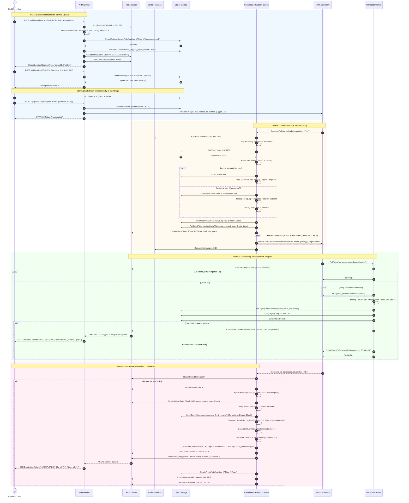
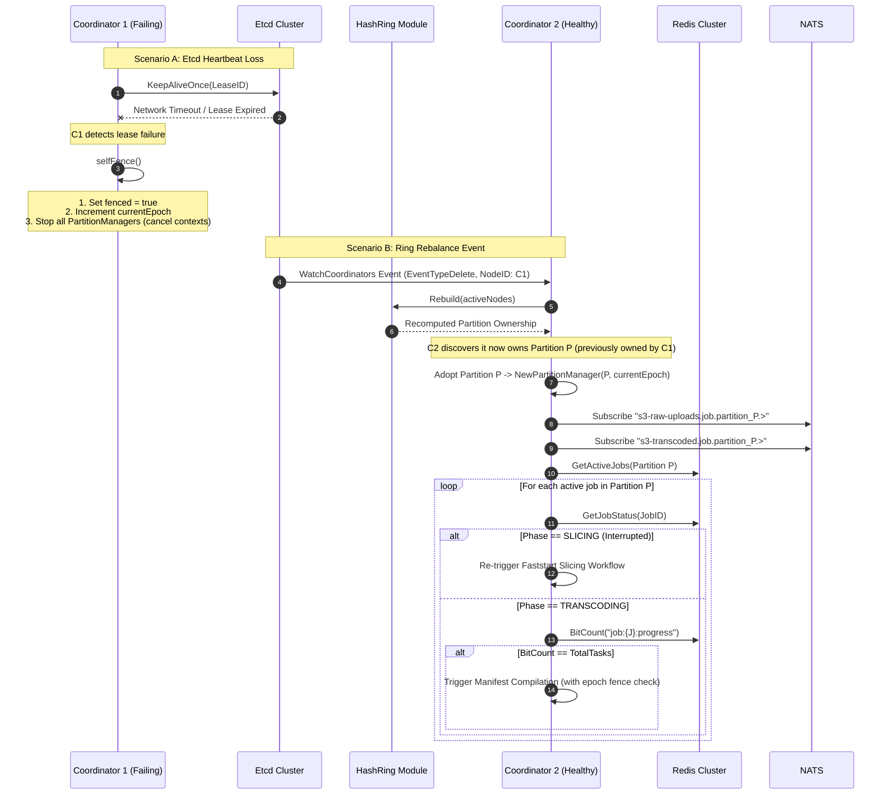
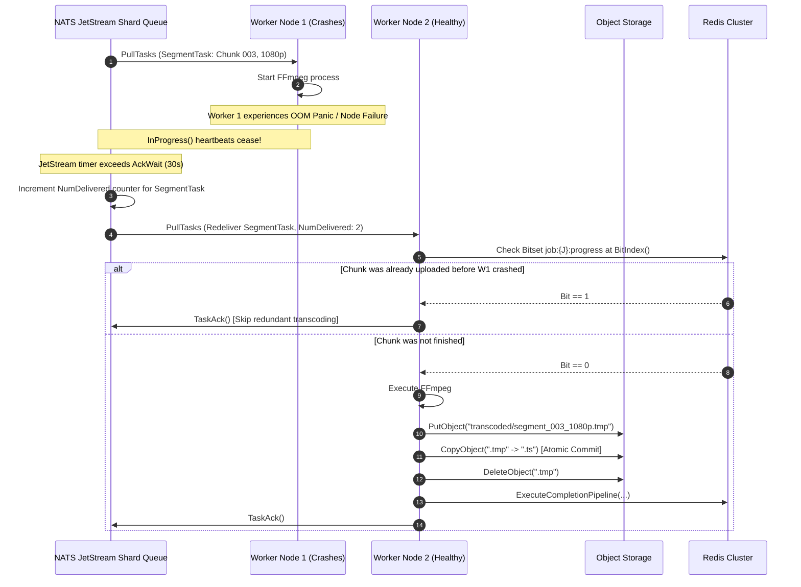
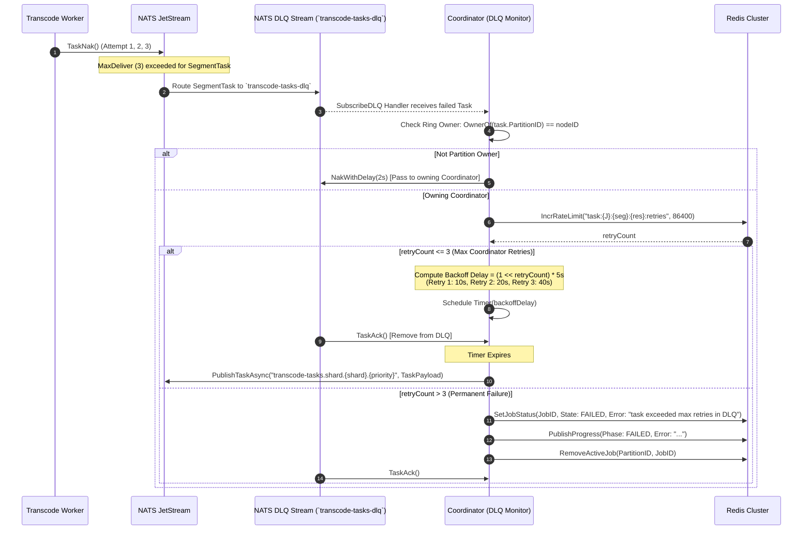
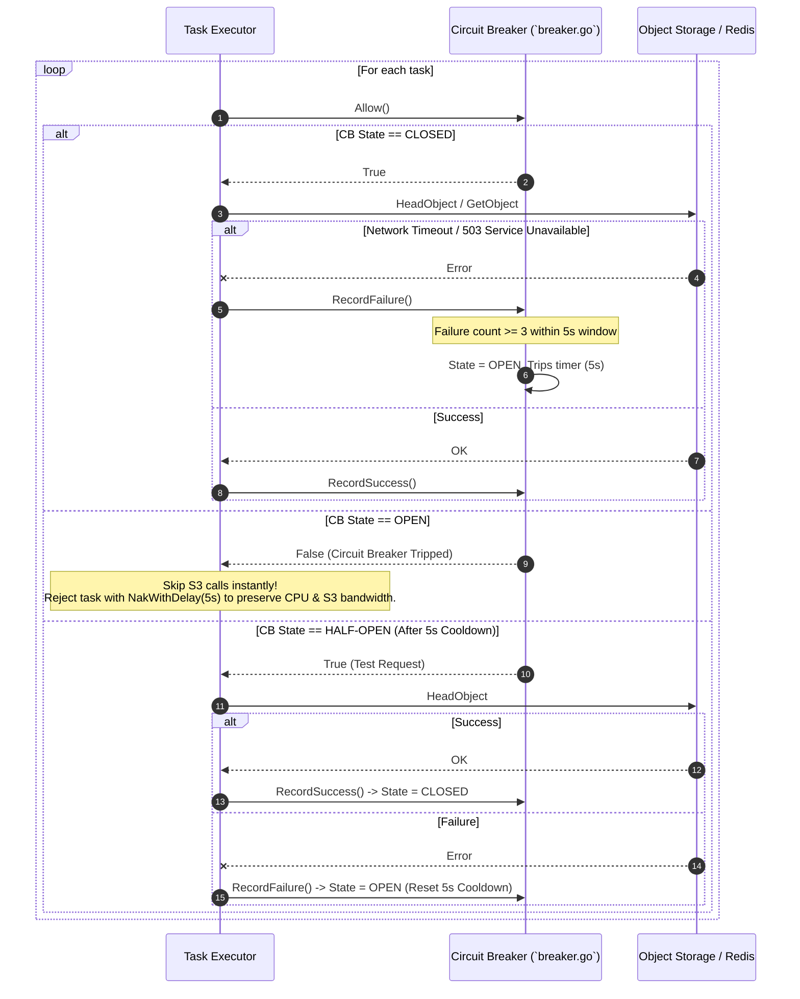
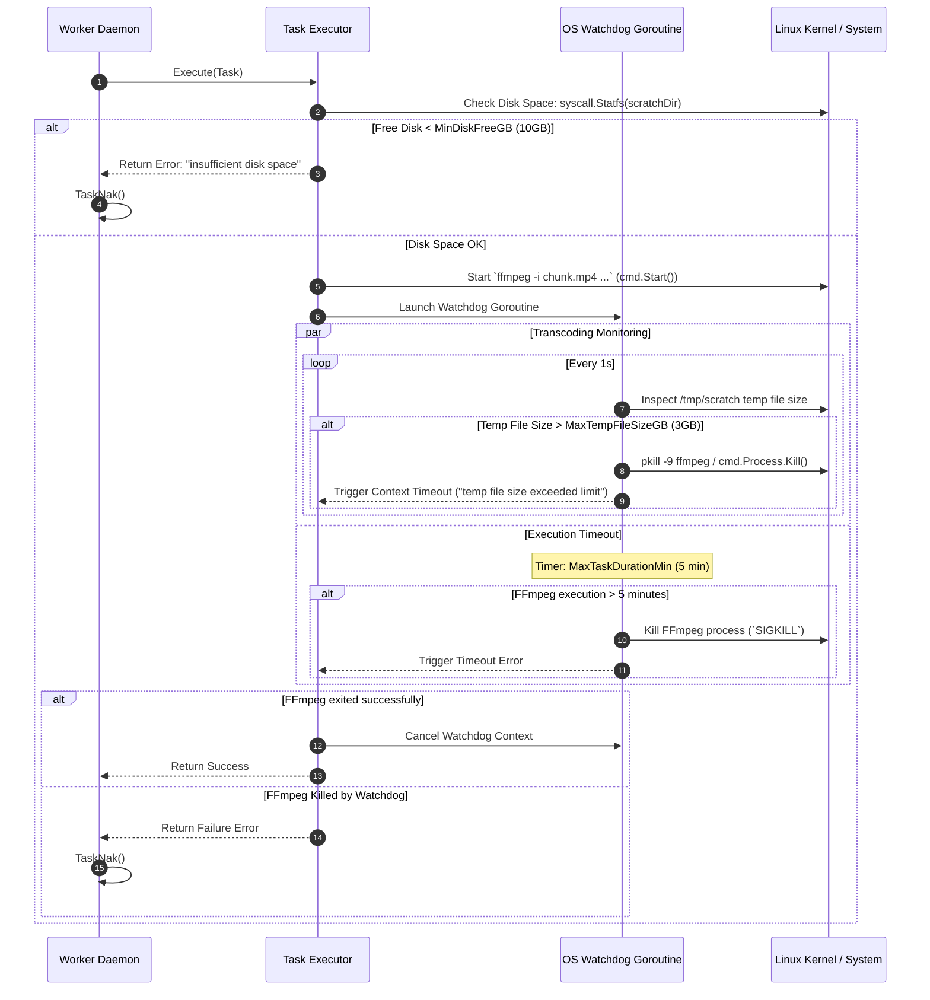
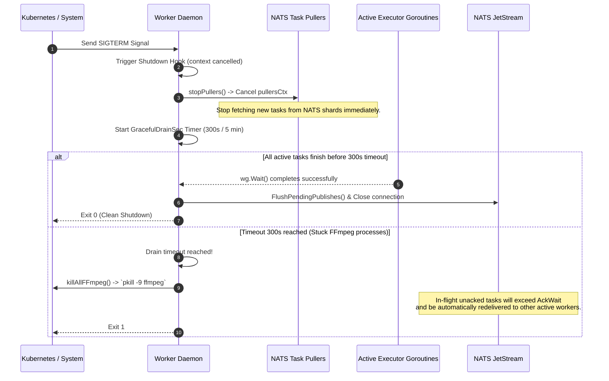
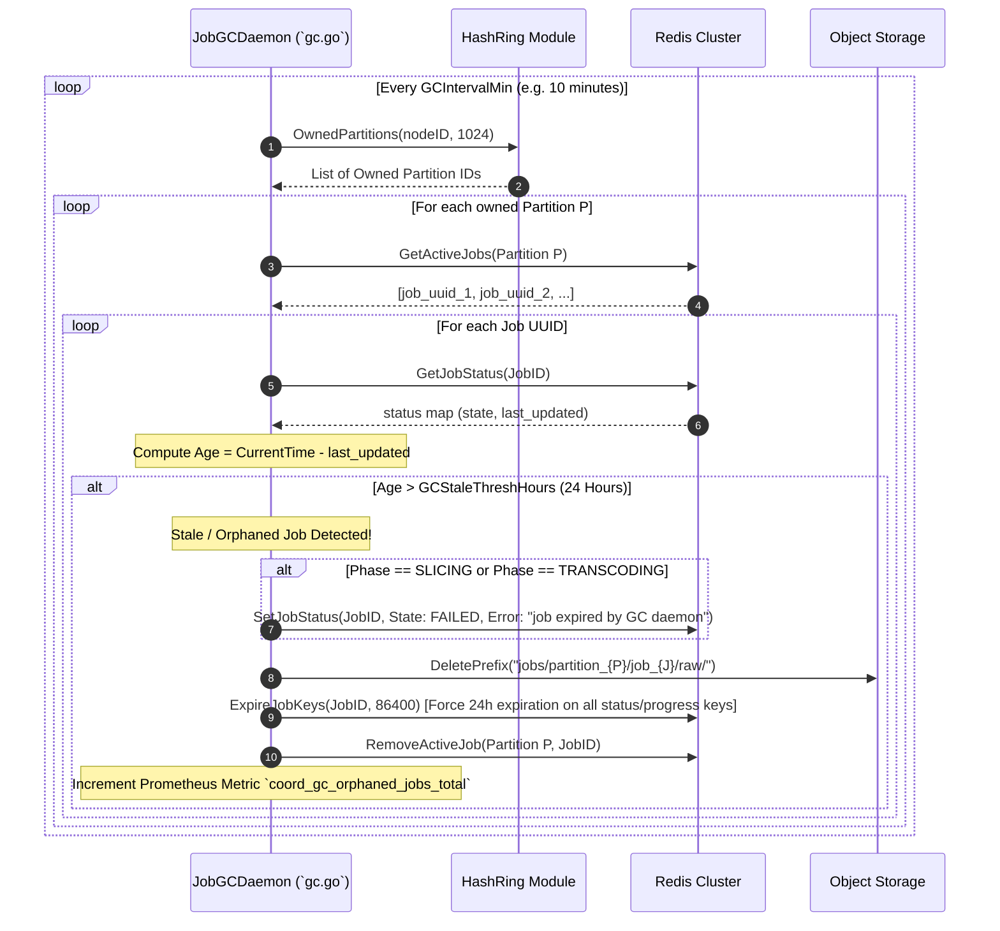
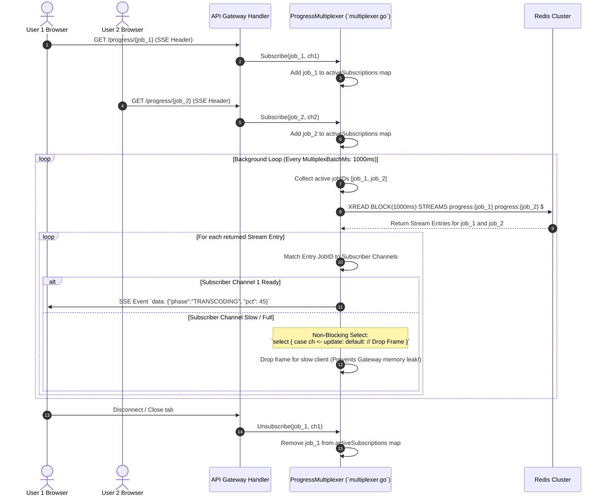
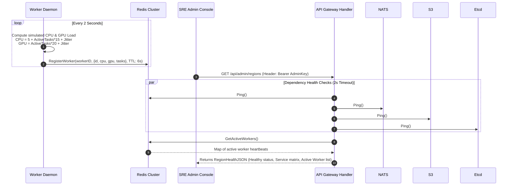

# 6. Runtime View

This section details the runtime behavior, execution flows, cross-module interactions, algorithmic formulas, and self-healing mechanics of Tessera across normal execution and failure scenarios.

---

## 6.1 Complete Job Lifecycle (Happy Path)

The happy-path lifecycle processes a raw video file from client submission to final multi-bitrate HLS and MPEG-DASH stream delivery.



---

## 6.2 Detailed Module Interaction & State Transition Matrix

The job state transitions through 6 distinct phases managed atomically across Redis and Object Storage.

```
 [CREATED] ───(Slicer Probe)───► [SLICING] ───(Tasks Enqueued)───► [TRANSCODING]
     │                                                                   │
     ├──────────────────────(Fatal Slicing/S3 Error)─────────────────────┤
     │                                                                   ▼
     │                                                            [COMPILING]
     │                                                                   │
     │                                                        (Manifest Compiled)
     │                                                                   │
     ▼                                                                   ▼
 [FAILED] ◄──────────────────(Max Retries / DLQ)────────────────── [COMPLETED]
```

### State Definitions & Persistence Locations

| Job Phase | Trigger Event | Redis Key Status (`job:{uuid}:status`) | Primary Action / Responsible Module |
| :--- | :--- | :--- | :--- |
| **`CREATED`** | `POST /api/jobs/upload-session` | `state: CREATED, completed: 0, total: 0` | Gateway registers upload; client uploads binary chunks directly to S3. |
| **`SLICING`** | `s3-raw-uploads` event in NATS | `state: SLICING, owner_epoch: E` | Coordinator acquires `AcquireSlicingLock`, probes MP4 header, streams slices to S3. |
| **`TRANSCODING`** | Slicing completes & tasks published | `state: TRANSCODING, total: N*R` | Workers pull `SegmentTask` from NATS shards, run FFmpeg, upload `.ts` chunks to S3. |
| **`COMPILING`** | `BitCount == TotalTasks` | `state: COMPILING, owner_epoch: E` | Coordinator verifies epoch fence, waits 1s S3 barrier, builds `master.m3u8` & `manifest.mpd`. |
| **`COMPLETED`** | Playlists & manifests written to S3 | `state: COMPLETED` | Coordinator emits completion SSE, purges `raw/` S3 prefix, sets 24h Redis TTL. |
| **`FAILED`** | Max retries exceeded / unrecoverable error | `state: FAILED, error: "..."` | DLQ Monitor or Coordinator flags job as failed, notifies progress stream, cleans up active jobs. |

---

## 6.3 Self-Healing & Failover Runtime Workflows

### 6.3.1 Coordinator Hash Ring Rebalance & Lease Loss

When a Coordinator node crashes, loses network connectivity, or experiences an Etcd lease timeout, the system executes an automated partition rebalance.



---

### 6.3.2 Worker Failure & NATS JetStream Redelivery

Workers are completely stateless. If a worker pod crashes mid-transcode (e.g. OOM killed by Linux kernel), JetStream guarantees zero task loss.



---

### 6.3.3 Dead Letter Queue (DLQ) & Exponential Backoff Retries

If a transcoding task repeatedly fails across multiple workers (e.g. corrupt input chunk or FFmpeg syntax crash), it is routed to the DLQ to prevent blocking worker pools.



---

### 6.3.4 S3 Thundering Herd & Worker Circuit Breaker Tripping

When Redis or S3 experiences transient degradation, thousands of concurrent workers issuing `HeadObject` calls can crash the storage subsystem ("Thundering Herd"). The Worker Circuit Breaker prevents this.

```
 [CLOSED] ──────(3 Failures in 5s)──────► [OPEN]
    ▲                                       │
    │                                       │
(Success)                              (5s Cooldown)
    │                                       │
    └─────────── [HALF-OPEN] ◄──────────────┘
```



---

### 6.3.5 Worker Resource Safeguards & OS Watchdogs

To prevent runaway FFmpeg processes from consuming host RAM, CPU, or local disk space, the worker enforces OS-level watchdogs.



---

### 6.3.6 Worker Graceful Shutdown & Drain Sequence

When a Worker pod receives a `SIGTERM` (e.g. KEDA scaling down pods during low traffic), it drains active work gracefully without corrupting segments.



---

### 6.3.7 Distributed Garbage Collection & Stale Job Reclamation

The `JobGCDaemon` runs continuously in the background on every Coordinator node to purge orphaned S3 files and expired Redis keys for abandoned or completed jobs.



---

## 6.4 Progress Stream Multiplexing & Client Delivery

The Gateway multiplexes thousands of incoming Server-Sent Events (SSE) connections through a single Redis Stream reader goroutine.



---

## 6.5 Core Algorithmic Mathematics & Formulas

### 6.5.1 Partition Mapping (`FNV-1a` Consistent Hashing)
Given a `JobID` string (e.g. `us-east:550e8400-e29b-41d4-a716-446655440000`) and partition count $P = 1024$:

$$\text{hash} = \text{FNV-1a32}(\text{JobID})$$
$$\text{PartitionID} = \text{hash} \pmod{P}$$

Code reference: [`PartitionOf`](../internal/models/hashing.go#L11).

### 6.5.2 Progress Bitmap Indexing
Given a task's segment index $S$ and target resolution $R \in \{\text{1080p}, \text{720p}, \text{480p}\}$, where $O(R)$ is the resolution array index offset ($0$ for 1080p, $1$ for 720p, $2$ for 480p):

$$\text{BitIndex}(S, R) = S \times |\text{AllResolutions}| + O(R)$$

For segment 3 at 720p: $\text{BitIndex} = 3 \times 3 + 1 = 10$.  
Code reference: [`SegmentTask.BitIndex()`](../internal/models/types.go#L79).

### 6.5.3 NATS Shard Routing
Given partition $P$, partition count $N_{p} = 1024$, and NATS shard count $N_{s} = 4$:

$$\text{Shard} = \left\lfloor \frac{P}{N_{p} / N_{s}} \right\rfloor = \left\lfloor \frac{P}{256} \right\rfloor$$

Code reference: [`PartitionManager.compileManifest`](../internal/coordinator/slicer.go#L173).

### 6.5.4 Exponential DLQ Retry Backoff
Given coordinator retry attempt $k \in \{1, 2, 3\}$:

$$\text{BackoffDelay}(k) = 2^{k} \times 5 \text{ seconds}$$

- Attempt 1: $2^1 \times 5\text{s} = 10\text{s}$
- Attempt 2: $2^2 \times 5\text{s} = 20\text{s}$
- Attempt 3: $2^3 \times 5\text{s} = 40\text{s}$

Code reference: [`runDLQMonitor`](../internal/coordinator/dlq.go#L48).

### 6.5.5 Seamless Keyframe Alignment (HLS Switching)
To guarantee seamless ABR (Adaptive Bitrate) quality switching without visual artifacting or player stalls:

$$\text{-force\_key\_frames expr:gte}(t, n_{\text{forced}} \times 5)$$

Forces an exact H.264 IDR I-frame every $5.000$ seconds across all independent workers processing 1080p, 720p, and 480p streams for the same chunk.  
Code reference: [`buildFFmpegCmd`](../internal/worker/executor.go#L198).

---

## 6.6 End-to-End Tracing & Telemetry Correlation

The OpenTelemetry system maps the `JobUUID` directly to the `TraceID` across all distributed services.

```
 [Gateway Endpoint] ──(TraceID: JobUUID)──► [NATS JetStream Header]
                                                   │
                                                   ▼
 [Coordinator Daemon] ◄──(TraceID: JobUUID)── [Worker Executor]
```

1. **Gateway**: Extracts/generates `JobUUID`. Initializes OTLP span with `TraceID = JobUUID`.
2. **NATS Message**: `SegmentTask` payload carries `JobID`. Worker reads `JobID` and initializes task span with `TraceID = JobID`.
3. **OTLP Collector**: All logs, metrics, and trace spans export over gRPC (`otel-collector:4317`) mapped to the same single trace root in Jaeger / Datadog.  
Code reference: [`tracing.InitTracer`](../internal/tracing/tracing.go#L15).

---

## 6.7 Secondary Driver Workflows (AWS SQS & Hardware Acceleration)

### 6.7.1 SQS Message Bus Provider (`sqs.go`)
When `MessageBusProvider = "sqs"` is configured in place of NATS:
- **FIFO Queues**: Shards map to FIFO queues `transcode-tasks-shard-{id}.fifo`.
- **Deduplication & Grouping**: `MessageGroupId` is set to `partitionID`, ensuring in-order task evaluation per partition while enabling parallel processing across partitions.
- **Visibility Extension**: Calls to `msg.InProgress()` invoke AWS SQS `ChangeMessageVisibility` to prevent early redelivery during long FFmpeg transcodes.
- **DLQ Redelivery**: SQS Redrive Policy routes failed tasks to `transcode-tasks-dlq.fifo` after max receive counts.  
Code reference: [`infra.NewSQSBus`](../internal/infra/sqs.go#L35).

### 6.7.2 Hardware Acceleration GPU Matrix
Workers dynamically select FFmpeg video acceleration based on `HWAccel` settings:
- `nvenc`: NVIDIA GPU H.264 hardware encoding (`-c:v h264_nvenc`).
- `vaapi`: Linux Intel/AMD GPU acceleration (`-vaapi_device /dev/dri/renderD128 -vf format=nv12,hwupload`).
- `videotoolbox`: Apple Silicon M1/M2/M3 hardware acceleration (`-c:v h264_videotoolbox`).
- `none`: Software x264 CPU fallback (`-c:v libx264 -preset fast`).  
Code reference: [`buildFFmpegCmd`](../internal/worker/executor.go#L198).

---

## 6.8 Admin Telemetry & Worker Dynamic Load Registration



1. **Worker Load Telemetry**: Workers heartbeat CPU/GPU load and active task count into Redis with a strict 6-second TTL (`RegisterWorker`). If a worker dies, its telemetry automatically expires from the cluster within 6 seconds.
2. **Gateway Dependency Timeout**: `/api/admin/regions` runs dependency health checks (`Ping`) wrapped in a 2-second `context.WithTimeout`. If Redis, NATS, S3, or Etcd hangs, the handler returns immediately without blocking SRE dashboard rendering.  
Code reference: [`handleListRegions`](../internal/gateway/handlers.go#L422).

---

## 6.9 Summary of Critical Failure Modes & Self-Healing Guards

| Component / Layer | Failure Scenario | System Safeguard / Self-Healing Mechanism | Primary Code Location |
| :--- | :--- | :--- | :--- |
| **Gateway** | Client connection drop / network lag | Non-blocking channel push drops progress frames for slow clients to prevent memory leaks. | [`multiplexer.go`](../internal/gateway/multiplexer.go#L70) |
| **Gateway** | Redis/NATS/S3 dependency timeout | `/api/admin/regions` health handler enforces a 2-second strict context timeout to prevent gateway API hangs. | [`handlers.go`](../internal/gateway/handlers.go#L424) |
| **Coordinator** | Network partition / Etcd lease loss | Node detects lost lease during `KeepAliveOnce`, invokes `selfFence()`, cancels all active `PartitionManager` contexts, and increments `owner_epoch`. | [`daemon.go`](../internal/coordinator/daemon.go#L136) |
| **Coordinator** | Ring rebalance split-brain | `compileManifests` enforces Epoch Fencing: aborts if `storedEpoch > currentEpoch`. | [`manifest.go`](../internal/coordinator/manifest.go#L30) |
| **Coordinator** | Multiple nodes slice same video | `AcquireSlicingLock` uses Etcd `concurrency.NewMutex` to guarantee single-coordinator slicing execution. | [`etcd.go`](../internal/infra/etcd.go#L180) |
| **Coordinator** | Slicer concurrency overload | `sliceSem` buffered channel limits max concurrent slicing processes per coordinator node. | [`daemon.go`](../internal/coordinator/daemon.go#L40) |
| **Worker** | Duplicate task delivery from NATS/SQS | Worker checks Redis Bitset (`BitIndex()`) prior to FFmpeg execution; if bit is set, immediately ACKs and skips. | [`executor.go`](../internal/worker/executor.go#L87) |
| **Worker** | S3 thundering herd / 503 errors | `CircuitBreaker` trips to `OPEN` state after 3 failures in 5s, rejecting tasks with `NakWithDelay(5s)`. | [`breaker.go`](../internal/worker/breaker.go#L45) |
| **Worker** | Runaway FFmpeg / Disk fill-up | OS Watchdog checks disk space via `syscall.Statfs` and kills FFmpeg with `SIGKILL` if temp files exceed 3GB or 5 minutes. | [`daemon.go`](../internal/worker/daemon.go#L210) |
| **Worker** | Pod SIGTERM / KEDA scale-down | Worker stops pulling new tasks, enters 300s graceful drain; unacked in-flight tasks time out in JetStream/SQS and redeliver to healthy workers. | [`daemon.go`](../internal/worker/daemon.go#L105) |
| **Worker** | Corrupted / partial segment upload | Worker uploads to `segment.ts.tmp`, then performs S3 `CopyObject` -> `segment.ts` and deletes `.tmp`. | [`executor.go`](../internal/worker/executor.go#L165) |
| **DLQ** | Unrecoverable task execution error | JetStream retries task 3 times -> routes to `transcode-tasks-dlq` -> Coordinator DLQ Monitor retries with 10s, 20s, 40s backoff -> marks job `FAILED`. | [`dlq.go`](../internal/coordinator/dlq.go#L48) |
| **GC Daemon** | Abandoned / incomplete jobs in S3 | `JobGCDaemon` sweeps owned partitions every 10 min; if job age > 24h, deletes raw S3 files and sets 24h Redis key TTLs. | [`gc.go`](../internal/coordinator/gc.go#L50) |
