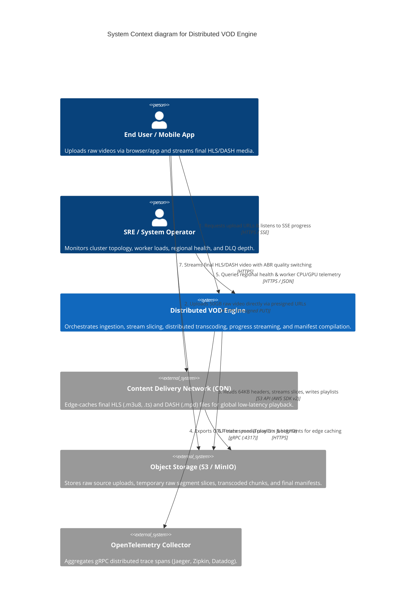

# 3. Context and Scope

This section describes the Distributed VOD Engine's place within the digital media ecosystem, mapping its system boundaries, external interfaces, actor lifecycles, protocol specifications, request/response payload schemas, and data flow contracts.

---

## 3.1 Business Context & System Domain

In modern video-on-demand (VOD) architectures, media processing sits between raw content creation and global content delivery. Users upload video files generated by smartphones, broadcast equipment, or screen recording software. These raw source files feature diverse container formats (MP4, MOV, MKV, AVI), varied video codecs (H.264, H.265/HEVC, ProRes), arbitrary frame rates (24fps, 30fps, 60fps), and massive file sizes ranging from hundreds of megabytes to 50 gigabytes.

Serving raw source video directly to client applications is impractical due to high bandwidth consumption, device incompatibility, and buffering on mobile networks. The VOD Engine acts as the central ingestion and processing orchestrator. It receives raw source media, slices and encodes it into multi-bitrate Adaptive Bitrate (ABR) streams (Apple HLS and MPEG-DASH), and delivers structured media packages to Content Delivery Networks (CDNs) for edge caching.



---

## 3.2 System Boundary & Component Responsibilities

The system boundary clearly segregates internal micro-tier components from external infrastructure dependencies:

### Inside the System Boundary
1. **API Gateway Tier ([`internal/gateway/`](../internal/gateway/))**: Stateless edge ingress handling authentication, presigned URL generation, rate limiting, and SSE progress multiplexing.
2. **Coordinator Tier ([`internal/coordinator/`](../internal/coordinator/))**: Stateful brain managing Etcd hash ring topology, faststart stream slicing, task dispatching, DLQ monitoring, and manifest compilation.
3. **Worker Tier ([`internal/worker/`](../internal/worker/))**: Stateless compute engines pulling tasks, enforcing resource watchdogs, executing FFmpeg transcoding, and performing atomic S3 commits.

### Outside the System Boundary
1. **Object Storage (S3 / MinIO)**: Stores binary media assets. Interacted with exclusively via AWS SDK v2 presigned URLs and S3 API calls.
2. **State Store (Redis Cluster)**: Manages ephemeral status hashes, progress bitmaps, and stream logs.
3. **Consensus Engine (Etcd Cluster)**: Manages coordinator registration, partition leases, and slicing mutexes.
4. **Message Bus (NATS JetStream / AWS SQS)**: Handles asynchronous task delivery and dead letter queue routing.
5. **OpenTelemetry Collector**: Receives gRPC OTLP trace spans on port `:4317`.

---

## 3.3 Complete External API Specifications & Data Contracts

### 1. Upload Session Initialization (`POST /api/jobs/upload-session`)
Initializes a video upload session, validates file constraints, computes partition routing, creates S3 multipart uploads, and returns JWT credentials.

*   **Primary Handler**: [`handleCreateSession`](../internal/gateway/handlers.go#L37)
*   **Authentication**: Public / IP Rate Limited (`IncrRateLimit`)
*   **Request Headers**: `Content-Type: application/json`
*   **Request Body Schema**:
    ```json
    {
      "file_size_bytes": 10737418240,
      "file_name": "presentation_4k.mp4",
      "content_type": "video/mp4"
    }
    ```
*   **Validation Rules**:
    - `file_size_bytes` must be $> 0$ and $\le 53,687,091,200$ (50GB). Violations return `HTTP 400 Bad Request`.
*   **Response Body Schema (HTTP 200 OK)**:
    ```json
    {
      "job_id": "us-east:550e8400-e29b-41d4-a716-446655440000",
      "session_token": "eyJhbGciOiJIUzI1NiIsInR5cCI6IkpXVCJ9...",
      "upload_id": "YWJjZGVmZ2hpamtsbW5vcHFyc3R1dnd4eXo",
      "part_size": 52428800,
      "total_parts": 205,
      "progress_wss": "wss://gateway.vod.internal/progress/us-east:550e8400-e29b-41d4-a716-446655440000?token=..."
    }
    ```

---

### 2. Presigned URL Batch Request (`POST /api/jobs/{uuid}/urls`)
Generates a batch of cryptographically signed S3 PUT URLs allowing clients to stream raw binary parts directly to object storage.

*   **Primary Handler**: [`handlePresignedBatch`](../internal/gateway/handlers.go#L120)
*   **Authentication**: Required Header `Authorization: Bearer <session_token>`
*   **Query Parameters**:
    - `start`: First part number requested (1-indexed, e.g. `start=1`).
    - `count`: Number of URLs requested in batch (1 to 100, e.g. `count=10`).
*   **Validation Rules**:
    - JWT `SessionToken` must be valid and `job_id` claim must match path `{uuid}`.
    - `start` $> 0$, `count` $> 0$ and $\le 100$. Violations return `HTTP 400 Bad Request`.
*   **Response Body Schema (HTTP 200 OK)**:
    ```json
    {
      "part_numbers": [1, 2, 3],
      "urls": [
        "https://minio.internal:9000/transcoder-bucket/jobs/partition_512/job_us-east:550e.../raw/source.mp4?uploadId=...&partNumber=1&X-Amz-Signature=...",
        "https://minio.internal:9000/transcoder-bucket/jobs/partition_512/job_us-east:550e.../raw/source.mp4?uploadId=...&partNumber=2&X-Amz-Signature=...",
        "https://minio.internal:9000/transcoder-bucket/jobs/partition_512/job_us-east:550e.../raw/source.mp4?uploadId=...&partNumber=3&X-Amz-Signature=..."
      ]
    }
    ```

---

### 3. Multipart Upload Completion (`POST /api/jobs/{uuid}/complete`)
Finalizes S3 multipart assembly and bridges raw upload completion events to NATS JetStream.

*   **Primary Handler**: [`handleCompleteUpload`](../internal/gateway/handlers.go#L211)
*   **Authentication**: Required Header `Authorization: Bearer <session_token>`
*   **Request Body Schema**:
    ```json
    {
      "parts": [
        { "part_number": 1, "etag": "\"b10a8db164e0754105b7a99be72e3fe5\"" },
        { "part_number": 2, "etag": "\"c20b9ec275f1865216c8ba00f83f4gf6\"" }
      ]
    }
    ```
*   **Response Body Schema (HTTP 200 OK)**:
    ```json
    {
      "status": "completed"
    }
    ```

---

### 4. Real-Time Progress Stream (`GET /progress/{uuid}`)
Establishes a Server-Sent Events (SSE) channel delivering minute-level progress events.

*   **Primary Handler**: [`handleWebSocketOrSSE`](../internal/gateway/handlers.go#L180)
*   **Response Headers**: `Content-Type: text/event-stream`, `Cache-Control: no-cache`, `Connection: keep-alive`
*   **SSE Event Data Format**:
    ```http
    data: {"phase":"TRANSCODING","completed":45,"total":300,"pct":15}

    data: {"phase":"COMPLETED","hls_url":"https://storage/master.m3u8","dash_url":"https://storage/manifest.mpd"}
    ```

---

### 5. SRE Regional Telemetry (`GET /api/admin/regions`)
Returns cluster health status, service pings, and active worker CPU/GPU telemetry.

*   **Primary Handler**: [`handleListRegions`](../internal/gateway/handlers.go#L422)
*   **Authentication**: Header `Authorization: Bearer <admin_api_key>`
*   **Response Body Schema (HTTP 200 OK)**:
    ```json
    {
      "region": "us-east-1",
      "gateway_url": "http://gateway.us-east.vod.internal:8080",
      "healthy": true,
      "services": {
        "redis": true,
        "nats": true,
        "s3": true,
        "etcd": true
      },
      "active_sockets": 1420,
      "upload_count": 850,
      "dlq_depth": 0,
      "workers": [
        { "id": "worker-node-01", "cpu": 45, "gpu": 60, "tasks": 3 },
        { "id": "worker-node-02", "cpu": 30, "gpu": 40, "tasks": 2 }
      ]
    }
    ```
