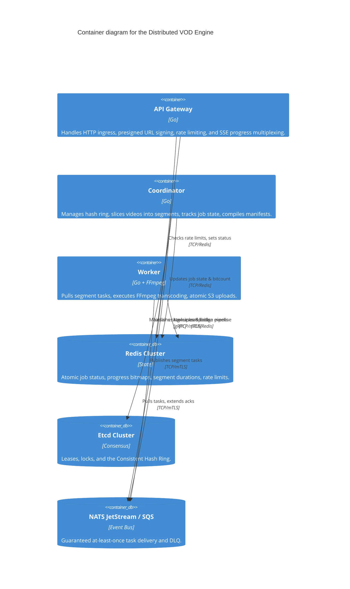

# 5. Building Block View (C4 Components)

This section dissects the internal architecture of the Distributed VOD Engine, detailing macro-containers, micro-components, data model schemas, and infrastructure driver implementations.

---

## 5.1 Level 2: C4 Container View

The primary compute tier is split into three decoupled containers (Gateway, Coordinator, Worker). They communicate exclusively via Redis Cluster, Etcd, and NATS JetStream / AWS SQS.



---

## 5.2 Level 3: Data Schema Specifications (`internal/models/types.go`)

### 1. `JobManifest` ([`types.go`](../internal/models/types.go#L34))
The manifest contract written to S3 as `job_manifest.json` at the start of a job:
```go
type JobManifest struct {
    JobID        string       `json:"job_id"`           // Unique Job Identifier (e.g. "us-east:uuid")
    PartitionID  int          `json:"partition_id"`     // Partition (0..1023) derived via FNV-1a
    OwnerEpoch   int64        `json:"owner_epoch"`      // Monotonic coordinator epoch fence
    Region       string       `json:"region"`           // Deployment region (e.g. "us-east")
    SourcePath   string       `json:"source_path"`      // Raw upload S3 object key
    SourceSizeB  int64        `json:"source_size_bytes"`// Raw file size in bytes
    Resolutions  []Resolution `json:"resolutions"`      // Target resolutions [1080p, 720p, 480p]
    SegmentCount int          `json:"segment_count"`    // Populated after slicing
    TotalTasks   int          `json:"total_tasks"`      // SegmentCount * len(Resolutions)
    CreatedAt    time.Time    `json:"created_at"`       // Creation timestamp
}
```

### 2. `SegmentTask` ([`types.go`](../internal/models/types.go#L65))
The payload published to NATS JetStream and pulled by workers:
```go
type SegmentTask struct {
    JobID       string     `json:"job_id"`         // Associated Job UUID
    PartitionID int        `json:"partition_id"`   // Owning partition ID
    OwnerEpoch  int64      `json:"owner_epoch"`    // Coordinator epoch fence
    SegmentIdx  int        `json:"segment_idx"`    // Zero-indexed segment number
    Resolution  Resolution `json:"resolution"`     // Target output resolution
    RawChunkKey string     `json:"raw_chunk_key"`  // S3 key for raw 5s slice
    OutputKey   string     `json:"output_key"`     // S3 key for final transcoded .ts file
    HWAccel     string     `json:"hw_accel"`       // Hardware accel hint ("nvenc", "vaapi", "none")
    Priority    string     `json:"priority"`       // Queue priority ("high", "normal", "low")
}
```

---

## 5.3 Level 3: Gateway Component Details

The Gateway ([`gateway/`](../internal/gateway/)) serves as the stateless HTTP edge:

*   **Rate Limiter ([`ratelimit.go`](../internal/gateway/ratelimit.go#L29))**: Implements token-bucket rate limiting using Redis pipelines (`IncrRateLimit`). The global `/upload-session` endpoint enforces IP rate limits (`RateLimitPerIP`, default 100/min), while data APIs enforce JWT user limits (`RateLimitPerUser`, default 500/day).
*   **Progress Multiplexer ([`multiplexer.go`](../internal/gateway/multiplexer.go#L56))**: Operates a background goroutine executing blocking `XREAD BLOCK` calls against Redis Streams (`progress:{job_id}`). Multiplexes progress events across thousands of client channels using non-blocking channel selects (`select { case ch <- update: default: }`).
*   **Session Handler ([`handlers.go`](../internal/gateway/handlers.go#L37))**: Validates upload requests against 50GB file limits, computes the FNV-1a partition ID, creates S3 multipart upload IDs, writes initial manifests, caches job metadata in Redis, and issues 24-hour JWT `SessionToken`s.
*   **Presigned Batch Handler ([`handlers.go`](../internal/gateway/handlers.go#L120))**: Validates client JWTs, generates batches of signed S3 PUT URLs with 15-minute expiration times for direct upload.
*   **Region Health Handler ([`handlers.go`](../internal/gateway/handlers.go#L422))**: Executes 2-second timeout health pings across Redis, NATS, S3, and Etcd. Collects worker CPU/GPU load telemetry from Redis and returns a unified JSON health report for SRE monitoring.

---

## 5.4 Level 3: Coordinator Component Details

The Coordinator ([`coordinator/`](../internal/coordinator/)) acts as the stateful control brain:

*   **Consistent Hash Ring ([`ring.go`](../internal/coordinator/ring.go#L22))**: Maintains a virtual node ring assigning 150 virtual nodes per Coordinator node across 1024 partitions. Watches Etcd coordinator events (`WatchCoordinators`) and rebalances partition ownership automatically upon node joins/leaves.
*   **Faststart Slicer ([`slicer.go`](../internal/coordinator/slicer.go#L45))**: Probes the first 64KB of S3 raw video objects. If the Faststart atom (`moov`) is present, it pipes the S3 network stream directly into `ffmpeg -i pipe:0` in memory, chunking raw 5-second slices to S3. Limits concurrent slicing processes via `sliceSem` (capacity 50).
*   **Epoch-Fenced Compiler ([`manifest.go`](../internal/coordinator/manifest.go#L28))**: Verifies job completion (`BitCount == TotalTasks`), validates `storedEpoch <= currentEpoch`, waits out a 1-second S3 consistency barrier, verifies final segment existence via `HeadObject`, compiles HLS (`master.m3u8`, `1080p.m3u8`) and DASH (`manifest.mpd`) playlists, purges temporary raw S3 files, and sets 24h key TTLs in Redis.
*   **DLQ Monitor ([`dlq.go`](../internal/coordinator/dlq.go#L17))**: Consumes failed tasks from `transcode-tasks-dlq`, verifies partition ownership, increments Redis retry counters, applies exponential backoff delays (10s, 20s, 40s), and republishes tasks or marks the job `FAILED`.
*   **Job Garbage Collector ([`gc.go`](../internal/coordinator/gc.go#L18))**: Scans owned partitions every 10 minutes (`GCIntervalMin`), identifies jobs older than 24 hours (`GCStaleThreshHours`), purges raw S3 prefixes, sets Redis expirations, and updates Prometheus metrics.

---

## 5.5 Level 3: Worker Component Details

The Worker ([`worker/`](../internal/worker/)) serves as the stateless compute engine:

*   **Task Executor ([`executor.go`](../internal/worker/executor.go#L35))**: Pulls `SegmentTask` payloads from NATS shards, checks Redis bitsets for idempotency, issues `msg.InProgress()` heartbeats every 10 seconds, executes hardware-accelerated FFmpeg CLI processes, uploads output to `.tmp` S3 keys, and performs atomic S3 copy-renames.
*   **Circuit Breaker ([`breaker.go`](../internal/worker/breaker.go#L20))**: Protects S3/Redis from Thundering Herds. Trips to `OPEN` state after 3 failures in 5 seconds, rejecting tasks with a 5-second cooldown delay (`NakWithDelay`).
*   **OS Watchdogs ([`daemon.go`](../internal/worker/daemon.go#L210))**: Inspects free scratch disk space via `syscall.Statfs` (requires 10GB min free) and monitors temporary file sizes every 1 second, killing runaway FFmpeg processes (`pkill -9 ffmpeg`) if files exceed 3GB or transcode duration exceeds 5 minutes.
*   **Graceful Drain Handler ([`daemon.go`](../internal/worker/daemon.go#L105))**: Catches OS `SIGTERM` signals during pod scale-down, stops NATS pullers immediately, and waits up to 300 seconds (`GracefulDrainSec`) for in-flight transcodes to finish cleanly before force-killing remaining processes.
