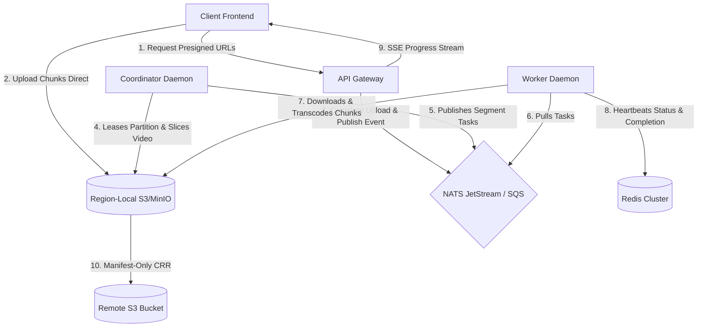

# Developer Integration & Deployment Guide: Distributed VOD Transcoder

This guide provides comprehensive, production-grade documentation for developers integrating and deploying the **Distributed Video on Demand (VOD) Transcoder system**. It covers the system's architecture, backing infrastructure configurations, deployment patterns, API integration workflows, client-side implementations, SRE monitoring, and custom driver extensions.

---

## 1. System Architecture Overview

The system is designed as a **3-tier, geo-distributed, share-nothing regional architecture** to ingest and process high-volume video streams at a scale of 40–50 million active users.



### Core Architecture Concepts
* **Data Gravity**: Raw source video uploads and high-volume media segments (`.ts` chunks) are processed and stored strictly within the region-local S3/MinIO bucket. No heavy media data crosses regional WAN boundaries.
* **Shared-Nothing Regional Control Plane**: Each region runs isolated `etcd` and `Redis` clusters. A complete failure of one region's database will not cause cascading blocks or latency in other regions.
* **Consistent Hashing Ring**: Active coordinator nodes register leases in etcd and map themselves around a 1024-partition consistent hash ring. When coordinators fail or scale up, partition ownership rebalances automatically, preventing duplicate slicing or transcoding.
* **Storage-Level Manifest Replication (CRR)**: Playback compatibility is achieved by replicating only the final completed HLS master playlist (`.m3u8`), DASH manifest (`.mpd`), and completion sentinel metadata across regions via S3 Cross-Region Replication (CRR).
* **Pluggable Infrastructure Drivers**: The engine consumes abstract Go interfaces rather than concrete library clients. Developers can swap NATS for **AWS SQS** or Redis for **AWS DynamoDB** natively via simple config toggles.

---

## 2. Infrastructure Requirements & Local Setup

### 2.1. Backing Services Dependency Matrix
The following table outlines the minimum production version requirements and roles of each dependency service:

| Dependency | Minimum Version | Role in Architecture |
| :--- | :--- | :--- |
| **Redis** | `7.x` | Active job status index, rate limit tracking, progress multiplexer streaming, and worker registries. |
| **NATS JetStream** | `2.10.x` | Partition-sharded message pipeline for task distribution. |
| **etcd** | `3.5.x` | Coordinator topology state leases, partition locks, and consensus. |
| **S3-Compatible Storage** | MinIO / AWS S3 | Segment and raw file data gravity storage. |

### 2.2. Local Development Environment Setup
Save the following configuration as `docker-compose.yml` to boot the complete single-region transcoder stack locally:

```yaml
version: '3.8'

services:
  # 1. State Store
  redis:
    image: redis:7-alpine
    ports:
      - "6379:6379"
    command: redis-server --protected-mode no

  # 2. Task Queue
  nats:
    image: nats:2.10-alpine
    ports:
      - "4222:4222"
      - "8222:8222"
    command: -js

  # 3. Coordinator Lock Manager
  etcd:
    image: bitnami/etcd:3.5
    ports:
      - "2379:2379"
    environment:
      - ALLOW_NONE_AUTHENTICATION=yes

  # 4. Storage Engine
  minio:
    image: minio/minio
    ports:
      - "9000:9000"
      - "9001:9001"
    environment:
      - MINIO_ROOT_USER=minioadmin
      - MINIO_ROOT_PASSWORD=minioadmin
    command: server /data --console-address ":9001"

  # Bucket Auto-Initialization
  create-buckets:
    image: minio/mc
    depends_on:
      - minio
    entrypoint: >
      /bin/sh -c "
      until (/usr/bin/mc alias set local http://minio:9000 minioadmin minioadmin); do echo 'Waiting for MinIO...'; sleep 1; done;
      /usr/bin/mc mb --ignore-existing local/transcoder-bucket;
      /usr/bin/mc anonymous set download local/transcoder-bucket;
      /usr/bin/mc cors set local/transcoder-bucket <<EOF
      [
        {
          \"AllowedHeaders\": [\"*\"],
          \"AllowedMethods\": [\"PUT\", \"POST\", \"GET\"],
          \"AllowedOrigins\": [\"*\"],
          \"ExposeHeaders\": [\"ETag\"]
        }
      ]
      EOF
      "
```

---

## 3. Configuration Specification

The Transcoder uses a **unified YAML configuration**. Each daemon container reads this file and parses the segments matching its active `-role`.

### 3.1. Unified YAML Config Options
Below is the default configuration schema (e.g., `config.yaml`):

```yaml
role: "gateway"                 # Default fallback execution mode
region: "us-east-1"             # Execution region tag
node_id: ""                     # Left empty; auto-generated at boot to prevent duplicate node collisions

# Message Bus Provider: "nats" | "sqs"
message_bus_provider: "nats"

# ──── Infrastructure Endpoints ────
redis:
  addrs:
    - "127.0.0.1:6379"
  password: ""
  max_retries: 3
  pool_size: 10
nats:
  urls:
    - "nats://127.0.0.1:4222"
  tls_cert: ""                  # Path to client certificate (mTLS)
  tls_key: ""                   # Path to client key
  tls_ca: ""                    # Path to CA trust root
etcd:
  endpoints:
    - "127.0.0.1:2379"
object_store:
  endpoint: "127.0.0.1:9000"    # Use S3 endpoint for production AWS S3
  bucket: "transcoder-bucket"
  region: "us-east-1"
  access_key: "minioadmin"
  secret_key: "minioadmin"
  use_ssl: false                # Enforce true in production

# ──── Component Settings ────
gateway:
  listen_addr: "127.0.0.1:8080"
  jwt_secret: "us-east-secret-key"
  admin_api_key: "admin-secret-token" # Authorization token protecting /api/admin/* telemetry endpoints
  max_upload_size_gb: 50
  rate_limit_per_ip: 1000
  rate_limit_per_user: 5000
  multiplex_batch_ms: 100

coordinator:
  partition_count: 1024         # Hash ring size; must be identical across nodes
  slicing_semaphore: 50         # Concurrent ffmpeg slicing runs per coordinator
  nats_shard_count: 4           # Task queues division shards
  etcd_lease_ttl_sec: 5         # Failover lease timeout threshold
  slicing_lock_ttl_sec: 10      # Timeout protection for coordinator crashes mid-slicing
  self_fence_thresh_sec: 3      # Fencing threshold if etcd latency exceeds this limit
  takeover_grace_sec: 5         # Failover cooldown wait window
  gc_interval_min: 10
  gc_stale_thresh_hours: 24     # Timeout threshold to purge incomplete timed out tasks

worker:
  scratch_dir: "/tmp/scratch"   # Temporary path for local video processing
  min_disk_free_gb: 20          # Prevent worker execution if disk quota is exceeded
  watchdog_interval_sec: 10     # Monitor duration of stalled ffmpeg processes
  max_task_duration_min: 5
  max_temp_file_size_gb: 15
  concurrent_tasks: 8           # Number of simultaneous transcoding tasks (FFmpeg slots)
  graceful_drain_sec: 300       # SIGTERM shutdown timeout to wait for active tasks
  circuit_breaker_window: 5
  circuit_breaker_thresh: 3
  hw_accel: "none"              # "nvenc" (NVIDIA GPUs) | "videotoolbox" (Apple Silicon) | "none"

metrics:
  listen_addr: "127.0.0.1:9091"
  path: "/metrics"
```

### 3.2. Environment Variable Overrides
In cloud environments, developers can override configurations dynamically using standard environment variables:

* `TRANSCODER_MESSAGE_BUS_PROVIDER`: Set `"nats"` or `"sqs"`.
* `TRANSCODER_REDIS_ADDRS`: Comma-separated Redis node URLs.
* `TRANSCODER_REDIS_PASSWORD`: Connection password.
* `TRANSCODER_NATS_URLS`: Comma-separated NATS URLs.
* `TRANSCODER_ETCD_ENDPOINTS`: Comma-separated etcd endpoints.
* `TRANSCODER_S3_ENDPOINT`: Object store endpoint.
* `TRANSCODER_S3_ACCESS_KEY`: Storage Access Key.
* `TRANSCODER_S3_SECRET_KEY`: Storage Secret Key.
* `TRANSCODER_S3_BUCKET`: Regional bucket name.
* `TRANSCODER_JWT_SECRET`: Gateway upload session JWT signature key.
* `TRANSCODER_LISTEN_ADDR`: API Gateway port/host binding.
* `TRANSCODER_REGION`: Node region designation.

---

## 4. Developer API Integration Guide

Developers interface their frontend client applications directly with the Transcoder endpoints to support direct-to-storage uploads. 

### 4.1. Step-by-Step API Workflow

#### Step 1: Initialize Upload Session
Your backend application server requests an upload session on behalf of the client user. This endpoint should be protected by the developer's application routing.

* **Endpoint**: `POST http://gateway-ip:8080/api/jobs/upload-session`
* **JSON Payload**:
  ```json
  {
    "file_size_bytes": 104857600,
    "file_name": "marketing_reel.mp4",
    "content_type": "video/mp4"
  }
  ```
* **Response Payload**:
  ```json
  {
    "job_id": "us-east-1:7ff8b548-c8ee-449e-b7d1-c27633f81e3a",
    "session_token": "eyJhbGciOiJIUzI1NiIsIn...", // Secure JWT Session Token
    "part_size": 52428800,                         // Part sizes in bytes (e.g. 50MB)
    "total_parts": 2,                              // Number of chunks client needs to upload
    "progress_wss": "wss://gateway-ip:8080/progress/us-east-1:7ff8b548-c8ee-449e-b7d1-c27633f81e3a?token=eyJhb..."
  }
  ```

#### Step 2: Request Presigned S3 Batch URLs
The client browser receives the `session_token` and queries the Gateway for presigned S3 PUT URLs. This returns URLs pointing directly to the region-local storage bucket (MinIO/S3), bypassing the application server.

* **Endpoint**: `POST http://gateway-ip:8080/api/jobs/{job_id}/urls?start=1&count=2`
* **Headers**: `Authorization: Bearer <session_token>`
* **Response Payload**:
  ```json
  {
    "part_numbers": [1, 2],
    "urls": [
      "http://minio-ip:9000/transcoder-bucket/jobs/.../raw/source.mp4?partNumber=1&uploadId=...",
      "http://minio-ip:9000/transcoder-bucket/jobs/.../raw/source.mp4?partNumber=2&uploadId=..."
    ]
  }
  ```

#### Step 3: Direct S3 Chunk Upload (Client Action)
The client browser performs standard HTTP `PUT` requests for each chunk. The client **must** extract the `ETag` header from the response of each S3 chunk upload.

* **HTTP Method**: `PUT`
* **URL**: `<presigned_url_for_part_X>`
* **Body**: Binary chunk payload (e.g. first 50MB, second 50MB).
* **Response Headers**:
  * `ETag`: `"d912b7f3a8b417c8cf15a31e847c2d96"`

#### Step 4: Complete Upload Session
Once all chunks are uploaded, the client calls completion on the API Gateway, passing the accumulated ETags. The Gateway completes the multipart upload directly with S3 and publishes the task event automatically.

* **Endpoint**: `POST http://gateway-ip:8080/api/jobs/{job_id}/complete`
* **Headers**: `Authorization: Bearer <session_token>`
* **JSON Payload**:
  ```json
  {
    "parts": [
      { "part_number": 1, "etag": "\"d912b7f3a8b417c8cf15a31e847c2d96\"" },
      { "part_number": 2, "etag": "\"f6a15b13e9a5c8c9bf10e42d76a5b9b1\"" }
    ]
  }
  ```
* **Response Payload**:
  ```json
  {
    "status": "completed"
  }
  ```

#### Step 5: Real-time Progress Tracking
The client establishes a **Server-Sent Events (SSE)** connection to receive real-time, zero-latency progress updates from the Gateway. The Gateway reads Redis stream entries and pipes updates.

* **Endpoint**: `GET http://gateway-ip:8080/progress/{job_id}`
* **Headers**: `Accept: text/event-stream`
* **SSE Data Frame Format**:
  ```
  data: {"job_id":"us-east-1:7ff8...","phase":"TRANSCODING","pct":45,"completed":4,"total":8,"partition_id":4}
  
  data: {"job_id":"us-east-1:7ff8...","phase":"COMPILING","pct":90,"completed":8,"total":8,"partition_id":4}
  
  data: {"job_id":"us-east-1:7ff8...","phase":"COMPLETED","pct":100,"completed":8,"total":8,"partition_id":4}
  ```

---

### 4.2. Complete JavaScript Integration Example
Below is the complete client-side JavaScript implementation to ingest a local file:

```javascript
async function uploadAndTranscode(file, gatewayUrl) {
  console.log(`Starting ingest for ${file.name} (${file.size} bytes)...`);

  // Step 1: Initialize Session
  const sessionRes = await fetch(`${gatewayUrl}/api/jobs/upload-session`, {
    method: "POST",
    headers: { "Content-Type": "application/json" },
    body: JSON.stringify({ file_size_bytes: file.size, file_name: file.name })
  });
  const session = await sessionRes.json();
  const { job_id, session_token, part_size, total_parts } = session;

  // Step 2: Fetch Batch Presigned URLs
  const urlRes = await fetch(`${gatewayUrl}/api/jobs/${job_id}/urls?start=1&count=${total_parts}`, {
    method: "POST",
    headers: { "Authorization": `Bearer ${session_token}` }
  });
  const { urls } = await urlRes.json();

  // Step 3: Upload chunks directly to storage in parallel
  const completedParts = [];
  const uploadPromises = [];

  for (let i = 0; i < total_parts; i++) {
    const start = i * part_size;
    const end = Math.min(start + part_size, file.size);
    const chunk = file.slice(start, end);

    const promise = fetch(urls[i], {
      method: "PUT",
      body: chunk
    }).then(res => {
      const etag = res.headers.get("ETag");
      completedParts.push({ part_number: i + 1, etag: etag });
      console.log(`Chunk ${i + 1}/${total_parts} uploaded successfully.`);
    });
    uploadPromises.push(promise);
  }

  await Promise.all(uploadPromises);

  // Step 4: Complete Upload on Gateway
  const completeRes = await fetch(`${gatewayUrl}/api/jobs/${job_id}/complete`, {
    method: "POST",
    headers: {
      "Authorization": `Bearer ${session_token}`,
      "Content-Type": "application/json"
    },
    body: JSON.stringify({ parts: completedParts })
  });
  await completeRes.json();
  console.log("Upload completed. Transcoding started in background...");

  // Step 5: Listen to SSE Progress Events
  const progressSource = new EventSource(`${gatewayUrl}/progress/${job_id}`);
  progressSource.onmessage = (event) => {
    const update = JSON.parse(event.data);
    console.log(`Job state: ${update.phase} | progress: ${update.pct}%`);

    if (update.phase === "COMPLETED") {
      progressSource.close();
      const playUrl = `${gatewayUrl}/jobs/partition_${update.partition_id}/job_${job_id}/transcoded/master.m3u8`;
      console.log(`🎉 Transcoding Complete! Playback stream: ${playUrl}`);
    } else if (update.phase === "FAILED") {
      progressSource.close();
      console.error(`❌ Transcoding Failed: ${update.error}`);
    }
  };
}
```

---

### 4.3. Video Playback Integration
The completed HLS and DASH output streams are compiled directly under the transcoded bucket folder structure:

```
Bucket: transcoder-bucket/
└── jobs/
    └── partition_<ID>/
        └── job_<UUID>/
            └── transcoded/
                ├── master.m3u8              <-- HLS Playlist Entrypoint
                ├── manifest.mpd             <-- DASH Playback Entrypoint
                ├── segment_000_1080p.ts
                ├── segment_000_720p.ts
                └── segment_000_480p.ts
```

For client player implementation (e.g. using `hls.js` or standard HTML5 player):
```html
<video id="player" controls width="640"></video>
<script src="https://cdn.jsdelivr.net/npm/hls.js@latest"></script>
<script>
  const video = document.getElementById('player');
  const playlistUrl = 'http://s3-or-cdn-ip:9000/transcoder-bucket/jobs/partition_4/job_us-east-1:7ff8b548/transcoded/master.m3u8';

  if (Hls.isSupported()) {
    const hls = new Hls({
      // Resilient network error retry settings
      maxBufferLength: 30,
      maxMaxBufferLength: 600,
      maxStarvationDelay: 4,
    });
    hls.loadSource(playlistUrl);
    hls.attachMedia(video);
    
    // Auto-retry/recovery handling for network drops
    hls.on(Hls.Events.ERROR, function (event, data) {
      if (data.fatal) {
        switch (data.type) {
          case Hls.ErrorTypes.NETWORK_ERROR:
            console.log("Fatal network error encountered, retrying...");
            hls.startLoad();
            break;
          case Hls.ErrorTypes.MEDIA_ERROR:
            console.log("Fatal media error encountered, recovering...");
            hls.recoverMediaError();
            break;
          default:
            hls.destroy();
            break;
        }
      }
    });
  } else if (video.canPlayType('application/vnd.apple.mpegurl')) {
    // Safari native fallback support
    video.src = playlistUrl;
  }
</script>
```

---

## 5. Observability & SRE Operations

### 5.1. Prometheus Metrics Endpoints
Each component publishes Prometheus metrics under port `9091` (`/metrics`). SRE teams should hook these targets into regional Prometheus instances:

* **Ingestion Rate**: `transcoder_gateway_upload_count_total`
* **Active Tasks**: `transcoder_worker_active_tasks_count` (labeled by node ID and region)
* **Queued Backlog Depth**: `nats_stream_consumer_num_pending{stream="transcode-tasks"}`

### 5.2. Admin Console Telemetry APIs
The API Gateway exposes three administrative routes for SRE dashboards. These endpoints **require** authentication matching the gateway's `admin_api_key` via Bearer header:

#### 1. List Jobs
Retrieves active or completed jobs with sorting and pagination support:
* **Endpoint**: `GET /api/admin/jobs?limit=50&offset=0`
* **Header**: `Authorization: Bearer <admin_api_key>`
* **Response**:
  ```json
  [
    {
      "job_id": "us-east-1:7ff8b548-c8ee-449e-b7d1-c27633f81e3a",
      "phase": "COMPLETED",
      "completed": 8,
      "total": 8,
      "owner_epoch": 1,
      "partition_id": 4,
      "last_updated": 1782397956
    }
  ]
  ```

#### 2. Get Region Health & Workers Heatmap
Aggregates health checks of backing service subsystems, WebSocket socket counts, and registrations of active worker compute workloads:
* **Endpoint**: `GET /api/admin/regions`
* **Header**: `Authorization: Bearer <admin_api_key>`
* **Response**:
  ```json
  {
    "region": "us-east-1",
    "gateway_url": "http://127.0.0.1:8080",
    "healthy": true,
    "services": {
      "redis": true,
      "nats": true,
      "s3": true,
      "etcd": true
    },
    "active_sockets": 24,
    "upload_count": 412,
    "dlq_depth": 0,
    "workers": [
      { "id": "worker-node-1", "cpu": 45, "gpu": 20, "tasks": 1 },
      { "id": "worker-node-2", "cpu": 5, "gpu": 0, "tasks": 0 }
    ]
  }
  ```

#### 3. List Coordinators
Lists node IDs of all active coordinators in the region's etcd lock cluster:
* **Endpoint**: `GET /api/admin/coordinators`
* **Header**: `Authorization: Bearer <admin_api_key>`
* **Response**:
  ```json
  [
    "coordinator-node-1782397372235529000",
    "coordinator-node-1782397371431331000"
  ]
  ```

---

## 6. Advanced Customization & Extending Drivers

The system abstracts database, message queue, lock manager, and storage client services into simple interfaces inside package `infra`. Developers can implement their own drivers to extend the codebase:

### 6.1. Custom Message Bus (e.g., swapping NATS for AWS SQS)
To implement a custom messaging driver, developers create a struct that satisfies the `infra.MessageBus` interface defined in `internal/infra/bus.go`:

```go
type MessageBus interface {
	PublishTaskAsync(ctx context.Context, shard int, priority string, payload []byte) error
	FlushPendingPublishes(ctx context.Context) error
	PublishEvent(ctx context.Context, subject string, payload []byte) error
	PullTasks(ctx context.Context, shard int, batchSize int) ([]TaskMessage, error)
	SubscribePartitionUploads(ctx context.Context, partitionID int, handler func(msg TaskMessage)) error
	SubscribeCompletionEvents(ctx context.Context, partitionID int, handler func(msg TaskMessage)) error
	SubscribeDLQ(ctx context.Context, handler func(msg TaskMessage)) error
	GetDLQDepth() (int64, error)
	InitEcosystem(shardCount int) error
	Ping(ctx context.Context) error
	Close() error
}
```

The returned tasks must satisfy `infra.TaskMessage`:
```go
type TaskMessage interface {
	Data() []byte
	Ack() error
	Nak() error
	NakWithDelay(delay time.Duration) error
	InProgress() error
	Metadata() TaskMessageMeta
}
```

By initializing their custom struct inside `initInfra` in `main.go` and setting the YAML `message_bus_provider` config, the entire architecture leverages the new queue implementation without requiring changes to any other codebase components.
