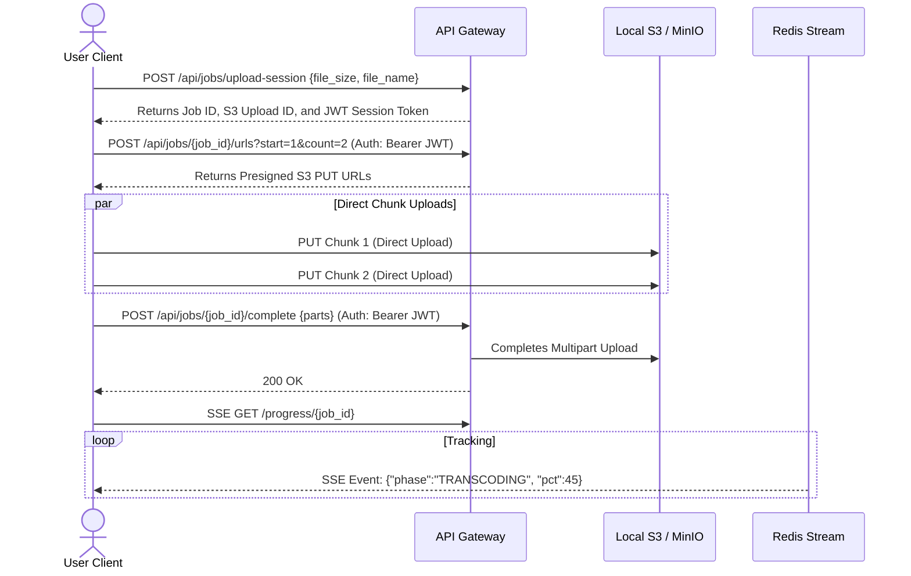

# Distributed VOD Processing System: Master Production Reference Manual

This manual is the single source of truth for the architecture, deployment, integration, and management of the Distributed Video on Demand (VOD) Transcoder system.

---

## 1. System Architecture & Core Concepts

The system is designed as a **3-tier, geo-distributed, share-nothing regional video transcoding network** capable of handling 40–50 million active users.

```
                  [ User Client Browser ]
                             │
              ┌──────────────┴──────────────┐
              ▼                             ▼
       ┌──────────────┐              ┌──────────────┐
       │ US-East PoP  │              │ EU-West PoP  │
       │ (Local S3)   │              │ (Local S3)   │
       └──────┬───────┘              └──────┬───────┘
              │                             │
              └──────► [S3 CRR Sync] ◄──────┘
                (Manifests & Sentinels Only)
```

### 1.1. Ingestion Gateways (Tier 1)
* **Stateless API Daemons**: Gateways parse configuration overrides, execute rate limiting, generate secure JWT upload session claims, and provide presigned direct-to-S3 upload URLs.
* **Horizontal Scaling**: Gateways scale horizontally behind Geo-DNS or Anycast load balancers. They do not share active connection states, allowing instant scalability.

### 1.2. Coordinators (Tier 2)
* **Consensus & Ring Topologies**: Coordinators register node leases in etcd and self-allocate to a 1024-partition consistent hash ring.
* **Video Slicing**: When a video completes upload, the coordinator owning the partition acquires an etcd slicing lock, downloads the raw stream, stream-slices it into 5-second GOP-aligned `.mp4` chunks, uploads the chunks to the regional S3 bucket, and publishes individual segment transcoding tasks to NATS JetStream.

### 1.3. Workers (Tier 3)
* **Pull-Based Consumers**: Workers run as elastic compute pools subscribing to regional NATS JetStream shards.
* **Process Isolation**: Workers transcode segments into target HLS `.ts` formats using local FFmpeg child processes bounded by Linux cgroups v2 memory limits. They report completion events to NATS and heartbeat CPU/GPU stats to Redis.

### 1.4. Key Distributed Principles
* **Data Gravity**: Raw uploads and transcoded `.ts` segments remain local to their home region. High-volume media data never traverses global WAN lines.
* **Manifest-Only S3 CRR**: Playback accessibility is achieved by replicating only the lightweight final compiled HLS `.m3u8` playlists and DASH `.mpd` manifests using bucket replication.
* **Share-Nothing Control Planes**: Backing etcd, Redis, and NATS clusters are entirely region-isolated. Disaster in one region has zero cascading effect on others.

---

## 2. Developer Integration API Specifications

Client applications interface with the API Gateway to perform secure direct-to-S3 uploads.



### 2.1. API Contract Reference

#### 1. POST `/api/jobs/upload-session` (Request Session)
* **Body**:
  ```json
  {
    "file_size_bytes": 104857600,
    "file_name": "marketing_reel.mp4",
    "content_type": "video/mp4"
  }
  ```
* **Response**:
  ```json
  {
    "job_id": "us-east-1:7ff8b548-c8ee-449e-b7d1-c27633f81e3a",
    "session_token": "eyJhbGciOiJIUzI1NiIsIn...",
    "part_size": 52428800,
    "total_parts": 2,
    "progress_wss": "wss://gateway-ip:8080/progress/us-east-1:7ff8b548?token=..."
  }
  ```

#### 2. POST `/api/jobs/{job_id}/urls` (Request Presigned Batch URLs)
* **Headers**: `Authorization: Bearer <session_token>`
* **Query Parameters**: `start=1`, `count=2`
* **Response**:
  ```json
  {
    "part_numbers": [1, 2],
    "urls": [
      "http://minio-ip:9000/transcoder-bucket/jobs/.../raw/source.mp4?partNumber=1&uploadId=...",
      "http://minio-ip:9000/transcoder-bucket/jobs/.../raw/source.mp4?partNumber=2&uploadId=..."
    ]
  }
  ```

#### 3. POST `/api/jobs/{job_id}/complete` (Complete Upload)
* **Headers**: `Authorization: Bearer <session_token>`
* **Body**:
  ```json
  {
    "parts": [
      { "part_number": 1, "etag": "\"d912b7f3a8b417c8cf15a31e847c2d96\"" },
      { "part_number": 2, "etag": "\"f6a15b13e9a5c8c9bf10e42d76a5b9b1\"" }
    ]
  }
  ```

#### 4. GET `/progress/{job_id}` (Real-time Progress Stream)
* **Headers**: `Accept: text/event-stream`
* **SSE Event Frame**:
  ```
  data: {"job_id":"us-east-1:7ff8...","phase":"TRANSCODING","pct":45,"completed":4,"total":8,"partition_id":4}
  ```

### 2.2. Player Integration & Playback Contract
Upon transcoding completion, feed the playlist path directly to HLS players (e.g. `hls.js` or standard iOS Safari players):

* **HLS Master Entrypoint URL**:
  `http://<cdn-or-storage-endpoint>/<bucket-name>/jobs/partition_<id>/job_<job_id>/transcoded/master.m3u8`

* **hls.js Integration Script**:
  ```javascript
  const video = document.getElementById('player');
  const playlistUrl = 'http://s3.internal:9000/transcoder-bucket/jobs/partition_4/job_us-east-1:7ff8b548/transcoded/master.m3u8';

  if (Hls.isSupported()) {
    const hls = new Hls({
      maxBufferLength: 30,
      maxMaxBufferLength: 600
    });
    hls.loadSource(playlistUrl);
    hls.attachMedia(video);
    hls.on(Hls.Events.ERROR, function (event, data) {
      if (data.fatal) {
        if (data.type === Hls.ErrorTypes.NETWORK_ERROR) {
          hls.startLoad();
        } else if (data.type === Hls.ErrorTypes.MEDIA_ERROR) {
          hls.recoverMediaError();
        }
      }
    });
  }
  ```

---

## 3. Pluggable Infrastructure Drivers

The codebase abstracts database, message queue, lock manager, and storage clients into Go interfaces inside package `infra`. Developers can implement their own drivers to swap out backing components.

### 3.1. swappable Go Interfaces
* **`infra.MessageBus`**: Abstracts message queue publishing, subscribing, pull-based consumer logic, DLQs, and health checks.
* **`infra.StateStore`**: Abstracts Redis Cluster status tracking, bitmaps, caching, rate limiting, and worker registries.
* **`infra.Coordination`**: Abstracts etcd coordinate registration and partition locks.
* **`infra.ObjectStore`**: Abstracts multipart uploads, file copying, deletions, and presigned URLs.

### 3.2. SQS Message Bus Driver Config (NATS vs AWS SQS)
To swap out NATS for SQS, developers configure the `message_bus_provider` key. 

* **Config YAML (`config.yaml`)**:
  ```yaml
  message_bus_provider: "sqs"
  
  # SQS reuses credentials defined in the Object Store config block
  object_store:
    endpoint: "s3.us-east-1.amazonaws.com"
    bucket: "transcoder-us-east"
    region: "us-east-1"
    access_key: "aws-access-key"
    secret_key: "aws-secret-key"
    use_ssl: true
  ```
* **Environment Override**:
  ```bash
  export TRANSCODER_MESSAGE_BUS_PROVIDER="sqs"
  export TRANSCODER_S3_ACCESS_KEY="aws-access-key"
  export TRANSCODER_S3_SECRET_KEY="aws-secret-key"
  ```

---

## 4. Multi-Region Routing & Replication Blueprint

To deploy across multiple regional Points of Presence (PoPs) like US-East and EU-West, follow this setup.

### 4.1. DNS & Entrypoint Latency Routing
Configure **Geo-DNS** (e.g. AWS Route 53 Geolocation / Latency Records) or **Anycast IP** routing for the gateway domain name `gateway.transcoder.company.com`. 

* Requests originating in North America route to the **US-East Load Balancer** (Gateway Port 8080).
* Requests originating in Europe route to the **EU-West Load Balancer** (Gateway Port 8080).

### 4.2. AWS S3 Cross-Region Replication (CRR) Rules
Configure Cross-Region Replication (CRR) between regional buckets (e.g. from `apple-transcoder-us-east` to `apple-transcoder-eu-west`).

Apply this replication JSON configuration to source buckets:
```json
{
  "Role": "arn:aws:iam::123456789012:role/S3TranscoderReplicationRole",
  "Rules": [
    {
      "ID": "ReplicateCompletedManifestsOnly",
      "Status": "Enabled",
      "Priority": 1,
      "Filter": {
        "And": {
          "Prefix": "jobs/",
          "Tags": [
            {
              "Key": "replicate",
              "Value": "true"
            }
          ]
        }
      },
      "Destination": {
        "Bucket": "arn:aws:s3:::apple-transcoder-eu-west",
        "StorageClass": "STANDARD"
      }
    }
  ]
}
```

*Note: SRE teams must configure S3 event tagging rules to attach `"replicate": "true"` to compiled master playlist formats (`*.m3u8`, `*.mpd`) and completed sentinel JSON files (`job_completed.json`). Exclude `**/raw/**` and `**/transcoded/**` `.ts` segments to maintain Data Gravity.*

### 4.3. Regional Isolation Filtering
To prevent local coordinators from attempting to run tasks on replicated foreign jobs, job IDs include region prefixes (`<region>:<uuid>`). During startup and partition takeover scans, regional partition managers skip foreign prefixes:
```go
parts := strings.Split(jobID, ":")
if len(parts) > 1 && parts[0] != pm.coord.cfg.Region {
    continue // ignore foreign region job
}
```

---

## 5. Kubernetes Production Deployment & Orchestration

Deploy components inside regional namespaces (`us-east` and `eu-west`) using the following orchestration manifests.

### 5.1. StatefulSet Coordinators & Daemon Deployments
Save this schema as `k8s-deployment.yaml` and apply it to target cluster namespaces:

```yaml
apiVersion: apps/v1
kind: Deployment
metadata:
  name: transcoder-gateway
  namespace: transcoder-system
spec:
  replicas: 40 # Scale as needed per region
  selector:
    matchLabels:
      app: transcoder-gateway
  template:
    metadata:
      labels:
        app: transcoder-gateway
    spec:
      containers:
        - name: gateway
          image: transcoder:v1.0.0
          args: ["-role=gateway", "-config=/etc/transcoder/config.yaml"]
          ports:
            - containerPort: 8080
            - containerPort: 9091
          volumeMounts:
            - name: config-volume
              mountPath: /etc/transcoder
      volumes:
        - name: config-volume
          configMap:
            name: regional-config
---
apiVersion: apps/v1
kind: StatefulSet
metadata:
  name: transcoder-coordinator
  namespace: transcoder-system
spec:
  serviceName: "transcoder-coordinator-headless"
  replicas: 20
  selector:
    matchLabels:
      app: transcoder-coordinator
  template:
    metadata:
      labels:
        app: transcoder-coordinator
    spec:
      containers:
        - name: coordinator
          image: transcoder:v1.0.0
          args: ["-role=coordinator", "-config=/etc/transcoder/config.yaml"]
          ports:
            - containerPort: 9091
          volumeMounts:
            - name: config-volume
              mountPath: /etc/transcoder
      volumes:
        - name: config-volume
          configMap:
            name: regional-config
```

### 5.2. Worker Deployment & Auto-scaling metrics
Deploy the workers with RAM-disk scratch storage to maximize IOPS during transcoding:

```yaml
apiVersion: apps/v1
kind: Deployment
metadata:
  name: transcoder-worker
  namespace: transcoder-system
spec:
  replicas: 10 # Initial baseline
  selector:
    matchLabels:
      app: transcoder-worker
  template:
    metadata:
      labels:
        app: transcoder-worker
    spec:
      containers:
        - name: worker
          image: transcoder:v1.0.0
          args: ["-role=worker", "-config=/etc/transcoder/config.yaml"]
          volumeMounts:
            - name: config-volume
              mountPath: /etc/transcoder
            - name: scratch-volume
              mountPath: /tmp/scratch
      volumes:
        - name: config-volume
          configMap:
            name: regional-config
        - name: scratch-volume
          emptyDir:
            medium: Memory # Allocates local node RAM disk (15GB limit)
            sizeLimit: 15Gi
```

### 5.3. Horizontal Pod Autoscaler (HPA) Config
Configure the Horizontal Pod Autoscaler based on the **NATS Stream pending tasks backlog** to handle burst ingest traffic:

```yaml
apiVersion: autoscaling/v2
kind: HorizontalPodAutoscaler
metadata:
  name: transcoder-worker-hpa
  namespace: transcoder-system
spec:
  scaleTargetRef:
    apiVersion: apps/v1
    kind: Deployment
    name: transcoder-worker
  minReplicas: 10
  maxReplicas: 4000
  metrics:
    - type: External
      external:
        metric:
          name: nats_tasks_backlog
        target:
          type: Value
          value: "50" # Spawns 1 additional worker pod for every 50 pending NATS tasks
```

---

## 6. Observability & Telemetry APIs

### 6.1. Prometheus Instrumentation Metrics
Daemons expose Prometheus metrics on port `9091` (`/metrics`):
* **Ingestion counter**: `transcoder_gateway_upload_count_total`
* **Active worker slots**: `transcoder_worker_active_tasks_count` (labeled by `node_id` and `region`)
* **NATS pending queue length**: `nats_stream_consumer_num_pending{stream="transcode-tasks"}`

### 6.2. Telemetry APIs (Authorized via Bearer Key)
Gateway hosts administrative endpoints protected via Bearer authentication using the gateway's `admin_api_key` configuration:

1. **List Jobs (`GET /api/admin/jobs?limit=50&offset=0`)**:
   Returns sorted and paginated active job status states.
2. **List Regions health (`GET /api/admin/regions`)**:
   Returns health checks of Redis, NATS, S3, etcd, active socket counts, DLQ depths, and CPU/GPU metrics heatmap entries of registered workers.
3. **List Coordinators (`GET /api/admin/coordinators`)**:
   Returns node IDs of active coordinators registered on the consistent hash ring.

---

## 7. Disaster Recovery & regional Outage Runbook

In the event of a complete regional failure (e.g. `us-east-1` goes down):

### Step 1: Shift DNS Ingest Traffic
Shift DNS routing away from the failed region using Anycast / Route 53 traffic policies. Incoming upload requests will automatically route to the secondary healthy region (e.g., `eu-west-1`).

### Step 2: Handle In-Flight Ingestions
In-flight uploads that were currently transcoding in the failed region are lost. The client's SSE progress stream connection will catch a disconnect error. The client application **should catch this disconnect** and request a new session from the gateway, which will resolve to the healthy region.

### Step 3: Global Playback Continuity
Because completed manifests (`*.m3u8` / `*.mpd`) were replicated via S3 CRR to the healthy region's bucket before the outage, client video playback requests for all previously transcoded videos continue to resolve successfully from the healthy region.
